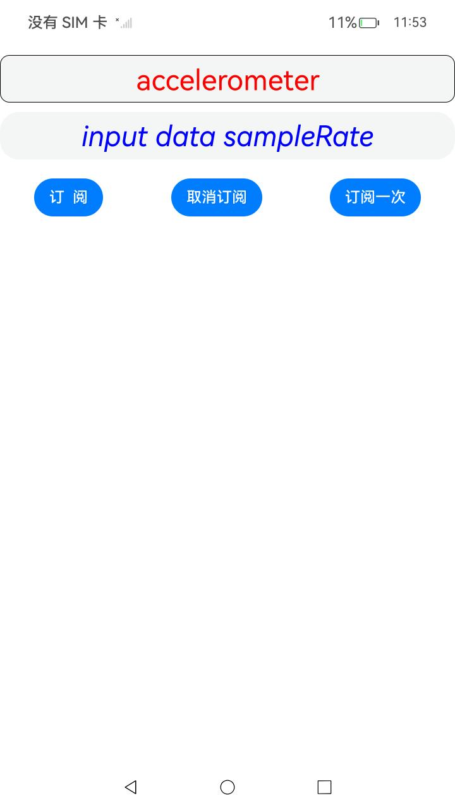
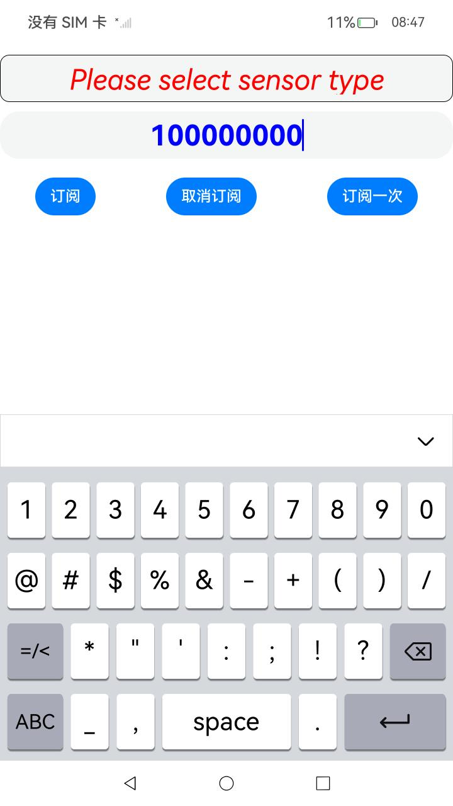
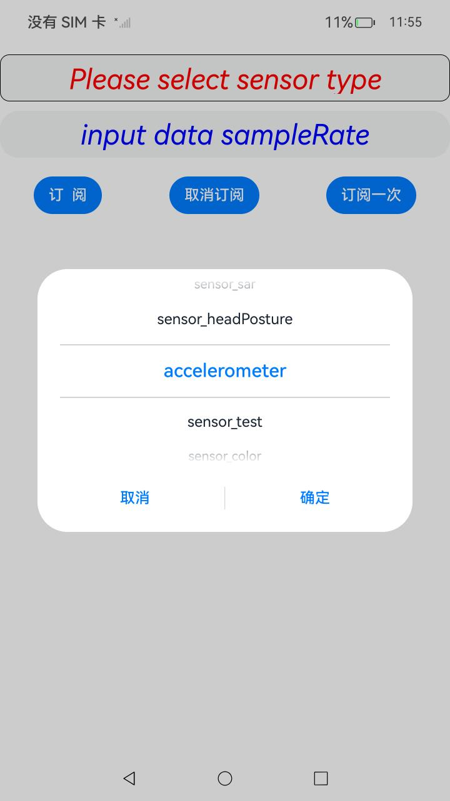
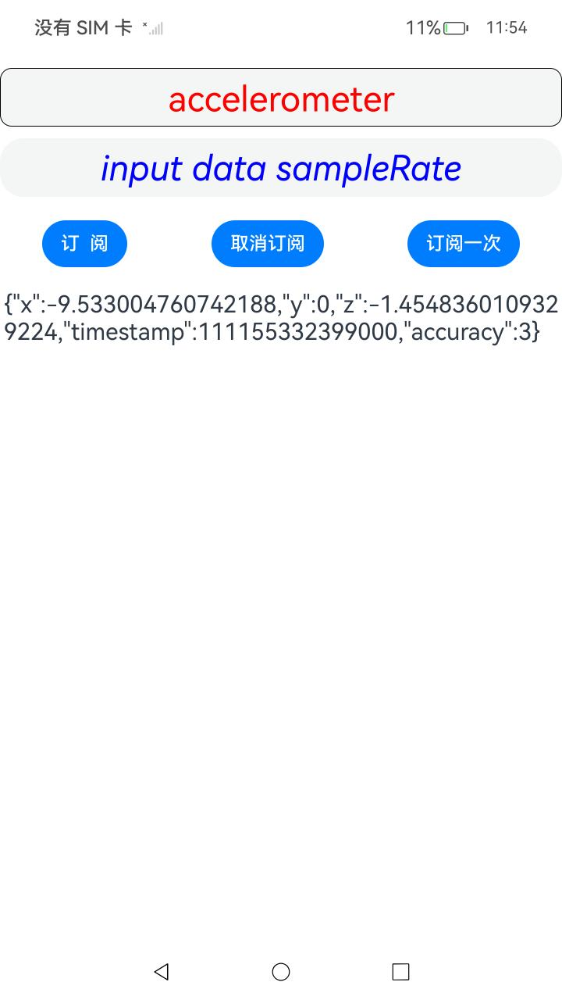

# 订阅/取消订阅传感器

### 介绍

本示例主要展示了传感器的基础功能，包括传感器订阅和取消传感器订阅。

### 效果预览

| 首页                                                         | 选择传感器类型                                               | 数据上报                                                     | 输入数据采样频率                                             |
| ------------------------------------------------------------ | ------------------------------------------------------------ | ------------------------------------------------------------ | ------------------------------------------------------------ |
|  |  |  |  |

使用说明：

1.点击“input data sampleRate”按钮，输入100000000；该属性有最小值和最大值的限制，由硬件支持的上报频率决定，当设置频率大于最大值时以最大值上报数据，小于最小值时以最小值上报数据，置空则以默认频率上报;

2.在主界面点击”Please select sensor type“按钮，进入选择传感器类型页面；

3.在选择传感器页面选择需要订阅的传感器类型后，点击“订阅”按钮，持续订阅传感器数据会出现在下方；

4.如果需要取消订阅，点击“取消订阅”按钮，即可取消订阅传感器数据;

5.点击“订阅一次”按钮，将会上报订阅传感器一次的数据；

6.需要订阅其他传感器之前，需要先取消订阅本次传感器数据。

### 工程目录

```
entry/src/main/
|---ets
|---|---common
|---|---|---contants
|---|---|---|---CommonConstants.ets        // 用于存放应用程序共享的库文件和资源
|---|---|---utils
|---|---|---|---CommonUtils.ets            // 共享资源库
|---|---|---|---Logger.ets                 // 日志打印工具
|---|---|---|---Utils.ets                  // 日志工具
|---|---entryability
|---|---|---EntryAbility.ets               // 应用入口
|---|---EntryBackupAbility
|---|---|---EntryBackupAbility.ets         // 备份恢复能力
|---|---pages
|---|---|---Index.ets                      // 订阅传感器，取消订阅传感器
|---resources                              // 静态资源文件（图形、多媒体等）

```

### 具体实现

- 图片功能在Index中实现，具体参考[Index.ets](entry/src/main/ets/pages/Index.ets)：
- 点击“Please select sensor type”按钮，通过[sensor.getSensorListSync()](https://gitee.com/openharmony/docs/blob/master/zh-cn/application-dev/reference/apis-sensor-service-kit/js-apis-sensor.md#sensorgetsensorlistsync12)获取设备支持的传感器类型；
- 点击“订阅”按钮，通过[sensor.on()](https://gitee.com/openharmony/docs/blob/master/zh-cn/application-dev/reference/apis-sensor-service-kit/js-apis-sensor.md#sensoron)订阅传感器，获取传感器数据；
- 点击"取消订阅"按钮，通过[sensor.off()](https://gitee.com/openharmony/docs/blob/master/zh-cn/application-dev/reference/apis-sensor-service-kit/js-apis-sensor.md#sensoroff)，取消订阅传感器。
- 点击"订阅一次"按钮，通过[sensor.once()](https://gitee.com/openharmony/docs/blob/master/zh-cn/application-dev/reference/apis-sensor-service-kit/js-apis-sensor.md#sensoronce)，取消订阅传感器。

### 相关权限

[ohos.permission.ACCELEROMETER](https://gitee.com/openharmony/docs/blob/master/zh-cn/application-dev/reference/apis-sensor-service-kit/js-apis-sensor.md#accelerometer9)

[ohos.permission.GYROSCOPE](https://gitee.com/openharmony/docs/blob/master/zh-cn/application-dev/reference/apis-sensor-service-kit/js-apis-sensor.md#gyroscope9)

[ohos.permission.ACTIVITY_MOTION](https://gitee.com/openharmony/docs/blob/master/zh-cn/application-dev/reference/apis-sensor-service-kit/js-apis-sensor.md#pedometer9)

[ohos.permission.READ_HEALTH_DATA](https://gitee.com/openharmony/docs/blob/master/zh-cn/application-dev/reference/apis-sensor-service-kit/js-apis-sensor.md#heart_rate9)

### 依赖

不涉及。

### 约束与限制

1. 本示例仅支持标准系统上运行，支持设备：RK3568、Phone、Tablet;
2. 本示例为Stage模型，支持API14版本SDK，版本号：5.0.2.43；
3. 本示例需要使用DevEco Studio Release（5.0.3.900）及以上版本才可编译运行；
4. 传感器数据订阅和取消订阅接口成对调用，当不再需要订阅传感器数据时，开发者需要调用取消订阅接口停止数据上报；
5. 本示例涉及系统接口，需要配置系统应用签名，可以参考[特殊权限配置方法](https://gitee.com/openharmony/docs/blob/master/zh-cn/application-dev/security/hapsigntool-overview.md)，把配置文件中的“app-feature”字段信息改为“hos_system_app”。

### 下载

如需单独下载本工程，执行如下命令：

```
git init
git config core.sparsecheckout true
echo code/DocsSample/Sensor > .git/info/sparse-checkout
git remote add origin https://gitee.com/openharmony/applications_app_samples.git
git pull origin master
```

