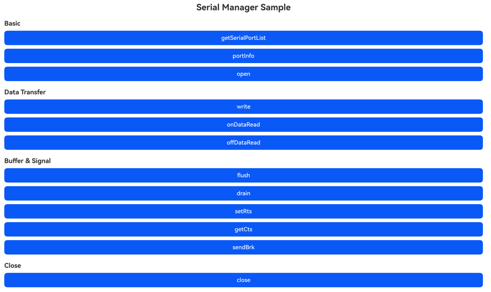

# 串口管理

### 介绍

本示例主要展示了串口管理相关的功能，使用[@ohos.busManager.serial](https://gitcode.com/openharmony/interface_sdk-js/blob/master/api/@ohos.busManager.serial.d.ts)中的接口，实现了获取串口列表、打开/关闭串口、数据读写、监听数据接收、刷新缓冲区、等待写入完成以及信号控制等功能。

### 效果预览

|主页|
|--------------------------------|
||

使用说明

1. 在主界面，点击**getSerialPortList**按钮获取当前设备串口列表，日志输出串口数量及各串口信息；
2. 点击**portInfo**按钮获取第一个串口的设备信息（端口名、VID、PID、制造商）；
3. 点击**open**按钮以指定配置（波特率115200、8位数据位、1位停止位、无校验）打开串口，操作完成后自动关闭；
4. 点击**close**按钮先打开串口再关闭，演示完整的打开-关闭流程；
5. 点击**write**按钮打开串口后发送一段测试数据，输出写入长度后自动关闭；
6. 点击**onDataRead**按钮打开串口后注册数据接收回调，再通过offDataRead取消注册，最后关闭串口；
7. 点击**offDataRead**按钮打开串口后注册数据接收回调，再调用offDataRead（不传回调）清除所有监听，最后关闭串口；
8. 点击**flush**按钮打开串口后刷新串口缓冲区，完成后自动关闭；
9. 点击**drain**按钮打开串口后等待所有写入请求完成，完成后自动关闭；
10. 点击**setRts**按钮打开串口后设置RTS信号为true，完成后自动关闭；
11. 点击**getCts**按钮打开串口后获取CTS信号状态，完成后自动关闭；
12. 点击**sendBrk**按钮打开串口后发送BRK信号，完成后自动关闭。

### 工程目录

```
entry/src/main/
|---ets/
|   |---entryability/
|   |   |---EntryAbility.ets               // 入口Ability
|   |---pages/
|   |   |---Index.ets                       // 主页面，包含串口各接口的示例调用
|---module.json5                            // 模块配置
entry/src/ohosTest/
|---ets/
|   |---test/
|   |   |---Ability.test.ets                // 自动化测试用例
|   |   |---List.test.ets                   // 测试用例入口
```

### 具体实现

* 串口各接口的示例调用封装在Index页面中，使用成员变量port保存第一个串口，查询串口时赋值，其它用例直接使用该串口调用被测接口，源码参考：[Index.ets](entry/src/main/ets/pages/Index.ets)
    * 获取串口列表：调用serial.getSerialPortList()获取设备上所有串口，遍历输出每个串口的portInfo信息，并将第一个串口保存到成员变量port；
    * 读取串口设备信息：通过成员变量port的portInfo属性获取SerialPortInfo，包含portName、vendorId、productId、manufacturer；
    * 打开串口：调用SerialPort.open(config?)打开串口设备，可传入SerialConfigs配置波特率、数据位、停止位、校验位等参数；
    * 写入数据：调用SerialPort.write(data, timeout?)向串口发送Uint8Array数据，返回实际写入长度；
    * 监听数据接收：调用SerialPort.onDataRead(callback)注册回调监听串口接收数据，调用SerialPort.offDataRead(callback?)取消监听；
    * 刷新缓冲区：调用SerialPort.flush()刷新串口缓冲区；
    * 等待写入完成：调用SerialPort.drain()等待所有写入请求完成；
    * 设置RTS信号：调用SerialPort.setRts(enable)设置RTS信号状态；
    * 获取CTS信号：调用SerialPort.getCts()获取CTS信号状态；
    * 发送BRK信号：调用SerialPort.sendBrk()发送BRK信号；
    * 关闭串口：调用SerialPort.close()关闭已打开的串口设备，并将成员变量port置空。

### 相关权限

无

### 依赖

无

### 约束与限制

1. 本示例仅支持标准系统上运行，支持设备：2in1；
2. 本示例为Stage模型，仅支持API 26版本SDK，SDK版本号(API Version 26.0.0)，镜像版本号(7.0)；
3. 本示例需要使用DevEco Studio 版本号(7.0)版本才可编译运行；
4. 运行本示例需要设备连接USB虚拟串口设备或具备板载串口。

### 下载

如需单独下载本工程，执行如下命令：

```
git init
git config core.sparsecheckout true
echo code/DocsSample/Serial/SerialManagerSample/ > .git/info/sparse-checkout
git remote add origin https://gitee.com/openharmony/applications_app_samples.git
git pull origin master
```
