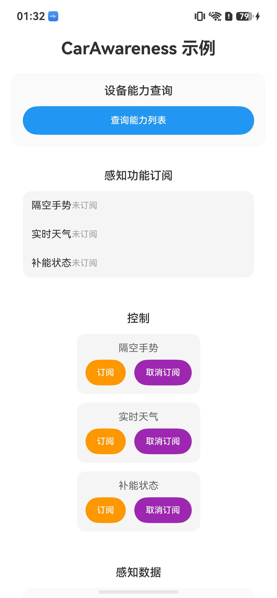
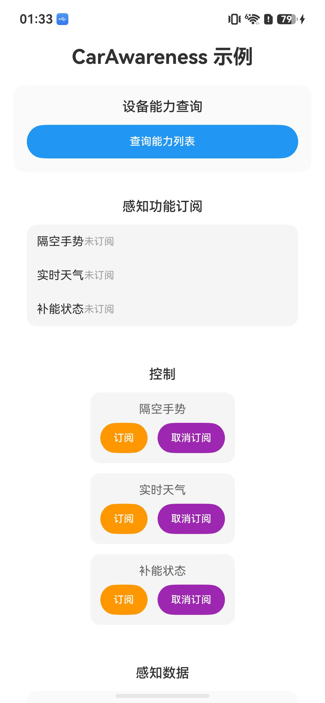

# CarAwareness服务

### 介绍

1. carAwareness（车辆感知）模块面向车载应用提供基于摄像头的环境与动作感知能力，包括隔空手势感知、实时天气感知和补能状态感知三种功能。

详细的接口介绍请参考[CarAwareness接口](https://gitcode.com/openharmony/docs/blob/master/zh-cn/application-dev/reference/apis-multimodalawareness-kit/js-apis-awareness-carAwareness.md)。

2. 实现对以下指南文件中 [车辆感知开发指导](https://gitcode.com/openharmony/docs/blob/master/zh-cn/application-dev/device/stationary/carAwareness-guidelines.md) 示例代码片段的工程化。保证指南中示例代码与sample工程文件同源。

### 效果预览

|         页面说明          |                                          截图                                          |
|:---------------------:|:------------------------------------------------------------------------------------:|
|      **index页面**      |  |
|      **订阅隔空手势**      |  |
|      **取消订阅隔空手势**      |  |
|      **订阅实时天气**      |  |
|      **取消订阅实时天气**      |  |
|      **订阅补能状态**      |  |
|      **取消订阅补能状态**      |  |


### 使用说明

1. 在主界面，点击"订阅"按钮使能对应感知功能，点击"取消订阅"按钮去使能对应感知功能；
2. 点击"查询能力列表"按钮可获取设备支持的感知能力列表。

### 工程目录

```
entry/src/
 ├── main
 │   ├── ets
 │   │   ├── entryability
 │   │   ├── entrybackupability
 │   │   └── pages
 │   │       └── Index.ets               // CarAwareness调用
 │   ├── module.json5
 │   └── resources
 └── ohosTest
     └── ets
         └── test
             └── Ability.test.ets        // 自动化测试代码
```

### 具体实现

本样例展示了车辆感知模块接口的使用样例，包含获取支持的感知功能列表；订阅、取消订阅包括隔空手势感知、实时天气感知与补能状态感知在内的算法，该功能全部接口已封装在Index.ets，源码参考：[Index.ets](./entry/src/main/ets/pages/Index.ets)

### 相关权限

使用carAwareness模块获取车辆感知能力时，需要权限：

| 感知功能 | 需要权限 |
|----------|----------|
| 隔空手势感知 | ohos.permission.vehicle.MMA_SPATIALACTION + (ohos.permission.CAMERA_BACKGROUND 或 ohos.permission.CAMERA) |
| 实时天气感知 | ohos.permission.vehicle.MMA_WEATHER + (ohos.permission.CAMERA_BACKGROUND 或 ohos.permission.CAMERA) |
| 补能状态感知 | ohos.permission.vehicle.MMA_ENERGYREFILL + (ohos.permission.CAMERA_BACKGROUND 或 ohos.permission.CAMERA) |

具体申请方式请参考[声明权限](https://gitcode.com/openharmony/docs/blob/master/zh-cn/application-dev/security/AccessToken/declare-permissions.md)。

### 依赖

不涉及。

### 约束与限制

#### 隔空手势感知

此功能依赖后排摄像头，摄像头不可用时返回能力不支持错误码；摄像头被遮挡、用户手势超出识别区域时，无法正常识别。

#### 实时天气感知

此功能依赖车外摄像头，车外摄像头不可用时返回能力不支持错误码；仅能识别车辆当前位置的实时天气。

#### 补能状态感知

此功能依赖车外摄像头，车外摄像头不可用时返回能力不支持错误码；车辆非P挡状态下，状态字段默认返回无效值。

### 下载

如需单独下载本工程，执行如下命令：

````
git init
git config core.sparsecheckout true
echo code/DocsSample/Stationary/CarAwareness > .git/info/sparse-checkout
git remote add origin https://gitcode.com/openharmony/applications_app_samples.git
git pull origin master
````
