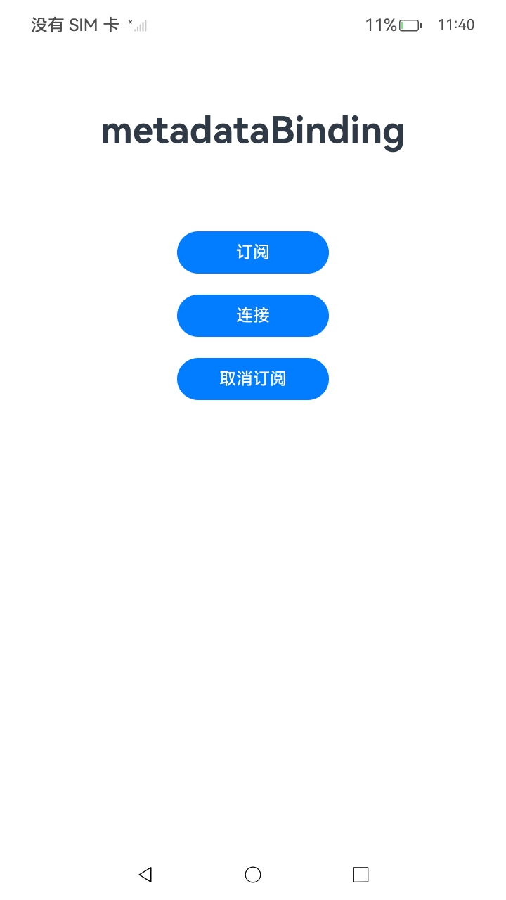
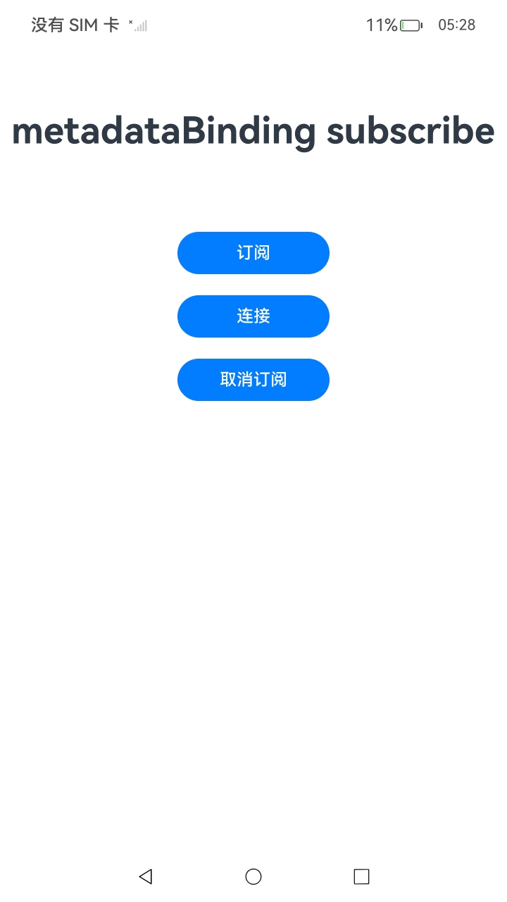

#  MetadataBinding服务

### 介绍

1.MetadataBinding（记忆链接）指由第三方应用提供[App Linking链接](https://developer.huawei.com/consumer/cn/doc/harmonyos-guides/applinking-introduction)，系统将当前用户浏览的内容与App Linking链接进行关联并保存的功能。

详细的接口介绍请参考[MetadataBinding接口](https://gitcode.com/openharmony/docs/blob/master/zh-cn/application-dev/reference/apis-multimodalawareness-kit/js-apis-awareness-metadataBinding.md)。

2.实现对以下指南文件中 [记忆链接开发指导](https://gitcode.com/openharmony/docs/blob/master/zh-cn/application-dev/device/stationary/metadataBinding-guidelines.md)示例代码片段的工程化。保证指南中示例代码与sample工程文件同源。

### 效果预览

|         页面说明          |                                          截图                                          |
|:---------------------:|:------------------------------------------------------------------------------------:|
|      **index页面**      |  |
|      **订阅**      |  |
|      **连接**      |  |
|      **取消订阅**      |  |


### 使用说明

1. 在主界面，点击订阅按钮使能功能，点击连接按钮提供App Linking链接，点击取消订阅按钮去使能功能。

### 工程目录

```
entry/src/
 ├── main
 │   ├── ets
 │   │   ├── entryability
 │   │   ├── entrybackupability
 │   │   └── pages
 │   │       └── Index.ets                   // MetadataBinding调用
 │   ├── module.json5
 │   └── resources
 └── ohosTest
     └── ets
         └── test
             └── Ability.test.ets        // 自动化测试代码
```

### 相关权限

不涉及。

### 依赖

不涉及。

### 约束与限制

1.本示例仅支持标准系统上运行，支持设备：Phone;

2.本示例为Stage模型，支持API18版本SDK，SDK版本号(API Version 18)。

3.本示例需要使用DevEco Studio 版本号(5.0.5 Release)版本才可编译运行。

4.鸿蒙App Linking链接的最大字节数为99。

### 下载

如需单独下载本工程，执行如下命令：

````
git init
git config core.sparsecheckout true
echo code/DocsSample/Stationary/MetadataBinding > .git/info/sparse-checkout
git remote add origin https://gitee.com/openharmony/applications_app_samples.git
git pull origin master
````