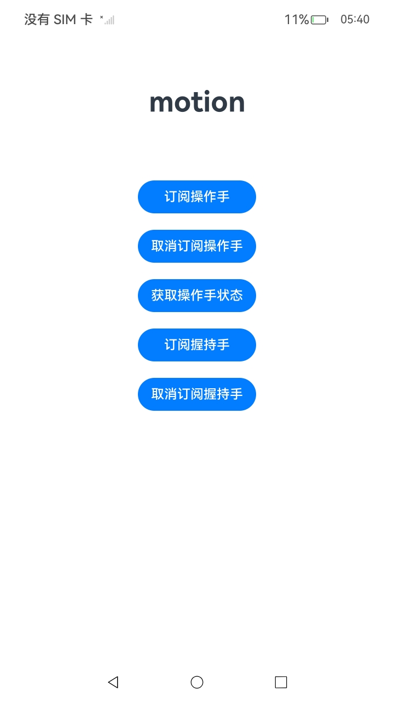
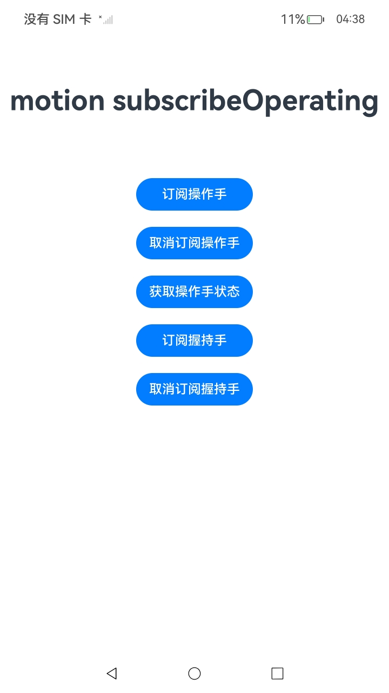
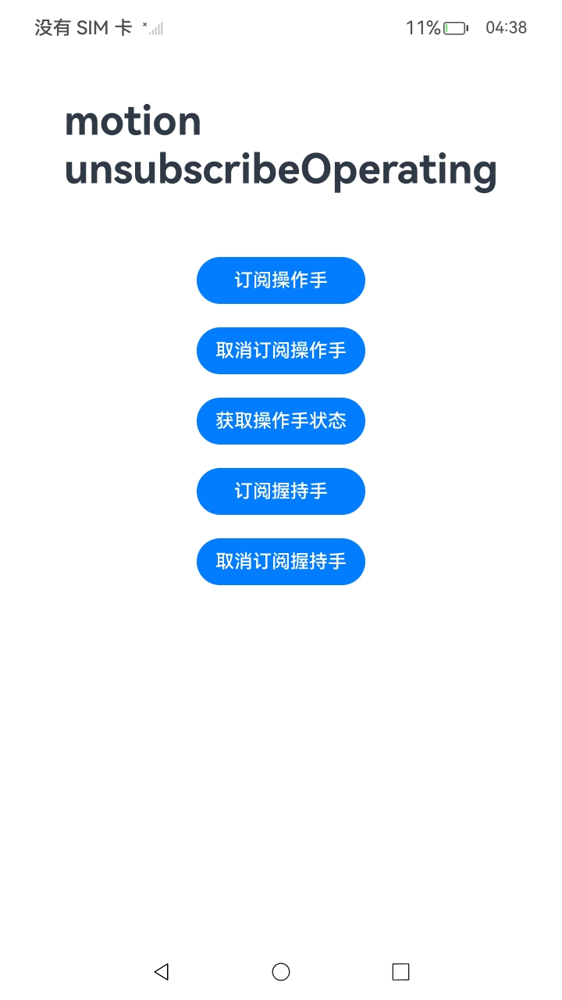
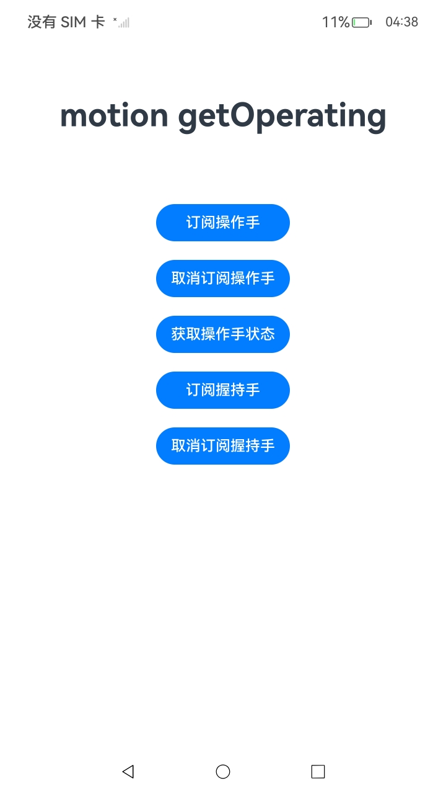
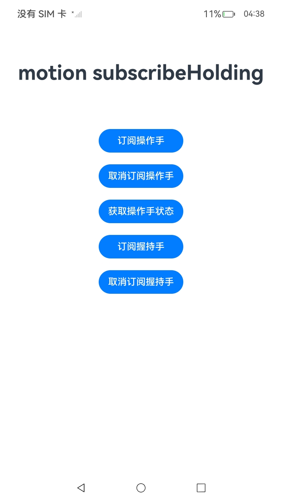
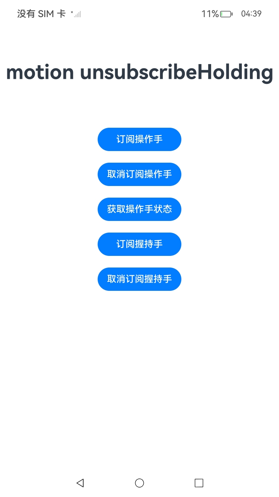

#  Motion服务

### 介绍

1.当应用需要获取用户动作时，可以调用motion模块，例如判断用户当前是用左手还是右手操作设备屏幕。

详细的接口介绍请参考[Motion接口](https://gitcode.com/openharmony/docs/blob/master/zh-cn/application-dev/reference/apis-multimodalawareness-kit/js-apis-awareness-motion.md)。

从API version 15开始，支持获取操作手状态。从API version 20开始，支持获取握持手状态。

2.实现对以下指南文件中 [获取用户动作开发指导](https://gitcode.com/openharmony/docs/blob/master/zh-cn/application-dev/device/stationary/motion-guidelines.md)示例代码片段的工程化。保证指南中示例代码与sample工程文件同源。

### 效果预览

|         页面说明          |                                          截图                                          |
|:---------------------:|:------------------------------------------------------------------------------------:|
|      **index页面**      |  |
|      **订阅操作手**      |  |
|      **取消订阅操作手**      |  |
|      **获取操作手状态**      |  |
|      **订阅握持手**      |  |
|      **取消订阅握持手**      |  |


### 使用说明

1. 在主界面，点击订阅操作手按钮使能操作手功能，点击取消订阅操作手按钮去使能操作手功能，点击获取操作手状态按钮获取当前操作手状态；
   点击订阅握持手按钮使能握持手功能，点击取消订阅握持手按钮去使能握持手功能。

### 工程目录

```
entry/src/
 ├── main
 │   ├── ets
 │   │   ├── entryability
 │   │   ├── entrybackupability
 │   │   └── pages
 │   │       └── Index.ets                   // Motion调用
 │   ├── module.json5
 │   └── resources
 └── ohosTest
     └── ets
         └── test
             └── Ability.test.ets        // 自动化测试代码
```

### 相关权限

使用motion模块获取用户操作手或握持手时，需要权限：ohos.permission.ACTIVITY_MOTION 或 ohos.permission.DETECT_GESTURE，
具体申请方式请参考[声明权限](https://gitcode.com/openharmony/docs/blob/master/zh-cn/application-dev/security/AccessToken/declare-permissions.md)。

### 依赖

不涉及。

### 约束与限制

#### 操作手

1.本示例仅支持标准系统上运行，支持设备：Phone;

2.本示例为Stage模型，支持API15版本SDK，SDK版本号(API Version 15)。

3.本示例需要使用DevEco Studio 版本号(5.0.0 Release)版本才可编译运行。

4.此功能如果设备不支持，将返回801错误码；指关节操作不属于使用手操作场景；窗口旋转场景，多指同时操作场景不支持；能力有效范围：不包含距离屏幕边缘8mm内区域。

#### 握持手

1.本示例仅支持标准系统上运行，支持设备：Phone;

2.本示例为Stage模型，支持API20版本SDK，SDK版本号(API Version 20)。

3.本示例需要使用DevEco Studio 版本号(6.0.0 Release)版本才可编译运行。

4.此功能当前支持部分机型，若设置菜单中存在“握姿跟随”开关（可在“设置-系统”中查看），则表明该设备支持此功能，若无此开关，将返回801错误码；设备屏幕需处于亮屏且解锁状态；设备保护壳（若有）厚度不得超过3毫米；需以五指自然握持设备，同时掌心区域接触设备（或拇指外的四指及掌心区域接触）；握持时确保每根接触手指的接触面积尽可能大（理想情况下不低于30mm²）；佩戴手套会显著降低识别准确率；竖屏握持时，摄像头需朝上；支持横屏握持，但需要注意：应用横屏时竖屏握持（握持设备短边），应用竖屏时横屏握持（握持设备长边），均属异常姿态，无法保证识别成功；握持时屏幕需朝向握持人；握持时不得同时接触其他物体（如桌面、其他身体部位等）；未握持的识别依赖设备状态，设备非静止时无法保证识别成功。

### 下载

如需单独下载本工程，执行如下命令：

````
git init
git config core.sparsecheckout true
echo code/DocsSample/Stationary/Motion > .git/info/sparse-checkout
git remote add origin https://gitee.com/openharmony/applications_app_samples.git
git pull origin master
````