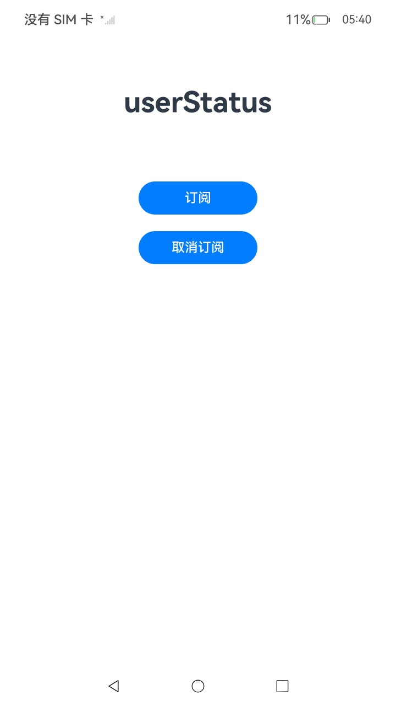
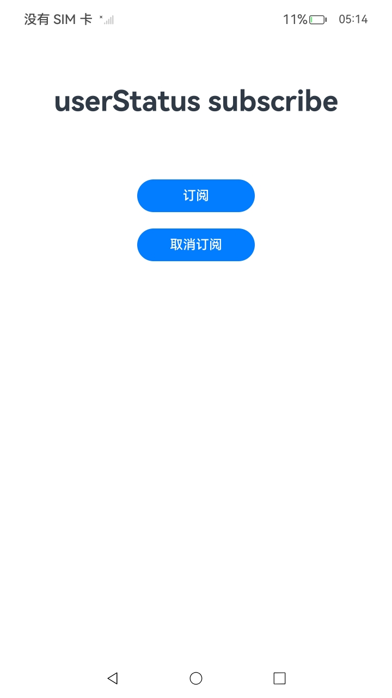
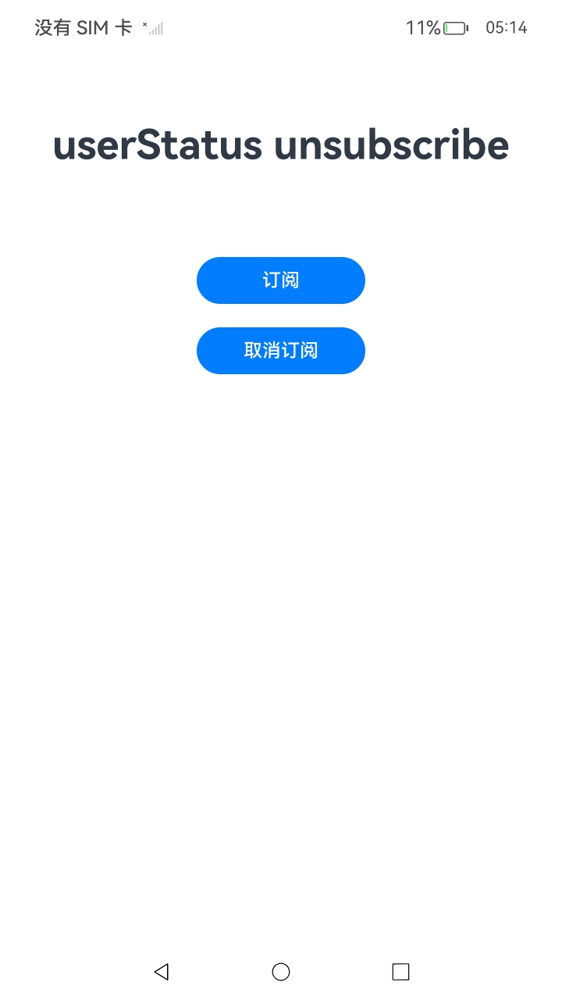

#  UserStatus服务

### 介绍

1.UserStatus（用户状态感知）模块提供用户感知能力，可以感知到操作者特定状态，例如：检测用户年龄组。

详细的接口介绍请参考[userStatus接口](https://gitcode.com/openharmony/docs/blob/master/zh-cn/application-dev/reference/apis-multimodalawareness-kit/js-apis-awareness-userStatus.md)。

2.实现对以下指南文件中 [用户状态感知开发指导](https://gitcode.com/openharmony/docs/blob/master/zh-cn/application-dev/device/stationary/userStatus-guidelines.md)示例代码片段的工程化。保证指南中示例代码与sample工程文件同源。

### 效果预览

|    页面说明     |                                          截图                                          |
|:-----------:|:------------------------------------------------------------------------------------:|
| **index页面** |  |
|   **订阅**    |  |
|  **取消订阅**   |  |


### 使用说明

1. 在主界面，点击订阅按钮使能功能，点击取消订阅按钮去使能功能。

### 工程目录

```
entry/src/
 ├── main
 │   ├── ets
 │   │   ├── entryability
 │   │   ├── entrybackupability
 │   │   └── pages
 │   │       └── Index.ets                   // UserStatus调用
 │   ├── module.json5
 │   └── resources
 └── ohosTest
     └── ets
         └── test
             └── Ability.test.ets        // 自动化测试代码
```

### 相关权限

不涉及。

### 依赖

不涉及。

### 约束与限制

1.本示例仅支持标准系统上运行，支持设备：Phone;

2.本示例为Stage模型，支持API20版本SDK，SDK版本号(API Version 20)。

3.本示例需要使用DevEco Studio 版本号(6.0.0 Release)版本才可编译运行。

4.此功能如果设备不支持，将返回801错误码。

### 下载

如需单独下载本工程，执行如下命令：

````
git init
git config core.sparsecheckout true
echo code/DocsSample/Stationary/UserStatus > .git/info/sparse-checkout
git remote add origin https://gitcode.com/openharmony/applications_app_samples.git
git pull origin master
````