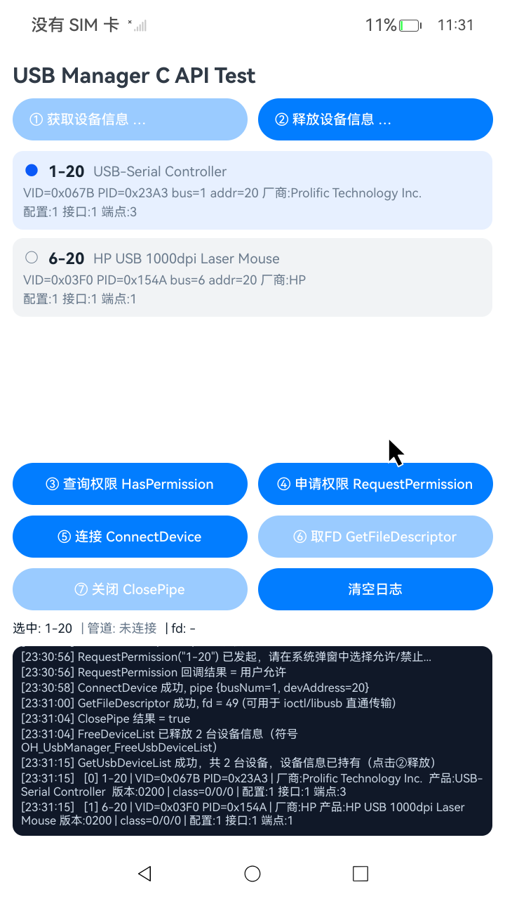

# USBManagerCApiSample

### 介绍

本示例基于 **USB Manager C API**（`OH_UsbManager_*`，libohusb_manager.so），通过 NAPI 在原生层完成 USB 设备的获取、授权、连接与管道管理。首页为手动测试页，按操作流程提供 ①~⑦ 步进按钮：**获取设备信息  → 查询权限 → 申请权限 → 连接 → 取 FD → 关闭 → 释放设备信息**，每一步的返回码与执行结果实时输出到底部日志面板。

本示例覆盖管理面全部 7 个 C API。其中取得的 **fd 是向 libusb 交接的关键产物**：fd 送入 `libusb_wrap_sys_device` 包装为 libusb 设备句柄后，后续的接口占用与批量/中断/控制传输全部由 libusb 完成。

原生层向外暴露的接口（见 `entry/src/main/cpp/types/libentry/Index.d.ts`）如下：


| 接口                                | 说明                                                         | 底层 C API                        |
| ----------------------------------- | ------------------------------------------------------------ | --------------------------------- |
| `getDeviceList()`                   | 获取设备信息（含配置/接口/端点三层结构），原生层持有设备列表 | `OH_UsbManager_GetUsbDeviceList`  |
| `freeDeviceList()` | 释放获取的设备信息，返回释放数量 | `OH_UsbManager_FreeUsbDeviceList` |
| `hasPermission(deviceName)`         | 查询设备访问权限                                             | `OH_UsbManager_HasPermission`     |
| `requestPermission(deviceName)`     | 请求设备访问权限（系统弹窗）                                 | `OH_UsbManager_RequestPermission` |
| `connectDevice(busNum, devAddress)` | 连接设备，打开管道                                           | `OH_UsbManager_ConnectDevice`     |
| `getFileDescriptor()`               | 获取已连接管道的文件描述符                                   | `OH_UsbManager_GetFileDescriptor` |
| `closePipe()`                       | 关闭管道并释放资源                                           | `OH_UsbManager_ClosePipe`         |
| `isPipeConnected()`                 | 查询当前管道状态                                             | 内部状态                          |

### 效果预览



### 使用说明

1. 插入一个 USB 外设。
2. 点击「① 获取设备信息 GetUsbDeviceList」，在设备列表中点击选择目标设备（日志会打印 VID/PID、厂商、产品名与配置/接口/端点计数）；获取后设备信息由原生层持有，重新获取前需先释放。
3. 点击「② 释放设备信息 FreeUsbDeviceList」释放原生层持有的设备列表，页面列表同时清空。
4. **③ 查询权限**：点击确认当前授权状态；**④ 申请权限**：点击后在系统弹窗中选择「允许」。
5. **⑤⑥ 管理面**：点击「连接 ConnectDevice」建立管道，点击「取FD GetFileDescriptor」获取文件描述符（fd 显示在状态栏，即向 libusb 交接的句柄）。
6. 点击「⑦ 关闭 ClosePipe」关闭管道；关闭后「② 释放设备信息」仍可操作，手动释放后「① 获取设备信息」恢复可用。可重复 ①→⑤→⑥→⑦→② 验证完整生命周期。
7. 所有调用的错误码（14400001 权限拒绝 / 14400004 服务异常 / 14400008 设备不存在 / 14400009 内存不足 / 14400012 IO 错误 / 14400014 非法参数）均以异常形式抛出，并在日志面板标红显示。

### fd 与 libusb 的交接（设备通信路径）

USB Manager C API 只负责管理面（枚举/授权/连接/管道），真正的数据传输走 **libusb**，两面的交接物就是 `OH_UsbManager_GetFileDescriptor` 返回的 fd：

```cpp
// 1. 管理面（本 demo）：连接设备并取得 fd
OH_UsbManager_UsbDevice device = {0};
device.busNum = busNum;
device.devAddress = devAddress;
OH_UsbManager_UsbPipe pipe = {0};
OH_UsbManager_ConnectDevice(&device, &pipe);
int32_t fd = -1;
OH_UsbManager_GetFileDescriptor(&pipe, &fd);

// 2. 传输面（libusb）：fd 包装为 libusb 设备句柄
libusb_set_option(nullptr, LIBUSB_OPTION_NO_DEVICE_DISCOVERY);  // 关闭系统级设备发现
libusb_init(nullptr);
libusb_device_handle *handle = nullptr;
libusb_wrap_sys_device(nullptr, (intptr_t)fd, &handle);

// 3. 之后 claim / bulk / interrupt / control 全部通过 libusb 与设备通信
libusb_claim_interface(handle, interfaceId);
libusb_bulk_transfer(handle, endpointAddr, data, len, &transferred, timeout);
```

要点：

* fd 必须来自**已授权并已连接**的管道，否则 `OH_UsbManager_GetFileDescriptor` 返回 `14400001`；
* `libusb_wrap_sys_device` 只接管该 fd 对应的设备，不经过系统枚举（`LIBUSB_OPTION_NO_DEVICE_DISCOVERY`）；
* 传输结束后先 `libusb_close(handle)`，再回到管理面调用 `OH_UsbManager_ClosePipe` 释放管道，顺序不可颠倒；
* 设备侧 libusb 位于 `/system/lib(64)/ndk/libusb_ndk.z.so`；完整的传输面示例（接口占用、批量/中断/实时传输、描述符读取）可参照姊妹工程 `UsbManagerCapiSample`。

### 工程目录

```
entry/src/
|---main
|   |---cpp
|   |   |---CMakeLists.txt                              // 构建脚本：链接 libohusb_manager.so
|   |   |---napi_init.cpp                               // NAPI 桥接：7 个 OH_UsbManager C API
|   |   |---types/libentry/Index.d.ts                   // NAPI 类型声明
|   |---ets
|   |   |---pages/Index.ets                             // 首页：①~⑦ 步进测试页
|   |---module.json5                                   // 模块配置（deviceTypes: default/tablet/2in1）
build-profile.json5                                     // runtimeOS: OpenHarmony, 26.0.0
local.properties                                        // sdk.dir 指向本地 OpenHarmony SDK
```

### 具体实现

* 获取设备信息：调用 `OH_UsbManager_GetUsbDeviceList`，转换 configs/interfaces/endpoints 三层结构，设备列表由原生层持有（页面「② 释放设备信息」按钮触发 `OH_UsbManager_FreeUsbDeviceList` 归还内存并清空页面列表）。
* 权限：`OH_UsbManager_HasPermission` 同步查询；`OH_UsbManager_RequestPermission` 异步请求，C 回调经条件变量同步后转换为 Promise（180s 超时保护）。
* 连接与文件描述符：`OH_UsbManager_ConnectDevice` → `OH_UsbManager_GetFileDescriptor`（fd 作为向 libusb 的交接物）→ `OH_UsbManager_ClosePipe`；管道为全局单例，互斥锁保护。
* 错误处理：所有 C API 错误码统一转换为携带 code 与错误名的 JS 异常，页面捕获后写入日志面板。

### 相关权限

本示例使用设备级运行时权限（`OH_UsbManager_RequestPermission` 弹窗授权），`module.json5` 中无需声明 `requestPermissions`。

### 依赖

* USB Manager C API：头文件 `BasicServicesKit/ohusb_manager.h`（since 26.1.0)。
* SDK 配置：`local.properties` 中 `sdk.dir` 指向本地 OpenHarmony SDK（26.0.0）；`build-profile.json5` 使用 `runtimeOS: OpenHarmony` + `compileSdkVersion` / `compatibleSdkVersion: 26.0.0`。

### 约束与限制

1. 本示例基于 OpenHarmony API 26（`compatibleSdkVersion 26.0.0`），仅支持标准系统；
2. 本 demo 仅覆盖管理面；数据传输需将 fd 交接给 libusb；
3. 管道为全局单例，同一时刻仅维护一条连接；切换设备前建议先「⑥ 关闭」再重新连接。

### 下载

如需单独下载本工程，执行如下命令：

```
git init
git config core.sparsecheckout true
echo code/DocsSample/USB/USBManagerCApiSample/ > .git/info/sparse-checkout
git remote add origin https://gitcode.com/openharmony/applications_app_samples.git
git pull origin ***(分支名)
```
