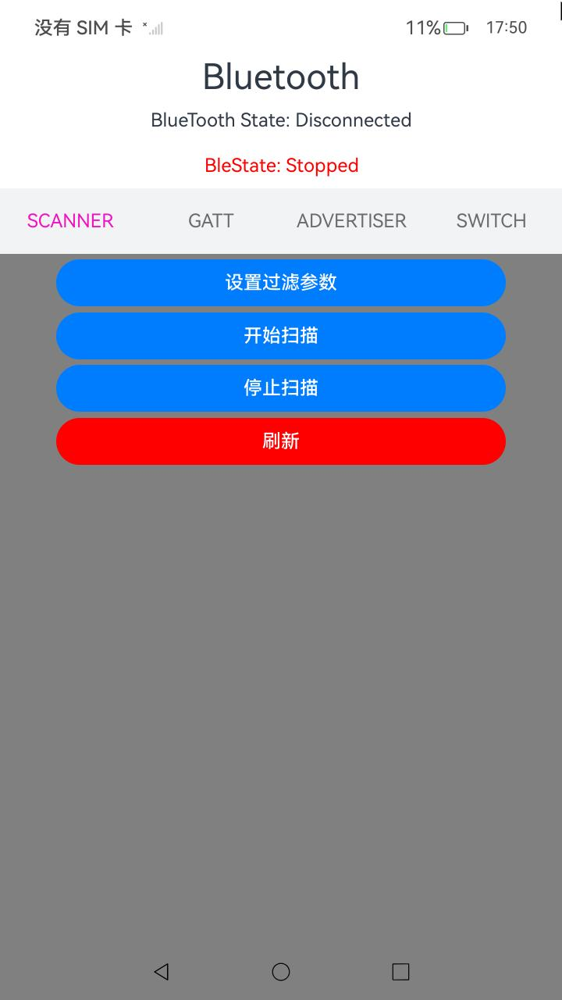
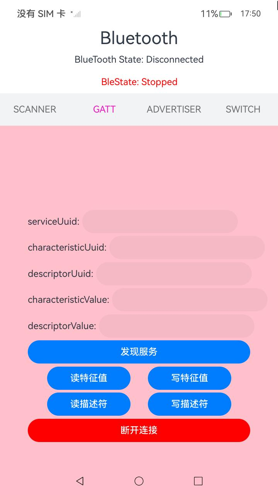

# 蓝牙示例代码工程化

### 介绍

本示例为开发指南中[蓝牙服务开发](https://gitee.com/openharmony/docs/blob/master/zh-cn/application-dev/connectivity/bluetooth/Readme-CN.md)章节中**蓝牙设置**，**广播与扫描**，**通用属性协议**示例代码的完整工程,该工程中展示的代码详细描述可查如下链接：
 
[蓝牙设置](https://gitee.com/openharmony/docs/blob/master/zh-cn/application-dev/connectivity/bluetooth/br-development-guide.md)
[广播与扫描](https://gitee.com/openharmony/docs/blob/master/zh-cn/application-dev/connectivity/bluetooth/ble-development-guide.md)
[通用属性协议](https://gitee.com/openharmony/docs/blob/master/zh-cn/application-dev/connectivity/bluetooth/gatt-development-guide.md)

### 效果预览
|Scan界面| Bonded界面 | Adveriser界面| Switch界面|
|-------|---------|--------|----------|
| | | | |

### 使用说明

1. 启动应用，蓝牙权限申请点击同意。
2. 切换到SWITCH页面，单击开启蓝牙，等待上方蓝牙状态变为BlueTooth State: Connected。
3. 在SCAN页面单击设置过滤参数，可以设置扫描的过滤参数。
4. 单击开始扫描，设备开始扫描设备，扫描到的设备ID会以弹窗形式展示，单击刷新，可以更新下方的设备列表。
5. 单击停止扫描，停止扫描设备。
6. 单击设备列表里的connect，连接设备，设备信息会在上方循环播放展示。
7. 切换GATT页面，填写读写特征值和描述符的过滤参数，上方输入框为写特征值和描述符的过滤参数。
8. 单击发现服务，可以获取已连接设备的服务列表，获得的内容在上方显示。
9. 单击写特征值或写描述符，根据上方过滤参数写入特征值和描述符。
10. 单击读特征值或描述符，读取特征值和描述符，读取到的内容以弹窗形式显示。
11. 单击断开连接，断开与当前设备的连接。
12. 在Adveriser界面，单击注册服务，可以注册服务，单击注销服务，可以注销服务。
13. 单击订阅读写特征值可以订阅读写特征值的操作。
14. 单击设置广播内容，在打开的弹窗中设置广播的内容和参数。
15. 单击开始广播，设备开始进行广播操作。
16. 单击暂停广播，设备暂时停止广播。
17. 单击继续广播，设备继续进行广播。
18. 单击关闭广播，设备停止广播操作，关闭广播服务。
19. 切换到SWITCH界面，单击关闭蓝牙，关闭设备的蓝牙服务。

### 工程目录
```
+--- src
|   +--- main
|   |   +--- ets
|   |   |   +--- bluetoothService
|   |   |   |   +--- BluetoothAdvertising.ets
|   |   |   |   +--- BluetoothScan.ets
|   |   |   |   +--- BluetoothSwitch.ets
|   |   |   |   +--- GattClientManager.ets
|   |   |   |   +--- GattServerManager.ets
|   |   |   +--- common
|   |   |   |   +--- AdvertisingDialog.ets
|   |   |   |   +--- ScanData.ets
|   |   |   |   +--- ScanDialog.ets
|   |   |   |   +--- ToastReport.ets
|   |   |   +--- entryability
|   |   |   |   +--- EntryAbility.ets
|   |   |   +--- entrybackupability
|   |   |   |   +--- EntryBackupAbility.ets
|   |   |   +--- pages
|   |   |   |   +--- Index.ets

```

### 具体实现

#### 蓝牙设置

1. import需要的access模块。

2. 需要SystemCapability.Communication.Bluetooth.Core系统能力。

3. 开启蓝牙。

4. 关闭蓝牙。

5. 错误码请参见[蓝牙服务子系统错误码](https://gitee.com/openharmony/docs/blob/master/zh-cn/application-dev/reference/apis-connectivity-kit/errorcode-bluetoothManager.md)。

6. 如何验证： 执行开启蓝牙代码，记录日志“bluetooth statues: STATE_ON”，则表示开启蓝牙成功。执行关闭蓝牙代码，记录日志“bluetooth statues: STATE_OFF”，则表示蓝牙关闭成功。

#### 广播与扫描开发指导

##### 开启/关闭广播

1. import需要的ble模块。
2. 开启设备的蓝牙。
3. 需要SystemCapability.Communication.Bluetooth.Core系统能力。
4. 开启广播，对端设备扫描该广播。
5. 关闭广播。
6. 错误码请参见[蓝牙服务子系统错误码](https://gitee.com/openharmony/docs/blob/master/zh-cn/application-dev/reference/apis-connectivity-kit/errorcode-bluetoothManager.md)。

##### 开启/关闭扫描

1. import需要的ble模块。
2. 开启设备的蓝牙。
3. 需要SystemCapability.Communication.Bluetooth.Core系统能力。
4. 对端设备开启广播。
5. 本端设备开启扫描，获取扫描结果。
6. 关闭扫描。
7. 错误码请参见[蓝牙服务子系统错误码](https://gitee.com/openharmony/docs/blob/master/zh-cn/application-dev/reference/apis-connectivity-kit/errorcode-bluetoothManager.md)。

#### 通用属性协议开发指导

##### 连接server端读取和写入信息

1. import需要的ble模块。
2. 创建gattClient实例对象。
3. 连接gattServer。
4. 读取gattServer的特征值和描述符。
5. 向gattServer写入特征值和描述符。
6. 断开连接，销毁gattClient实例。
7. 错误码请参见[蓝牙服务子系统错误码](https://gitee.com/openharmony/docs/blob/master/zh-cn/application-dev/reference/apis-connectivity-kit/errorcode-bluetoothManager.md)。

##### server端操作services和通知客户端信息

1. import需要的ble模块。
2. 创建gattServer实例对象。
3. 添加services信息。
4. 当向gattServer写入特征值通知gattClient。
5. 移除services信息。
6. 注销gattServer实例。
7. 错误码请参见[蓝牙服务子系统错误码](https://gitee.com/openharmony/docs/blob/master/zh-cn/application-dev/reference/apis-connectivity-kit/errorcode-bluetoothManager.md)。

### 相关权限

[ohos.permission.USE_BLUETOOTH](https://gitee.com/openharmony/docs/blob/master/zh-cn/application-dev/security/AccessToken/permissions-for-all.md#ohospermissionuse_bluetooth)

[ohos.permission.DISCOVER_BLUETOOTH](https://gitee.com/openharmony/docs/blob/master/zh-cn/application-dev/security/AccessToken/permissions-for-all.md#ohospermissiondiscover_bluetooth)

[ohos.permission.ACCESS_BLUETOOTH](https://gitee.com/openharmony/docs/blob/master/zh-cn/application-dev/security/AccessToken/permissions-for-all-user.md#ohospermissionaccess_bluetooth)
### 依赖

不涉及

### 约束与限制

1.本示例仅支持标准系统上运行, 支持设备：RK3568。

2.本示例为Stage模型，支持API14版本SDK，版本号：5.0.2.57，镜像版本号：OpenHarmony_5.0.2.57。

3.本示例需要使用DevEco Studio NEXT Developer Preview2 (Build Version: 5.0.5.306， built on December 12, 2024)及以上版本才可编译运行。

### 下载

如需单独下载本工程，执行如下命令：

````
git init
git config core.sparsecheckout true
echo code/DocsSample/bluetoothSample/ > .git/info/sparse-checkout
git remote add origin https://gitee.com/openharmony/applications_app_samples.git
git pull origin master
````