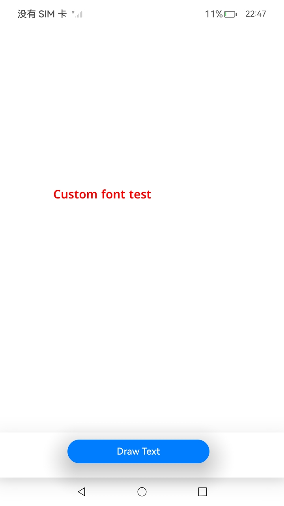

# 自定义字体的注册和使用接口使用说明（ArkTS）

## 介绍

本工程主要实现了对以下指南文档中 [自定义字体的注册和使用](https://docs.openharmony.cn/pages/v5.0/zh-cn/application-dev/graphics/custom-font-arkts.md) 示例代码片段的工程化，主要目标是实现指南中示例代码需要与sample工程文件同源，以及除基本文字、排版属性之外，针对应用中不同文本的设计，开发者可能需要设置使用不同的绘制样式或能力，以凸显对应文本的独特表现或风格，此时可以结合使用多种绘制样式进行文本的渲染。

## 效果预览

|  |
|---------------------------------|

**使用方法：**

1. 该工程可以选择在模拟器和开发板上运行。
2. 点击构建，即可在生成的应用中点击对应的按钮进行图案的绘制。
3. 进入”DocsSample/graphic/ArkGraphics2D/CustomFont/entry/src/ohosTest/ets/test/Ability.test.ets“文件，可以对本项目进行UI的自动化测试。

## 工程目录

```
ArkTSDrawing
├──entry/src/main
│  ├──ets  // ets代码区
│  │  ├──entryability
|  |  |  └──EntryAbility.ets        // 程序入口类
|  |  ├──entrybackupability
│  │  │  └──EntryBackupAbility.ets   
│  │  └──pages                      // 页面文件
│  │     └──Index.ets               // 主界面
|  ├──resources         			// 资源文件目录
```

## 具体实现

1. 利用Native XComponent来获取NativeWindow实例、获取布局/事件信息、注册事件回调并通过Drawing API实现在页面上绘制形状。
2. 通过在IDE中创建Native ArkTS 工程，在ts代码中定义对外接口为drawText，在js侧调用该接口可在页面上绘制出“Custom font test”自定义文字。
3. 在XComponent的OnSurfaceCreated回调中获取NativeWindow实例并初始化NativeWindow环境。调用loadFontSync同步接口，将路径对应的文件，以name作为使用的别名，注册自定义字体。loadFont使用指定的别名和文件路径注册对应字体，使用Promise异步回调。

## 相关权限

不涉及。

## 依赖

不涉及。

## 约束与限制

1. 本示例支持标准系统上运行，支持设备：RK3568。
2. 本示例支持API14版本SDK，版本号：5.0.2.126。
3. 本示例已支持DevEco Studio 5.0.2 Release (构建版本：5.0.7.210，构建 2025年5月6日)编译运行。

## 下载

如需单独下载本工程，执行如下命令：

```
git init
git config core.sparsecheckout true
echo code/DocsSample/graphic/Arkgraphics2D/CustomFont/ > .git/info/sparse-checkout
git remote add origin https://gitee.com/openharmony/applications_app_samples.git
git pull origin master
```