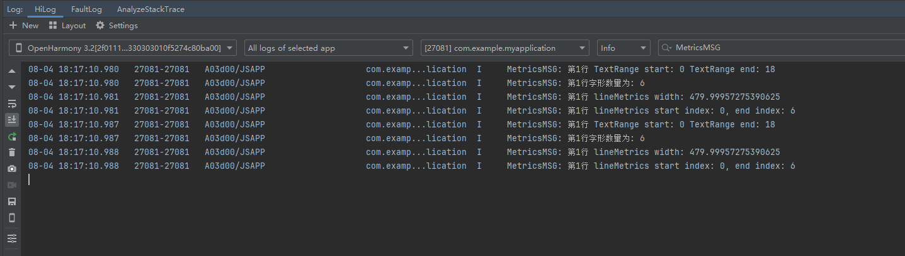

# 文本测量中常用接口使用说明（ArkTS）

## 介绍

本工程主要实现了对以下指南文档中 [文本测量](https://docs.openharmony.cn/pages/v5.0/zh-cn/application-dev/graphics/text-measure-arkts.md) 示例代码片段的工程化，主要目标是实现指南中示例代码需要与sample工程文件同源。

## 效果预览

|  |  |
|---------------------------------|---------------------------|

**使用方法：**

1. 该工程可以选择在模拟器和开发板上运行。
2. 点击构建，即可在生成的应用中点击对应的按钮进行图案的绘制。
3. 进入”DocsSample/graphic/ArkGraphics2D/TextMetrics/entry/src/ohosTest/ets/test/Ability.test.ets“文件，可以对本项目进行UI的自动化测试。

## 工程目录

```
ArkTSDrawing
├──entry/src/main
│  ├──ets  // ets代码区
│  │  ├──entryability
|  |  |  └──EntryAbility.ets        // 程序入口类
|  |  ├──entrybackupability
│  │  │  └──EntryBackupAbility.ets   
│  │  └──pages                      // 页面文件
│  │     └──Index.ets               // 主界面
|  ├──resources         			// 资源文件目录
```

## 具体实现

1. 利用Native XComponent来获取NativeWindow实例、获取布局/事件信息、注册事件回调并通过Drawing API实现在页面上绘制形状。
2. 通过在IDE中创建Native ArkTS 工程，在ts代码中定义对外接口为drawText，在js侧调用该接口可在页面上绘制出“文本测量测试”文字。
3. 在XComponent的OnSurfaceCreated回调中获取NativeWindow实例并初始化NativeWindow环境。调用getLongestLine获取段落最长行的宽度，getLongestLineWithIndent获取段落最长行的宽度（该宽度包含当前行缩进的宽度），getTextLines获取当前段落文本行对象数组，getLineMetrics获取段落所有行的度量信息，getLineMetrics(lineNumber: number)获取段落指定行的度量信息。包含行的高度、宽度、起始坐标等信息。超出当前段落排版后最大行数后返回 undefined。
## 相关权限

无。

## 依赖

不涉及。

## 约束和限制

1. 本示例支持标准系统上运行，支持设备：RK3568。
2. 本示例支持API14版本SDK，版本号：5.0.2.123。
3. 本示例已支持DevEco Studio 5.0.2 Release (构建版本：5.0.7.210，构建 2025年5月6日)编译运行。

## 下载

如需单独下载本工程，执行如下命令：

```
git init
git config core.sparsecheckout true
echo code/DocsSample/graphic/ArkGraphics2D/TextMetrics/ > .git/info/sparse-checkout
git remote add origin https://gitee.com/openharmony/applications_app_samples.git
git pull origin master
```