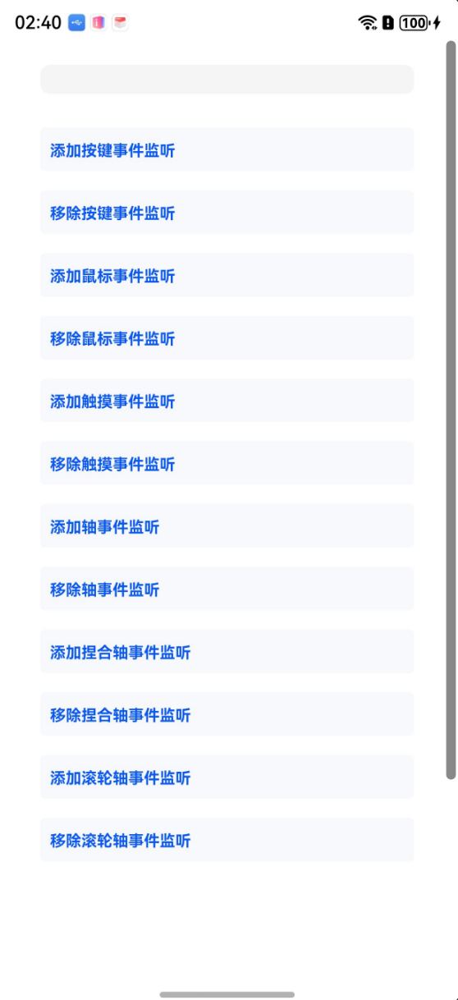

# 输入事件监听（C/C++）

## 介绍

本工程主要实现了对以下指南文档[事件监听开发指导](https://gitcode.com/openharmony/docs/blob/master/zh-cn/application-dev/device/input/inputmonitor-guidelines.md)
中示例代码片段的工程化，通过该工程可以添加和移除对于按键、输入事件（鼠标、触屏和轴事件）的监听。

## 效果预览

|  |
|----------------------------------|

使用说明：

1. 安装编译生成的hap包,打开应用。
2. 点击对应按键添加和移除按键事件监听，添加后使用键盘，页面会实时显示监听到的按键事件。
3. 点击对应按键添加和移除鼠标事件监听，添加后使用鼠标，页面会实时显示监听到的鼠标事件。
4. 点击对应按键添加和移除触摸事件监听，添加后进行触屏动作，页面会实时显示监听到的触摸事件。
5. 点击对应按键添加和移除轴事件监听，添加后在触摸板进行捏合动作或滚动鼠标滚轮，页面会实时显示监听到的捏合轴事件、滚轮轴事件。
6. 点击对应按键添加和移除捏合轴事件监听，添加后在触摸板进行捏合动作，页面会实时显示监听到的捏合轴事件事件。
7. 点击对应按键添加和移除滚轮轴事件监听，添加后滚动鼠标滚轮，页面会实时显示监听到的滚轮轴事件事件。
8. 进入"DocsSample/InputKit/NDKInputEventMonitor/entry/src/ohosTest/ets/test/Ability.test.ets"文件，可以对本项目进行UI的自动化测试。

## 工程目录

```
NDKInputEventMonitor
├──entry/src/main
│  ├──cpp                           // C++代码区
│  │  ├──CMakeLists.txt             // CMake配置文件
│  │  ├──napi_init.cpp              // 示例代码
|  |  ├──types
|  |  |  ├──libentry
|  |  |  |  ├──Index.d.ts
|  |  |  |  ├──oh-package.json5
│  ├──ets                           // ets代码区
│  │  ├──entryability
│  │  │  ├──EntryAbility.ts
|  |  ├──entrybackupability
|  |  |  ├──EntryBackupAbility.ets
│  │  ├──pages                      
│  │     ├──Index.ets               // 主界面
```

## 相关权限

ohos.permission.INPUT_MONITORING

## 依赖

不涉及。

## 约束和限制

1. 本示例支持标准系统上运行，支持设备：RK3568等。
2. 本示例支持API20版本SDK，版本号：6.0.0.36。
3. 本示例已支持使DevEco Studio 5.1.1 Release (构建版本：5.1.1.840，构建 2025年9月20日)编译运行。

## 下载

如需单独下载本工程，执行如下命令：

```
git init
git config core.sparsecheckout true
echo code/DocsSample/InputKit/NDKInputEventMonitor > .git/info/sparse-checkout
git remote add origin https://gitee.com/openharmony/applications_app_samples.git
git pull origin master
```

