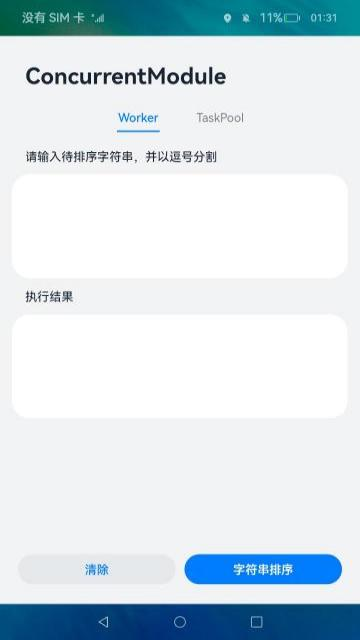
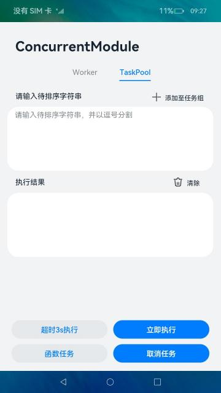

# 多线程任务

### 介绍

本示例通过[@ohos.taskpool](https://gitee.com/openharmony/docs/blob/master/zh-cn/application-dev/reference/apis-arkts/js-apis-taskpool.md)
和[@ohos.worker](https://gitee.com/openharmony/docs/blob/master/zh-cn/application-dev/reference/apis-arkts/js-apis-worker.md) 接口，展示了如何启动worker线程和taskpool线程。

### 效果预览

| 首页                              | 拷贝文件                             | worker页面                            | 任务池页面                           |
| --------------------------------- | ------------------------------------ | ------------------------------------- | ------------------------------------ |
|  |  |  |  |

使用说明

1. 在主界面，可以点击**字符串排序**和**拷贝文件**按钮进入对应的界面；

2. 点击**字符串排序**按钮进入多线程界面：

   worker：

   1. 选择**Worker**页签，输入待排序的字符串，并以逗号分割。

   2. 点击**字符串排序**按钮，会将排序前的字符串发送给worker线程，在worker线程实现字符串排序，然后将排序后的字符串发送给主线程，主线程中显示排序后的字符串。

   3. 点击**清除**按钮，清除字符串。

   taskpool：

   1. 选择**TaskPool**页签，输入待排序的字符串，并以逗号分割。

   2. 选择**添加至任务组**按钮，将当前字符串的排序任务添加至任务组。

   3. 点击**立即执行**按钮，如之前有添加至任务组操作则任务组执行完成后将排序后的字符串显示出来；如没有上述操作则执行当前任务完成，将排序后的字符串显示出来。

   4. 点击**超时3s执行**按钮，任务延迟3s后执行，执行完成后将排序后的字符串显示出来。

   5. 点击**函数任务**按钮，直接调用执行操作，执行完成后将排序后的字符串显示出来。需要注意的是，通过**函数任务**创建的task任务不支持取消。

   6. 点击**取消任务**按钮，会取消最后一个未执行的task任务。需要注意的是，只有当任务数大于最大线程数且任务未开始执行时才可以取消成功。

   7. 点击**清除**按钮，清除字符串。
   
   8. 点击**传递SendableClass**按钮，内存共享方式传递SendableClass。

3. 点击**拷贝文件**按钮进入文件拷贝界面：

   选择需要拷贝的文件，然后点击**拷贝文件**按钮，文件拷贝成功，触发事件日志显示沙箱下文件个数以及显示部分拷贝成功的文件名。

### 工程目录

```
entry/src/main/ets/
|---common
|   |---Common.ets                       // 公用方法，如bufferToString
|   |---Logger.ts                       // 日志
|---component
|   |---SendableTest.ets                 // 传递SendableClass页签
|   |---TaskPoolTab.ets                 // taskpool页签
|   |---test.ets                        // Sendable Class
|   |---WorkerTab.ets                   // worker页签
|---entryability
|---fileFs
|   |---MyWorker.ets                    // 批量拷贝文件
|---pages
|   |---CopyFile.ets                    // 拷贝文件界面，可选择把文件进行拷贝并显示触发事件后日志
|   |---Index.ets                       // 首页
|   |---StrSort.ets                     // worker和taskpool页签都在这里调用
|---workers
|   |---Worker.ts                       // worker线程
|   |---WorkerCopy.ts                   // 拷贝文件的worker线程
```

### 具体实现

* worker页签的实现在字符串排序页面调用，源码参考[StrSort.ets](entry/src/main/ets/pages/StrSort.ets)
  * 字符串排序：通过调用executeWorkerFunc()创建一个worker线程，把待排序字符串发送给worker线程，等worker线程排序完成后再把结果返回。
  * 清除：把字符串输入框和结果都清除。

* taskpool页签的实现在字符串排序页面调用，源码参考[StrSort.ets](entry/src/main/ets/pages/StrSort.ets)
  * 立即执行：如没有添加至任务组操作，通过调用executeImmediately()创建一个task任务，这个任务是立即执行字符串排序；如先进行了添加至任务组操作，则通过调用executeImmediately()将任务组执行完毕。
  * 超时3s执行：通过调用executeDelay()创建一个task任务，这个任务是延迟3s后执行字符串排序。
  * 函数任务：调用executeFunc()接口，不创建task任务，直接调用taskpool.execute()执行字符串排序。
  * 取消任务：调用cancelTask()接口，取消最后一个未执行的task任务。
  * 清除：把字符串输入框和结果都清除。
  * 添加至任务组：调用addTask()接口，将当前任务添加至任务组。

* 内存共享的实现在taskpool页面调用，源码参考[TaskPoolTab.ets](entry/src/main/ets/component/TaskPoolTab.ets)

* 批量拷贝文件的功能封装在MyWorker，源码参考：[MyWorker.ets](entry/src/main/ets/fileFs/MyWorker.ets)

  * 拷贝文件：在[CopyFile.ets](entry/src/main/ets/pages/CopyFile.ets)

    中调用MyWorker.WorkToCopyFiles()，在WorkToCopyFiles方法中向WorkerCopy线程发消息，并在WorkerCopy线程中批量拷贝，拷贝完成后将结果返回。

### 相关权限

不涉及。

### 依赖

不涉及。

### 约束与限制

1.本示例仅支持标准系统上运行, 支持设备：RK3568;。

2.本示例为Stage模型，支持API12版本SDK，版本号：5.0.0.21，镜像版本号：OpenHarmony 5.0.0.21。

3.本示例需要使用DevEco Studio NEXT Developer Preview1 (Build Version: 4.1.3.501, built on February 5, 2024)及以上版本才可编译运行。

### 下载

如需单独下载本工程，执行如下命令：

````
git init
git config core.sparsecheckout true
echo code/LanguageBaseClassLibrary/ConcurrentModule/ > .git/info/sparse-checkout
git remote add origin https://gitee.com/openharmony/applications_app_samples.git
git pull origin master
````