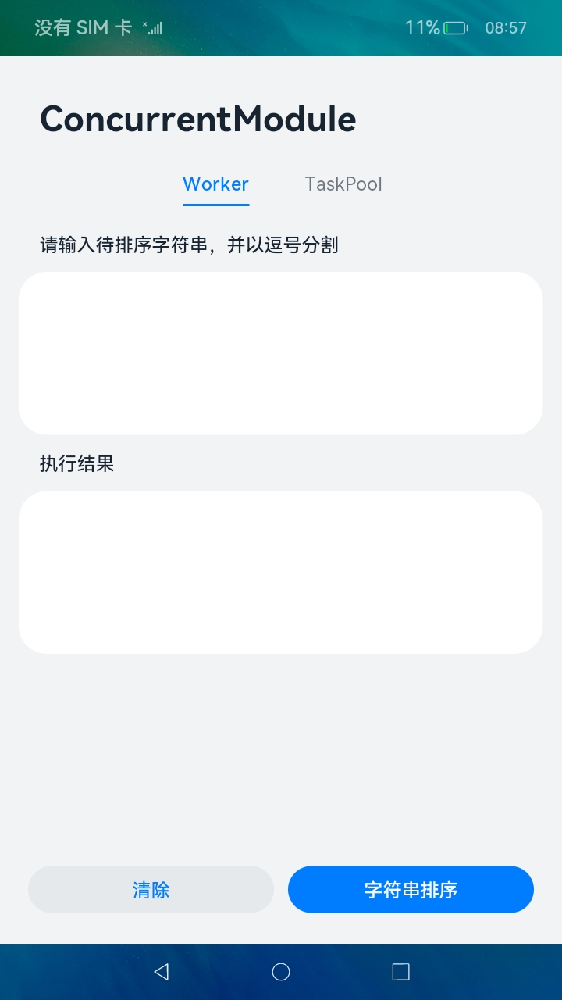
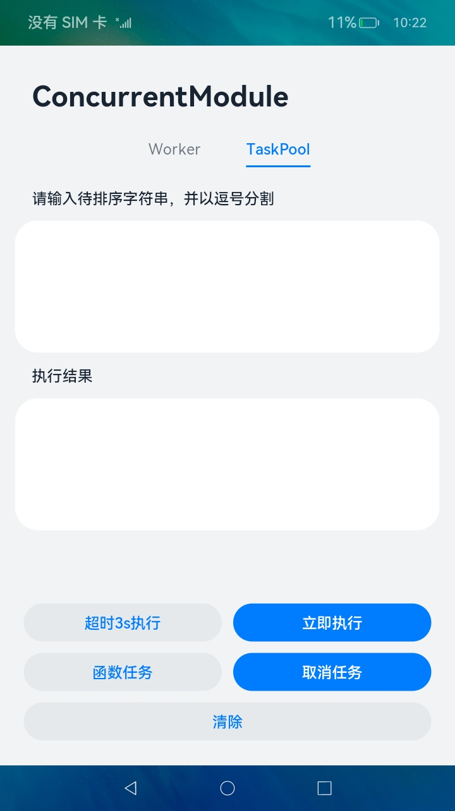

# 多线程任务

### 介绍

本示例通过[@ohos.taskpool](https://gitee.com/openharmony/docs/blob/master/zh-cn/application-dev/reference/apis/js-apis-taskpool.md)
和[@ohos.worker](https://gitee.com/openharmony/docs/blob/master/zh-cn/application-dev/reference/apis/js-apis-worker.md) 接口，展示了如何启动worker线程和taskpool线程。

### 效果预览

|worker页面|任务池页面|
|---|---|
|||

使用说明

worker：

1.选择**Worker**页签，输入待排序的字符串，并以逗号分割。

2.点击**字符串排序**按钮，会将排序前的字符串发送给worker线程，在worker线程实现字符串排序，然后将排序后的字符串发送给主线程，主线程中显示排序后的字符串。

3.点击**清除**按钮，清除字符串。

taskpool：

1.选择**TaskPool**页签，输入待排序的字符串，并以逗号分割。

2.点击**立即执行**按钮，任务执行完成后将排序后的字符串显示出来。

3.点击**超时3s执行**按钮，任务延迟3s后执行，执行完成后将排序后的字符串显示出来。

4.点击**函数任务**按钮，直接调用执行操作，执行完成后将排序后的字符串显示出来。需要注意的是，通过**函数任务**创建的task任务不支持取消。

5.点击**取消任务**按钮，会取消最后一个未执行的task任务。需要注意的是，只有当任务数大于最大线程数且任务未开始执行时才可以取消成功。

6.点击**清除**按钮，清除字符串。

### 工程目录

```
entry/src/main/ets/
|---component
|   |---TaskPoolTab.ets                 // taskpool页签
|   |---WorkerTab.ets                   // worker页签
|---entryability
|---pages
|   |---Index.ets                       // worker和taskpool页签都在这里调用
|---workers
|   |---Worker.ts                       // worker线程
``` 

### 具体实现

* worker页签的实现在首页调用，源码参考[Index.ets](entry/src/main/ets/pages/Index.ets)
  * 字符串排序：通过调用executeWorkerFunc()创建一个worker线程，把待排序字符串发送给worker线程，等worker线程排序完成后再把结果返回。
  * 清除：把字符串输入框和结果都清除。

* taskpool页签的实现在首页调用，源码参考[Index.ets](entry/src/main/ets/pages/Index.ets)
  * 立即执行：通过调用executeImmediately()创建一个task任务，这个任务是立即执行字符串排序。
  * 超时3s执行：通过调用executeDelay()创建一个task任务，这个任务是延迟3s后执行字符串排序。
  * 函数任务：调用executeFunc()接口，不创建task任务，直接调用taskpool.execute()执行字符串排序。
  * 取消任务：调用cancelTask()接口，取消最后一个未执行的task任务。
  * 清除：把字符串输入框和结果都清除。

### 相关权限

不涉及。

### 依赖

不涉及。

### 约束与限制

1.本示例仅支持标准系统上运行。

2.本示例需要使用DevEco Studio 3.1 Beta2 (Build Version: 3.1.0.400, built on April 7, 2023)才可编译运行。

### 下载

如需单独下载本工程，执行如下命令：

````
git init
git config core.sparsecheckout true
echo code/LaunguageBaseClassLibrary/ConcurrentModule/ > .git/info/sparse-checkout
git remote add origin https://gitee.com/openharmony/applications_app_samples.git
git pull origin master
````