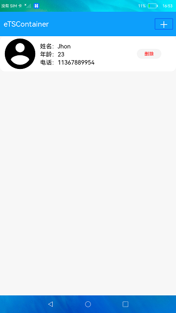
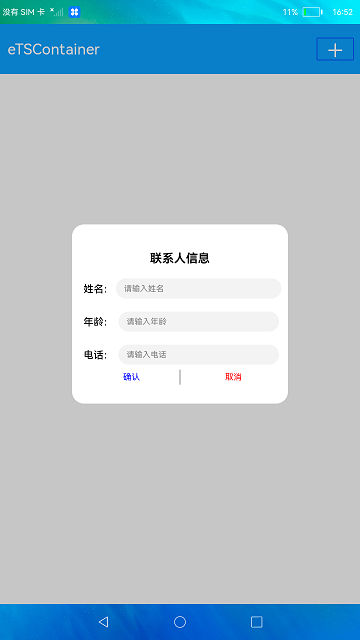

# 线性容器ArrayList

### 介绍

本示例使用了[@ohos.util.ArrayList]() 接口，展示了快速添加数据和删除指定index数据的功能。

### 效果预览

|主页|输入弹窗|
|---------|-------------|
|||

使用说明

1.点击屏幕右上方的 **+** 按钮，弹出添加联系人窗口；

2.在弹窗中填写姓名等相关信息；

3.点击弹窗的**确认**按钮后信息保存，并展示在主页面中；

4.点击**删除**按钮，删除对应联系人信息。

### 工程目录

```
entry/src/main/ets/
|---common
|   |---AddDialog.ets                // 弹窗组件
|---entryability
|---model
|   |---Information.ets              // 数据结构
|   |---Logger.ets                   // 日志文件
|---pages
|   |---Index.ets                    // 主页
```

### 具体实现

* 新增数据：在[Index.ets]()创建ArrayList类型的数据，然后调用ArrayList.add()实现新增数据
* 删除数据：在[Index.ets]()使用ArrayList.removeByIndex()实现删除指定index的数据

### 相关权限

不涉及。

### 约束与限制

1. 本示例仅支持在标准系统上使用。

2. 本示例已适配API10版本SDK，版本号：4.0.5.1。

3. 本示例需要使用DevEco Studio 3.1 Canary1 (Build Version: 3.1.0.100)及以上版本才可编译运行。

### 下载

如需单独下载本工程，执行如下命令：

````
git init
git config core.sparsecheckout true
echo Basic/Container/ > .git/info/sparse-checkout
git remote add origin https://gitee.com/openharmony/applications_app_samples.git
git pull origin master
````