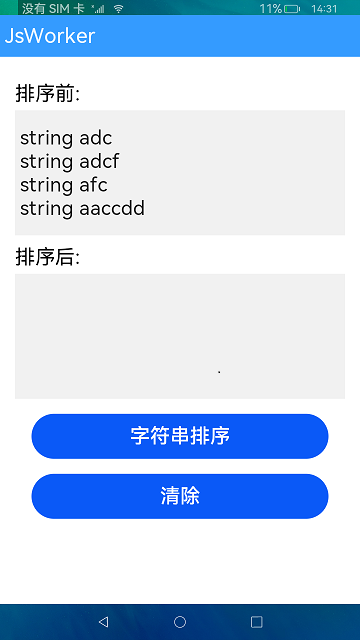

# 启动一个worker

### 介绍

本示例展示了如何启动一个worker线程，通过[@ohos.worker](https://gitee.com/openharmony/docs/blob/master/zh-cn/application-dev/reference/apis/js-apis-worker.md) 接口，实现worker线程和宿主线程的通信。实现效果如下：

### 效果预览
|主页|
|---|
|

使用说明


1.在首页中显示了排序前的四个字符串，点击**字符串排序**按钮，会将排序前的字符串发送给worker线程，在worker线程实现字符串排序，然后将排序后的字符串发送给主线程，主线程中显示排序后的字符串。

2.点击**清除**按钮，清除排序后的字符串。


### 工程目录

```
entry/src/main/js/MainAbility/
|---i18n                                // 国际化资源
|   |---en-US.json       
|   |---zh-CN.json                 
|---workers
|   |---worker.js                       // 定义需要Worker线程实现的功能
|---pages
|   |---Index.js                        // 首页js，宿主线程调用worker线程接口
|   |---Index.html                      // 首页页面
|   |---Index.css                       // 首页样式
``` 

### 具体实现

* Worker线程接口在worker.js中定义，事件触发在首页js中定义，源码参考[Index.js](https://gitee.com/tzliujiahui/applications_app_samples/blob/master/code/LaunguageBaseClassLibrary/JsWorker/entry/src/main/js/MainAbility/pages/index/index.js)
    * 导入模块Worker：@ohos.worker；
    * 定义按钮事件：index.js中触发按钮通过worker.postMessage()方法，宿主线程向Worker线程向发送消息；
    * Worker线程接收消息：通过调用worker.parentPort.onmessage()接收宿主线程消息，并在函数内定义业务功能（字符串排序）；
    * Worker线程把处理后的数据发给宿主线程：调用worker.parentPort.postMessage()。
    * 主线程接收数据，响应式数据渲染。
  
  
### 相关权限

不涉及。

### 依赖

不涉及。

### 相关概念

Worker：Worker是与主线程并行的独立线程。创建Worker的线程称之为宿主线程，Worker自身的线程称之为Worker线程。创建Worker传入的url文件在Worker线程中执行，可以处理耗时操作但不可以直接操作UI。


### 约束与限制

1.本示例仅支持标准系统上运行。

2.本示例需要使用DevEco Studio 3.1 Canary1 (Build Version: 3.1.0.100)及以上版本才可编译运行。

3.本示例已适配API version 9版本SDK，版本号：3.2.11.9。

### 下载

如需单独下载本工程，执行如下命令：

````
git init
git config core.sparsecheckout true
echo code/LaunguageBaseClassLibrary/JsWorker/ > .git/info/sparse-checkout
git remote add origin https://gitee.com/openharmony/applications_app_samples.git
git pull origin master
````