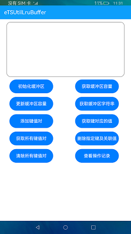

# 缓冲区

### 介绍

本示例展示了在eTS中缓冲区的初始化和api接口的使用,通过[@ohos.util](https://gitee.com/openharmony/docs/blob/master/zh-cn/application-dev/reference/apis/js-apis-util.md) 实现了缓冲区的管理功能。

### 效果预览

|主页|
|--------------------------------|
||

使用说明

1.在首页中分为两个区域，文本显示框和按钮区域，点击**初始化缓冲区**、**获取缓冲区容量**、**更新缓冲区容量**、**获取缓冲区字符串**、**添加键值对**、**获取键对应的值**、**获取所有键值对**、**删除指定键及其关联值**、**清除所有键值对**、**查看操作记录**按钮可以分别执行对应的操作并在文本显示框中显示操作的结果。

### 工程目录
```
entry/src/main/ets/
|---component
|   |---ActionSheetDialog.ets              // 弹窗组件
|   |---Operation.ets                      // 操作按钮组件
|   |---TitleBar.ets                       // 标题组件
|---entryAbility
|---model
|   |---Logger.ts                          // 日志工具
|---pages
|   |---index.ets                          // 首页
```

### 具体实现

* 缓冲区管理功能接口封装在Operation，源码参考:[Operation.ets](https://gitee.com/openharmony/applications_app_samples/blob/master/code/LaunguageBaseClassLibrary/UtilLruBuffer/entry/src/main/ets/component/Operation.ets)
   * 初始化缓冲区：使用new util.LruBuffer()来初始化缓冲区；
   * 获取缓冲区容量：调用buffer.getCapacity()函数可以来获取缓冲区的容量，如果需要更新缓冲区的容量可以使用buffer.updateCapacity(100)函数,这个100指的是想要设置的容量值；
   * 获取缓冲区字符串：将buffer转换成字符串能够获取缓冲区字符串,转换字符串方法可以使用buffer.toString(), 也可以使用JSON.stringfiy(buffer)；
   * 添加键值对：使用buffer.put()方法可以添加键值对，调用ramdomString函数来随机生成一个键和一个值作为put的两个参数，然后通过buffer.keys()方法能够获取缓冲区中所有的键，buffer.entries()可以获取键对应的值；
   * 删除键值对：buffer.clear()函数可以清除所有的键值对，而删除指定的键以及值可以根据action函数和buffer.keys()方法实现；
   * 查询操作记录：通过buffer.getCreateCount()、buffer.getMissCount()、buffer.getRemovalCount()、buffer.getMatchCount()、buffer.getPutCount()来查询操作的记录。

### 相关权限

不涉及。

### 依赖

不涉及。

### 约束与限制

1.本示例仅支持标准系统上运行。

2.本示例已适配API10版本SDK，版本号：4.0.5.1。

3.本示例需要使用DevEco Studio 3.1 Canary1 (Build Version: 3.1.0.100)及以上版本才可编译运行。

### 下载

如需单独下载本工程，执行如下命令：
```
git init
git config core.sparsecheckout true
echo code/LaunguageBaseClassLibrary/UtilLruBuffer/ > .git/info/sparse-checkout
git remote add origin https://gitee.com/openharmony/applications_app_samples.git
git pull origin master
```

