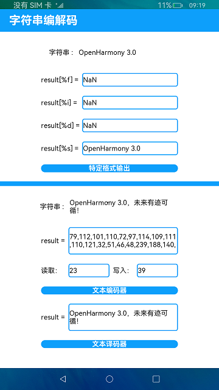

# 字符串编解码

### 简介

本示例对字符串进行了特定格式的输出，对错误码的内容进行了文本输出，对字符串的编码和解码做了演示结果。实现效果如下：

### 相关概念

特定格式输出：可以对字符串进行特定格式的输出。

文本编解码：可以对字符串进行编码和解码的操作。

### 相关权限

不涉及。

### 使用说明

1.点击**特定格式输出**，文本框会对该字符串进行不同格式的结果输出，例如整数、浮点数、字符串等格式。

2.点击**文本编码器**，会对上面字符串编码，输出编码后的文本，并输出编码返回的读取与写入的信息。

3.点击**文本译码器**，会对第二步编码后的文本内容进行译码，输出译码后的文本。

### 约束与限制

1.本示例仅支持在标准系统上运行。

2.本示例需要使用DevEco Studio 3.0 Beta4 (Build Version: 3.0.0.992, built on July 14, 2022)才可编译运行。