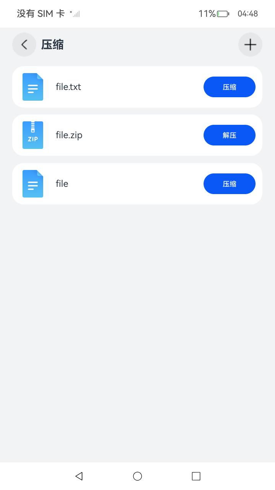
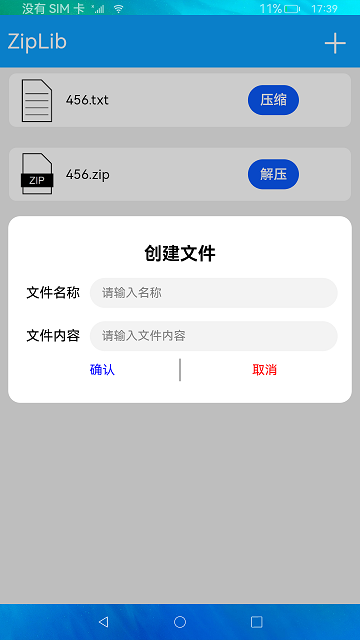

# 压缩与解压

### 介绍

本示例通过[@ohos.zlib](https://gitee.com/openharmony/docs/blob/master/zh-cn/application-dev/reference/apis/js-apis-zlib.md)
和[@ohos.fileio](https://gitee.com/openharmony/docs/blob/master/zh-cn/application-dev/reference/apis/js-apis-fileio.md) 接口，实现添加文件、解压和压缩文件场景。

### 效果预览

|主页|新建弹窗|
|---|---|
|||

使用说明

1.点击屏幕右上角 **+** 按钮，弹出创建文件窗口；

2.输入文件名称、文件内容，并点击 **确定** 按钮来创建文件；

3.文件创建成功后，文件名称自动追加.txt后缀并在主页面列表会显示，同时文件的物理地址为/data/app/el2/100/base/ohos.samples.ziplib/haps/entry/files/，点击 **压缩** 按钮，提示“文件压缩成功”，并会在文件列表创建一个相同名称的.zip文件；

4.点击压缩文件后的 **解压** 按钮，提示“文件解压成功”，并会再次在文件列表创建一个同名文件夹。

### 工程目录

```
entry/src/main/ets/
|---common
|   |---AddDialog.ets                   // 弹窗组件
|---entryability
|---model
|   |---DataSource.ets                  // 懒加载文件
|   |---Logger.ets                      // 日志文件
|---pages
|   |---Index.ets                       // 首页，接口都在这里调用
``` 

### 具体实现

* 添加文件、解压和压缩文件的接口都在首页调用，源码参考[Index.ets](https://gitee.com/openharmony/applications_app_samples/blob/master/code/LaunguageBaseClassLibrary/ZipLib/entry/src/main/ets/pages/Index.ets)
  * 添加文件：通过调用fileio.openSync()创建文件并调用fileio.writeSync()向文件中写入内容；
  * 压缩文件：通过调用zlib.zipFile()压缩文件；
  * 解压文件：通过zlib.unzipFile解压文件。

### 相关权限

不涉及。

### 依赖

不涉及。

### 约束与限制

1.本示例仅支持在标准系统上运行。

2.本示例需要使用DevEco Studio 3.1 Canary1 (Build Version: 3.1.0.100, built on November 3, 2022)才可编译运行。

3.解压与压缩相关接口的入参路径必须为context相关接口获取的相对路径，目前该接口仅支持操作应用目录下的文件。

4.本示例已适配API10版本SDK，版本号：4.0.5.1。

### 下载

如需单独下载本工程，执行如下命令：

```
git init
git config core.sparsecheckout true
echo code/LaunguageBaseClassLibrary/ZipLib/ > .git/info/sparse-checkout
git remote add origin https://gitee.com/openharmony/applications_app_samples.git
git pull origin master
```