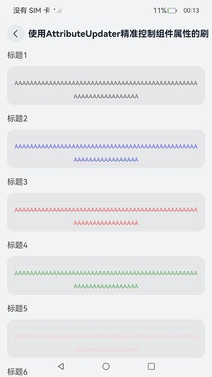
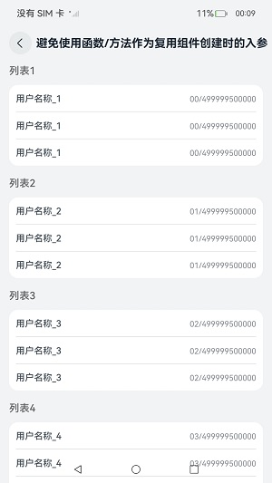

# 组件复用性能优化指导示例代码

### 介绍

本示例是[组件复用性能优化指导](https://gitcode.com/openharmony/docs/blob/master/zh-cn/application-dev/performance/component_recycle_case.md)示例代码，分场景展示了组件复用性能优化四建议。

### 效果展示

| 首页                                    | 减少组件复用的嵌套层级  |  精准控制组件刷新范围 |
|---------------------------------------|---|---|
|  |     |   |
| 使用reuseId标记不同的组件                            | 避免使用方法作为复用组件入参                                    |
|  |  |

### 使用说明

1. 在首页点击按钮，进入对应的页面展示组件复用优化场景。

### 工程目录

```
    ComponentReuse
    |---common                                                      // 公共模块
    |   |---Constants
    |   |---GlobalBuilderContext
    |---entryability                                                
    |   |---EntryAbility
    |---model                                                       // 数据model
    |   |---BasicDataSource
    |   |---ColorData
    |   |---FriendMomentData
    |---page                                                        // 首页
    |   |---Index
    |---view                                                        // 组件
    |   |---avoidusefunction                                        // 避免使用函数/方法作为复用组件创建时的入参
    |   |   |---WithFuncParam                                       // 避免使用函数/方法作为复用组件创建时的入参反例
    |   |   |---WithoutFuncParam                                    // 避免使用函数/方法作为复用组件创建时的入参正例
    |   |---preciseupdate                                           // 优化状态管理，精准控制组件刷新范围使用
    |   |   |---UpdaterComponent                                    // 使用AttributeUpdater精准控制组件属性的刷新，避免组件不必要的属性刷新正例
    |   |   |---UpdaterComponentNoModifier                          // 使用AttributeUpdater精准控制组件属性的刷新，避免组件不必要的属性刷新反例
    |   |   |---UpdaterStateVariableInAboutToReuse                  // 避免对@Link/@ObjectLink/@Prop等自动更新的状态变量，在aboutToReuse方法中再进行更新反例
    |   |   |---UsePropInReuse                                      // 使用@Link/@ObjectLink替代@Prop减少深拷贝，提升组件创建速度反例
    |   |---reducenestedlevels                                      // 减少组件复用的嵌套层级
    |   |   |---OneMoment
    |   |   |---OneMomentNoBuilder
    |   |   |---PageListSlideToHistotry                             // 减少组件复用的嵌套层级正例
    |   |   |---PageListSlideToHistotryNegative                     // 减少组件复用的嵌套层级反例
    |   |---usereuseid                                              // 复用组件嵌套结构会变更的场景，使用reuseId标记不同结构的组件构成
    |   |   |---WithoutReuseId                                      // 使用reuseId标记不同结构的组件构成反例
    |   |   |---WithReuseId                                         // 使用reuseId标记不同结构的组件构成正例
```

### 具体实现

本应用按照[组件复用性能优化指导](https://gitcode.com/openharmony/docs/blob/master/zh-cn/application-dev/performance/component_recycle_case.md)分为以下4个场景：

1. 减少组件复用的嵌套层级。

    反例：使用@Component自定义组件实现组件复用。

    正例：使用@Builder自定义组件实现组件复用。

2. 优化状态管理，精准控制组件刷新范围使用。

    正例1：使用AttributeUpdater修改组件属性，只精准刷新单一属性。

    反例1：不使用AttributeUpdater，导致组件所有属性进行刷新。

    反例2：在@Reusable修饰的复用组件中，在aboutToReuse方法中对@Link/@ObjectLink/@Prop修饰的变量进行更新，会造成不必要的方法执行和变量更新的耗时。
    
    反例3：使用@Prop修饰的变量传递参数时会进行深拷贝，导致基本类型、Map、Set、Date、Array外丢失类型，影响性能。

3. 复用组件嵌套结构会变更的场景，使用reuseId标记不同结构的组件构成。

    反例：通过if来控制复用组件走不同的分支，导致更新if分支时仍然可能走删除重创的逻辑。

    正例：通过不同的reuseId来标识需要复用的组件，省去走if删除重创的逻辑，提高组件复用的效率和性能。

4. 避免使用函数/方法作为复用组件创建时的入参

    反例：使用方法作为复用组件创建时的入参，方法在每次组件复用时都需要执行，会造成性能问题。

    正例：当方法返回值不变时，将其放在页面初始渲染时执行一次，然后在组件复用时直接使用方法返回值作为入参。

### 相关权限

不涉及

### 依赖

不涉及。

### 约束与限制

1. 本示例仅支持标准系统上运行。

2. 本示例为Stage模型，支持API20版本SDK。

3. 本示例需要使用DevEco Studio 6.0.0 Release及以上版本才可编译运行。

### 下载

如需单独下载本工程，执行如下命令：
```
git init
git config core.sparsecheckout true
echo code/Performance/ComponentReuse > .git/info/sparse-checkout
git remote add origin https://gitee.com/openharmony/applications_app_samples.git
git pull origin master
```