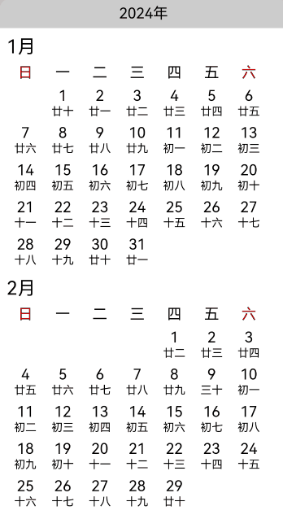

# 合理处理高负载组件的渲染文章示例代码

### 介绍

本示例是[合理处理高负载组件的渲染文章](https://atomgit.com/openharmony/docs/blob/master/zh-cn/application-dev/performance/reasonably-dispose-highly-loaded-component-render.md)的示例代码，主要讲解如何通过DisplaySync优化高负载组件的渲染，减少丢帧情况的发生。

### 效果预览

| 主页                                                     |
|--------------------------------------------------------|
|  |


**使用说明**

1. 通过组件复用，加载10年的日历数据，每个复用组件都在aboutToReuse接口中加载一个月的数据。
2. 通过DisplaySync的帧回调接口，在组件复用时将一个月的数据拆成多份，并在每一帧中加载其中一份数据，减少每一帧绘制的组件数量，减少丢帧现象的发生。

### 具体实现

**普通数据加载**，详细代码可参考[ReusePage.ets](entry/src/main/ets/pages/ReusePage.ets)。

1. 计算未来10年的日历数据（包括农历日期），放入数组中待用。

    ```typescript
    initCalenderData() {
      hiTraceMeter.startTrace('push_data_direct', 1);
      for (let k = this.currentYear; k < 2035; k++) {
        ...
      }
      hiTraceMeter.finishTrace('push_data_direct', 1);
    }
    ```

2. 通过List组件，在组件复用的aboutToReuse接口中直接加载数据

    ```typescript
    ...
    List() {
      LazyForEach(this.contentData, (monthItem: Month) => {
        ListItem() {
          ItemView({
            monthItem: monthItem,
            currentMonth: this.currentMonth,
            currentDay: this.currentDay
          }).reuseId('reuse_id_' + monthItem.days.length.toString())
        }
      })
    }
    ...
   
    @Reusable
    @Component
    struct ItemView {
      ...
      aboutToReuse(params: Record<string, Object>): void {
        hiTraceMeter.startTrace('reuse_' + (params.monthItem as Month).month, 1);
        this.monthItem = params.monthItem as Month;
        hiTraceMeter.finishTrace('reuse_' + (params.monthItem as Month).month, 1);
      }
      ...
      build() {
        Flex({ wrap: FlexWrap.Wrap }) {
          ...
        }
      }
    }
    ```
   
**通过DisplaySync优化列表数据加载**，详细代码可参考[ReuseFramePage.ets](entry/src/main/ets/pages/ReuseFramePage.ets)。

1. 计算未来10年的日历数据（包括农历日期），放入数组中待用。

     ```typescript
     initCalenderData() {
       hiTraceMeter.startTrace('push_data_direct', 1);
       for (let k = this.currentYear; k < 2035; k++) {
         ...
       }
       hiTraceMeter.finishTrace('push_data_direct', 1);
     }
     ```

2. 通过List组件，使用组件复用的aboutToReuse接口将数据放入一个数组中，不直接修改组件数据

   ```typescript
   @Reusable
   @Component
   struct ItemView {
      ...
      aboutToReuse(params: Record<string, Object>): void {
         hiTraceMeter.startTrace('reuse_' + (params.monthItem as Month).month, 1);
         this.temp.push(params.monthItem as Month);
         hiTraceMeter.finishTrace('reuse_' + (params.monthItem as Month).month, 1);
      }
         ...
   }
   ```
   
3. 通过DisplaySync的帧回调接口，遍历数组，将每一条数据都拆分成多份，分别放到单独一帧中加载

   ```typescript
   ...
   aboutToAppear(): void {
     hiTraceMeter.startTrace('appear_', 1);
     this.displaySync = displaySync.create();
     const range: ExpectedFrameRateRange = {
       expected: 120,
       min: 60,
       max: 120
     };
     this.displaySync.setExpectedFrameRateRange(range);
     this.displaySync.on('frame', () => {
       // 拆分数据，每次只加载5条数据
       ...
     });
     this.displaySync.start();
     ...
     hiTraceMeter.finishTrace('appear_', 1);
   }
   ...
   ```

### 工程目录
   ```
   highlyloadedcomponentrender                        // har类型
   |---pages
   |---|---GetDate.ets                                // 获取日期数据
   |---|---MainPage.ets                               // 首页
   |---|---MonthDataSource.ets                        // 懒加载数据类型
   |---|---ReuseFramePage.ets                         // 通过DisplaySync优化的页面
   |---|---ReusePage.ets                              // 正常加载数据的页面
   ```

### 依赖

[lunar_lite](https://ohpm.openharmony.cn/#/cn/detail/lunar_lite)

### 参考资料

[DisplaySync 文档](https://atomgit.com/openharmony/docs/blob/master/zh-cn/application-dev/reference/apis-arkgraphics2d/js-apis-graphics-displaySync.md)

### 约束与限制

1. 本示例支持标准系统上运行，支持设备：RK3568；

2. 本示例支持API26版本SDK，版本号：26.0.0.31；

3. 本示例已支持使DevEco Studio 6.0.0 Release (构建版本：6.0.2.642，构建 2026年3月5日)编译运行；

### 下载

如需单独下载本工程，执行如下命令：

```
git init
git config core.sparsecheckout true
echo code/Performance/HighlyLoadedComponentRender/ > .git/info/sparse-checkout
git remote add origin https://gitee.com/openharmony/applications_app_samples.git
git pull origin master
```
