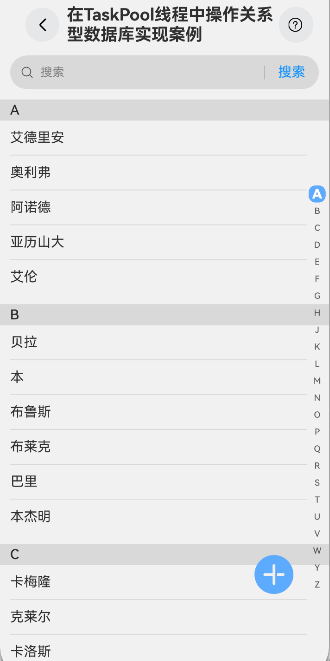

# 在TaskPool线程中操作关系型数据库实现案例

### 介绍

本示例通过通讯录场景实例进行讲解，介绍了在 TaskPool 线程中操作关系型数据库的方法，涵盖了单条插入（新增联系人）、批量插入（通讯录同步）、删除（删除联系人）、修改（更新联系人信息）和查询等基本操作。

### 效果图预览



**使用说明**

1. 进入页面，出现“点击同步通讯录数据”按钮。点击按钮后，将本地 JSON 数据分批插入数据库中。

2. 同步完成后，页面显示通讯录列表。点击列表项进入联系人的详情页面，点击加号按钮进入新增联系人页面。

3. 在详情页面，可以对联系人信息进行修改和删除操作。

### 实现思路

1. **首先，构建一个关系型数据库并封装数据库操作方法涉及几个关键步骤。**

- 通过getRdbStore方法初始化一个关系型数据库，用户可以根据STORE_CONFIG配置RdbStore的参数，使用Promise异步回调。
  ```javascript
  // 初始化数据库 
  public async initRdbStore(context: common.Context): Promise<void> {
    this.rdbStore = await rdb.getRdbStore(context, STORE_CONFIG);
    await this.createTable();
  }
  ```
- 使用executeSql接口初始化数据库表结构和相关数据。
  ```javascript
  // 创建数据库表
    private async createTable(): Promise<void> { 
    await this.rdbStore.executeSql(SQL_CREATE_TABLE);
  }
  ```
- 封装数据库操作方法分别为数据插入、数据删除、数据查询和数据查询。
  ```javascript
  // 单条数据插入数据库
  public async insertData(context: common.Context, contact: Contact): Promise<void> {
    let value1 = contact.name;
    let value2 = contact.phone;
    let value3 = contact.email;
    let value4 = contact.address;
    let value5 = contact.avatar;
    let value6 = contact.category;

    const valueBucket: ValuesBucket = {
      'name': value1,
      'phone': value2,
      'email': value3,
      'address': value4,
      'avatar': value5,
      'category': value6
    }
    if (this.rdbStore != undefined) {
      let ret = await this.rdbStore.insert(TABLE_NAME, valueBucket, rdb.ConflictResolution.ON_CONFLICT_REPLACE);
    }
  }

  // 批量插入数据库
  public async batchInsertData(context: common.Context, array: Array<Contact>): Promise<void> {
    let valueBuckets: ValuesBucket[] = [];
    for (let index = 0; index < array.length; index++) {
      let contactItem = array[index] as Contact;
      let value1 = contactItem.name;
      let value2 = contactItem.phone;
      let value3 = contactItem.email;
      let value4 = contactItem.address;
      let value5 = contactItem.avatar;
      let value6 = contactItem.category;

      const valueBucket: ValuesBucket = {
        'name': value1,
        'phone': value2,
        'email': value3,
        'address': value4,
        'avatar': value5,
        'category': value6
      }
      valueBuckets.push(valueBucket);
    }
    if (this.rdbStore != undefined) {
      let ret = await this.rdbStore.batchInsert(TABLE_NAME, valueBuckets);
    }
  }

  // 删除操作
  public async deleteData(context: common.Context, contact: Contact): Promise<void> { 
    this.rdbStore = await rdb.getRdbStore(context, STORE_CONFIG);

    predicates.or().equalTo('id', contact.id);
    this.rdbStore.delete(predicates, (err: BusinessError, row: number) => {
      if (err) {
        logger.info(TAG, 'delete failed, err: ' + err);
        return;
      }
      logger.info(TAG, `delete contact success:${row}`);
      promptAction.showToast({
        message: $r('app.string.operate_rdb_in_taskpool_delete_prompt_text', contact.name),
        duration: CommonConstants.PROMPT_DURATION_TIME
      });
    });

  }

  // 更新数据库
  public async updateData(context: common.Context, contact: Contact): Promise<void> {
    logger.info(TAG, 'update begin');
    if (!context) {
      logger.info(TAG, 'context is null or undefined');
    }

    const predicates = new rdb.RdbPredicates(TABLE_NAME);
    if (predicates === null || predicates === undefined) {
      logger.info(TAG, 'predicates is null or undefined');
    }

    if (!this.rdbStore) {
      logger.info(TAG, 'update rdbStore is null');
      await this.initRdbStore(context);
    }
    let value1 = contact.name;
    let value2 = contact.phone;
    let value3 = contact.email;
    let value4 = contact.address;
    let value5 = contact.avatar;
    let value6 = contact.category;

    const valueBucket: ValuesBucket = {
      'name': value1,
      'phone': value2,
      'email': value3,
      'address': value4,
      'avatar': value5,
      'category': value6
    }

    predicates.equalTo('id', Contact.id);

    if (this.rdbStore != undefined) {
      this.rdbStore.update(valueBucket, predicates, rdb.ConflictResolution.ON_CONFLICT_REPLACE,
        (err: BusinessError, row: number) => {
          if (err) {
            logger.info(TAG, "updated failed, err: " + err)
            return
          }
          logger.info(TAG, `update done:${row}`);
          promptAction.showToast({
            message: $r('app.string.operate_rdb_in_taskpool_update_prompt_text', contact.name),
            duration: CommonConstants.PROMPT_DURATION_TIME
          });
        })
    }
  }
  
  // 查询数据库
  public async query(context: common.Context): Promise<Array<Contact>> {
    if (!context) {
      logger.info(TAG, 'context is null or undefined');
      return [];
    }

    let predicates = new rdb.RdbPredicates(TABLE_NAME);
    predicates.orderByAsc('category')
    if (predicates === null || predicates === undefined) {
      logger.info(TAG, 'predicates is null or undefined');
      return [];
    }

    try {
      this.rdbStore = await rdb.getRdbStore(context, STORE_CONFIG);
      const resultSet: rdb.ResultSet =
        await this.rdbStore.query(predicates);
      logger.info(TAG, 'result is ' + JSON.stringify(resultSet.rowCount));
      // 处理查询到的结果数组
      return this.getListFromResultSet(resultSet);
    } catch (err) {
      logger.error(TAG, 'query result error:' + JSON.stringify(err));
      return [];
    }
  }
  ```

2. **创建任务池（taskpool）为数据库操作提供一个多线程的运行环境，将创建好的任务(新增、删除、修改、查询操作)放入taskpool内部任务队列，在子线程中实现数据库增删改查的任务，以此防止阻塞主线程。执行完成后，将结果回调至主线程，从而在主线程中更新数据源和用户界面。这样做不仅提升了应用的响应速度，还确保了用户交互的流畅性。以下代码以查询为例：（注：任务不会立即执行，而是等待分发到工作线程执行。）**[源码参考](casesfeature/operaterdbintaskpool/src/main/ets/view/TaskPool.ets)

  ```javascript
  // queryItem函数调用 需使用装饰器@Concurrent
  @Concurrent
  async function queryItem(context: common.Context): Promise<Array<Contact>> {
    return await DatabaseConnection.getInstance().query(context);
  }
 
  export async function taskPoolExecuteQuery(context: common.Context): Promise<Array<Contact>> {
    try {
      let task: taskPool.Task = new taskPool.Task(queryItem, context); // queryItem函数调用 需使用装饰器@Concurrent
      let result: Contact[] = await taskPool.execute(task) as Contact[];
      return result;
    } catch (err) {
      logger.error(TAG, 'query error:' + JSON.stringify(err));
      return [];
    }
  }
  ```

3. **在taskpool线程中操作关系型数据库方法的调用，将结果回调至主线程，在回调中来操作数据源。**[源码参考](casesfeature/operaterdbintaskpool/src/main/ets/view/AddressBookEdit.ets)

    ```javascript
    // 单条数据插入操作
    taskPoolExecuteInsert(context, this.result).then(() => {
        DynamicsRouter.popAppRouter();
        // 数据库插入成功后 操作列表数据源回调
        this.addCallback(this.result);
    });

    // 数据删除操作
    taskPoolExecuteDelete(context, this.contact).then(() => {
        if (this.sourceData) {
            // 数据库删除成功后 操作列表数据源
            DynamicsRouter.popAppRouter();
            this.deleteCallback(this.sourceData);
        }

    // 更新数据操作
    taskPoolExecuteUpdate(context, this.result).then(() => {
        DynamicsRouter.popAppRouter();
        // 数据库更新成功后 操作列表数据源回调
        this.editCallback(this.result);
    });

    // 数据查询操作
    queryRDB() {
        taskPoolExecuteQuery(context).then((contact: Array<Contact>) => {
            this.dataArray = contact.reduce((accumulator, item) => {
                // 如果类别不存在，则创建一个新的数组
                if (!accumulator[item.category]) {
                    accumulator[item.category] = [];
                }
                // 将当前项添加到相应类别的数组中
                accumulator[item.category].push(item);
                return accumulator;
            }, {} as Record<string, Contact[]>);

            // 清空类别数组
            this.categoryArray = [];

            // 使用 Object.entries() 遍历键值对
            Object.entries(this.dataArray).forEach(data => {
                let categoryContact: CategoryContact = { category: data[0], itemsContact: data[1] }
                this.categoryArray.push(data[0]);
                this.sourceArray.pushData(categoryContact);
            });
        });
    }
    ```

### 高性能知识点

本示例使用了[LazyForEach](https://docs.openharmony.cn/pages/v5.0/zh-cn/application-dev/reference/apis-arkui/arkui-ts/ts-rendering-control-lazyforeach.md)
进行数据懒加载，LazyForEach懒加载可以通过设置cachedCount属性来指定缓存数量，同时搭配[组件复用](https://docs.openharmony.cn/pages/v5.0/zh-cn/application-dev/performance/component-recycle.md)
能力以达到性能更好的效果。

### 工程结构&模块类型

```
operaterdbintaskpool                             // har类型
|---constant
|   |---CommonConstant.ets                       // 常量
|   |---RdbConstant.ets                          // Rdb常量
|---model
|   |---Contact.ets                              // Contact数据结构
|   |---DataSource.ets                           // 解析JSON数据 
|   |---DataSource.ets                           // 列表数据模型
|---view
|   |---AddressBookDetail.ets                    // 通讯录详情页
|   |---AddressBookEdit.ets                      // 通讯录编辑和新增页
|   |---AddressBookList.ets                      // 通讯录列表页
|   |---DatabaseConnection.ets                   // 数据库相关操作
|   |---OpetateRDBTaskPool.ets                   // 主页面
|   |---TaskPool.ets                             // TaskPool线程
```

### 参考资料

[AlphabetIndexer](https://docs.openharmony.cn/pages/v5.0/zh-cn/application-dev/reference/apis-arkui/arkui-ts/ts-container-alphabet-indexer.md)

[@ohos.i18n (国际化-I18n)(系统接口)](https://docs.openharmony.cn/pages/v5.0/zh-cn/application-dev/reference/apis-localization-kit/js-apis-i18n-sys.md)

[@ohos.taskpool（启动任务池）](https://docs.openharmony.cn/pages/v5.0/zh-cn/application-dev/reference/apis-arkts/js-apis-taskpool.md)

[@ohos.data.relationalStore（关系型数据库）](https://docs.openharmony.cn/pages/v5.0/zh-cn/application-dev/reference/apis-arkdata/js-apis-data-relationalStore.md)

[多线程能力场景化示例实践](https://docs.openharmony.cn/pages/v5.0/zh-cn/application-dev/performance/multi_thread_capability.md#%E5%9C%A8taskpool%E7%BA%BF%E7%A8%8B%E6%93%8D%E4%BD%9C%E5%85%B3%E7%B3%BB%E5%9E%8B%E6%95%B0%E6%8D%AE%E5%BA%93)

### 相关权限

不涉及。

### 依赖

不涉及。

### 约束与限制

1.本示例仅支持标准系统上运行。

2.本示例为Stage模型，支持API12版本SDK，SDK版本号（API Version 12 Release）。

3.本示例需要使用DevEco Studio版本号（DevEco Studio 5.0.0 Release）及以上版本才可编译运行。

### 下载

如需单独下载本工程，执行如下命令：

```shell
git init
git config core.sparsecheckout true
echo code/Performance/OperateRDBInTaskPool/ > .git/info/sparse-checkout
git remote add origin https://gitee.com/openharmony/applications_app_samples.git
git pull origin master
```

