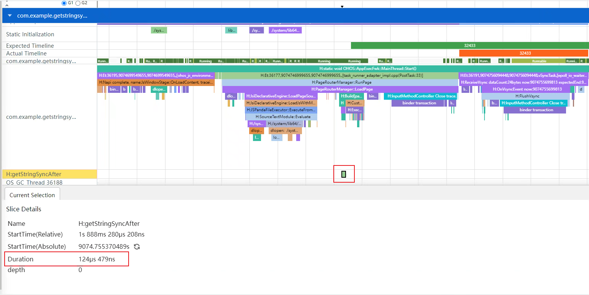
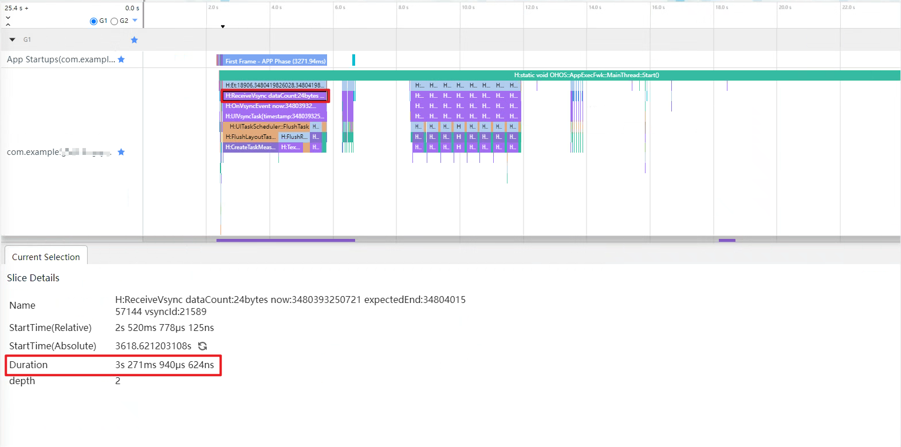
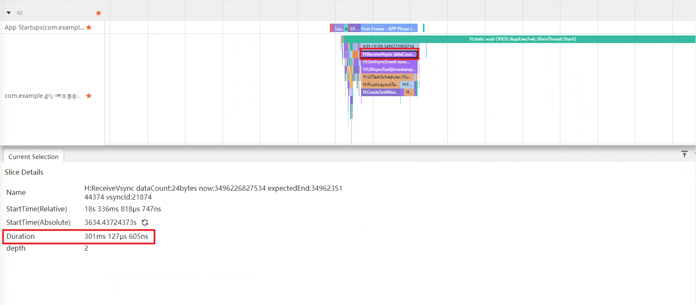
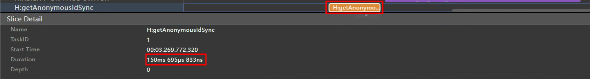
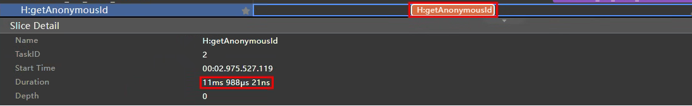

# 合理使用系统提供的接口

## 简介

在应用开发中，经常会调用系统提供的接口，比如读取本地文件、处理服务端数据等等。若对接口使用不合理，可能引起延迟、卡顿、丢帧等性能问题。本文以如下系统提供的接口为例，总结了使用中的注意事项。

- [ResourceManager](https://gitee.com/openharmony/docs/blob/master/zh-cn/application-dev/reference/apis-localization-kit/js-apis-resource-manager.md#resourcemanager)的getXXXSync接口
- [wordBreak](https://gitee.com/openharmony/docs/blob/master/zh-cn/application-dev/reference/apis-arkui/arkui-ts/ts-basic-components-text.md#wordbreak11)属性
- [IFAA](https://developer.huawei.com/consumer/cn/doc/harmonyos-references-V5/onlineauthentication-ifaa-api-V5)免密认证获取匿名化ID
- 国际化使用[Localization Kit](https://gitee.com/openharmony/docs/blob/master/zh-cn/application-dev/reference/apis-localization-kit/js-apis-intl.md)接口替换ArkTS运行时接口

## ResourceManager的getXXXSync接口

ResourceManager通过getXXXSync接口获取资源的方式有两种：通过resource对象```resourceManager.getStringSync($r('app.string.test'))```和通过id```resourceManager.getStringSync($r('app.string.test').id)```。
通过resource对象的方式在获取过程中发生了一次拷贝，通过id的方式只是对原对象的引用。
下面以[getStringSync](https://gitee.com/openharmony/docs/blob/master/zh-cn/application-dev/reference/apis-localization-kit/js-apis-resource-manager.md#getstringsync10)为例，测试一下这两种参数在方法中的使用是否会有耗时区别。

### 通过resource对象获取

```ts
@Entry
@Component
struct Index {
  @State message: string = 'getStringSync';

  aboutToAppear(): void {
    hiTraceMeter.startTrace('getStringSync', 1);
    // getStringSync接口的入参直接使用资源，未使用资源ID
    getContext().resourceManager.getStringSync($r('app.string.test'));
    hiTraceMeter.finishTrace('getStringSync', 1);
  }

  build() {
    RelativeContainer() {
      Text(this.message)
        .fontSize(50)
        .fontWeight(FontWeight.Bold)
    }
    .height('100%')
    .width('100%')
  }
}
```

通过SmartPerf Host工具抓取Trace。持续时间为1.621ms。


### 通过id获取

```ts
@Entry
@Component
struct Index {
  @State message: string = 'getStringSyncAfter';

  aboutToAppear(): void {
    hiTraceMeter.startTrace('getStringSyncAfter', 2);
    // getStringSync接口的入参使用了资源ID
    getContext().resourceManager.getStringSync($r('app.string.test').id);
    hiTraceMeter.finishTrace('getStringSyncAfter', 2);
  }

  build() {
    RelativeContainer() {
      Text(this.message)
        .fontSize(50)
        .fontWeight(FontWeight.Bold)
    }
    .height('100%')
    .width('100%')
  }
}
```

通过SmartPerf Host工具抓取Trace。持续时间为0.124ms。



### 总结

参数为资源信息时（1.621ms）比参数为资源ID值时（0.124ms）耗时更多。所以当需要使用类似方法时，使用资源ID值作为参数更优。

## wordBreak属性

零宽空格（Zero Width Space, ZWSP）是一个特殊的Unicode字符。它是一个不可见的字符，其宽度为零，不占用任何可见空间。在文本处理系统中，尽管它在视觉上是不可见的，但它在文本中确实存在，并可以作为潜在的断点，即允许在此位置断开行。这意味着如果一行文本过长需要自动换行时，文本可以在零宽空格的位置进行折行，而不影响单词的完整性。

虽然零宽空格在许多情况下都是有用的，但它也可能引起问题，特别是在文本处理和数据清洗中。不注意这些看不见的字符可能导致数据的意外错误、搜索失败、数据不一致等问题。因此，在处理来自不同源的文本数据时，了解和考虑这些不可见字符是非常重要的。

避免在文本组件内使用零宽空格(\u200b)的形式来设置断行规则，推荐使用[wordBreak](https://gitee.com/openharmony/docs/blob/master/zh-cn/application-dev/reference/apis-arkui/arkui-ts/ts-basic-components-text.md#wordbreak11)，wordBreak在使用性能方面优于零宽空格。例如推荐用法为：Text(this.diskName).wordBreak(WordBreak.BREAK_ALL)。

### 反例

```ts
@CustomDialog
export struct DiskFormatDialog {
  private diskName: string = '';
  build() {
    Column() {
      Text(this.diskName.split("").join("\u200B"))
      .textAlign(TextAlign.Start)
    }
  }
}
```

通过SmartPerf Host工具抓取Trace。启动时ReceiveVsync阶段耗时为3s271ms。



### 正例

```ts
@CustomDialog
export struct DiskFormatDialog {
  private diskName: string = '';
  build() {
    Column() {
      Text(this.diskName)
      .textAlign(TextAlign.Start)
      .wordBreak(WordBreak.BREAK_ALL)
    }
  }
}
```

通过SmartPerf Host工具抓取Trace。启动时ReceiveVsync阶段耗时为301ms。



### 总结

使用零宽空格时（3s271ms）比使用wordBreak时（301ms）耗时更多。所以当需要使用类似方法时，使用wordBreak性能更优。

## IFAA免密认证获取匿名化ID

在应用开发中，开发者可以使用IFAA免密认证模块实现免密登录，免密支付等业务场景，其中在主线程中使用同步接口getAnonymousIdSync获取IFAA免密认证的匿名化ID时，容易阻塞主线程操作，带来性能问题。建议开发者使用异步接口getAnonymousId进行替换，异步获取IFAA免密认证的匿名化ID。

### 使用同步接口getAnonymousIdSync

```ts
import { hiTraceMeter } from '@kit.PerformanceAnalysisKit';
import { ifaa } from '@kit.OnlineAuthenticationKit';

// 开发者需要按照IIFAA的TLV格式构造入参，并转换为Uint8Array参数；此处arg需要开发者替换为真实入参。
let arg = new Uint8Array([0]);

@Entry
@Component
export struct GetAnonymousIdSync {
  @State message: string = 'getAnonymousIdSync';

  build() {
    RelativeContainer() {
      Text(this.message)
        .fontSize(50)
        .fontWeight(FontWeight.Bold)
        .onClick(()=>{
          hiTraceMeter.startTrace('getAnonymousIdSync', 1);
          let getAnonIdResult: Uint8Array = ifaa.getAnonymousIdSync(arg);
          hiTraceMeter.finishTrace('getAnonymousIdSync', 1);
        })
    }
    .height('100%')
    .width('100%')
  }
}
```

使用IDE的Profiler工具抓取Trace数据，查看同步接口getAnonymousIdSync的调用耗时为150.695ms。



### 使用异步接口getAnonymousId

```ts
import { hiTraceMeter } from '@kit.PerformanceAnalysisKit';
import { ifaa } from '@kit.OnlineAuthenticationKit';

// 开发者需要按照IIFAA的TLV格式构造入参，并转换为Uint8Array参数；此处arg需要开发者替换为真实入参。
let arg = new Uint8Array([0]);

@Entry
@Component
export struct GetAnonymousId {
  @State message: string = 'getAnonymousId';

  build() {
    RelativeContainer() {
      Text(this.message)
        .fontSize(50)
        .fontWeight(FontWeight.Bold)
        .onClick(()=>{
          hiTraceMeter.startTrace('getAnonymousId', 1);
          ifaa.getAnonymousId(arg).then((getAnonIdResult: Uint8Array)=>{
          })
          hiTraceMeter.finishTrace('getAnonymousId', 1);
        })
    }
    .height('100%')
    .width('100%')
  }
}
```

使用IDE的Profiler工具抓取Trace数据，查看异步接口getAnonymousId的调用耗时为11.988ms。



### 总结

对比获取到的测试数据可以看出，异步接口getAnonymousId的调用耗时（11.988ms）远小于同步接口getAnonymousIdSync的调用耗时（150.695ms），因此建议开发者在主线程中获取IFAA免密认证的匿名化ID时，使用异步接口getAnonymousId获取。

## 国际化使用Localization Kit接口替换ArkTS运行时接口

在应用国际化处理时，由于ArkTS运行时兼容TS/JS，所以开发者可以直接使用国际化接口Intl实现包括时间日期格式化、数字格式化、排序格式化等国际化处理，而不需要导入额外模块。此外，开发者也可以使用Localization Kit接口intl实现相同功能。

但是，在分别使用Localization Kit接口intl和ArkTS运行时接口Intl创建同类对象时，Localization Kit接口的耗时更短，性能更优。并且在多次创建时，随着创建次数的增加，二者的耗时差异会更加明显。因此建议开发者在进行国际化开发时，使用Localization Kit模块提供的接口替换ArkTS运行时接口，减少执行耗时。

### 使用ArkTS运行时接口Intl

下面使用ArkTS运行时接口Intl执行100次对象创建，此时Intl不需要import导入，可以直接使用。

```ts
// 导入自定义打点模块
import { hiTraceMeter } from '@kit.PerformanceAnalysisKit';

// 循环创建100次RelativeTimeFormat对象，记录每次创建的耗时和总执行耗时
hiTraceMeter.startTrace('RelativeTimeFormat-100', 1);
for (let i = 0; i < 100; i++) {
  hiTraceMeter.startTrace('RelativeTimeFormat-single', 2);
  let relativeTimeFormat = new Intl.RelativeTimeFormat('zh-CN', { numeric: 'auto' });
  hiTraceMeter.finishTrace('RelativeTimeFormat-single', 2);
}
hiTraceMeter.finishTrace('RelativeTimeFormat-100', 1);

// 同样的过程创建DateTimeFormat、NumberFormat等其他类的实例
```

### 使用Localization Kit接口intl

使用Localization Kit接口替换ArkTS运行时接口创建100次同类对象，使用前需要先从Localization Kit导入intl。示例代码如下:

```ts
// 导入自定义打点模块
import { hiTraceMeter } from '@kit.PerformanceAnalysisKit';
// 导入国际化接口intl
import { intl } from '@kit.LocalizationKit';

// 循环创建100次RelativeTimeFormat对象，记录每次创建的耗时和总执行耗时
hiTraceMeter.startTrace('RelativeTimeFormat-100', 1);
for (let i = 0; i < 100; i++) {
  hiTraceMeter.startTrace('RelativeTimeFormat-single', 2);
  let relativeTimeFormat = new intl.RelativeTimeFormat('zh-CN', { numeric: 'auto' });
  hiTraceMeter.finishTrace('RelativeTimeFormat-single', 2);
}
hiTraceMeter.finishTrace('RelativeTimeFormat-100', 1);

// 同样的过程创建DateTimeFormat、NumberFormat等其他类的实例
```

### 性能对比

使用IDE的Profiler工具，分别获取使用ArkTS运行时接口和使用Localization Kit接口创建100次同类对象的耗时数据，从首次创建耗时、首次创建之后单次平均耗时和100次创建总耗时三个维度进行对比分析：

<table>
  <tr>
    <th>接口名</th>
    <th>接口来源</th>
    <th>首次创建耗时</th>
    <th>首次创建之后单次平均耗时</th>
    <th>100次创建总耗时</th>
  </tr>
  <tr>
    <td rowspan="2"><b>RelativeTimeFormat</b></td>
    <td>ArkTS运行时</td>
    <td>29ms 960μs</td>
    <td>4ms 244.1μs</td>
    <td>452ms 826.6μs</td>
  </tr>
  <tr>
    <td>Localization Kit</td>
    <td>18ms 323μs</td>
    <td>16μs</td>
    <td>20ms 285μs</td>
  </tr>
  <tr>
    <td rowspan="2"><b>Locale</b></td>
    <td>ArkTS运行时</td>
    <td>55μs</td>
    <td>8μs</td>
    <td>1ms 65μs</td>
  </tr>
  <tr>
    <td>Localization Kit</td>
    <td>26μs</td>
    <td>5μs</td>
    <td>744μs</td>
  </tr>
  <tr>
    <td rowspan="2"><b>DateTimeFormat</b></td>
    <td>ArkTS运行时</td>
    <td>5ms 982μs</td>
    <td>719μs</td>
    <td>77ms 866μs</td>
  </tr>
  <tr>
    <td>Localization Kit</td>
    <td>2ms 823μs</td>
    <td>250μs</td>
    <td>28ms 33μs</td>
  </tr>
  <tr>
    <td rowspan="2"><b>NumberFormat</b></td>
    <td>ArkTS运行时</td>
    <td>5ms 579μs</td>
    <td>61μs</td>
    <td>11ms 950μs</td>
  </tr>
  <tr>
    <td>Localization Kit</td>
    <td>200μs</td>
    <td>28μs</td>
    <td>3ms 209μs</td>
  </tr>
  <tr>
    <td rowspan="2"><b>Collator</b></td>
    <td>ArkTS运行时</td>
    <td>13ms 141μs</td>
    <td>6ms 483.8μs</td>
    <td>656ms 828μs</td>
  </tr>
  <tr>
    <td>Localization Kit</td>
    <td>657μs</td>
    <td>19μs</td>
    <td>2ms 823μs</td>
  </tr>
  <tr>
    <td rowspan="2"><b>PluralRules</b></td>
    <td>ArkTS运行时</td>
    <td>355μs</td>
    <td>133μs</td>
    <td>13ms 901μs</td>
  </tr>
  <tr>
    <td>Localization Kit</td>
    <td>254μs</td>
    <td>21μs</td>
    <td>2ms 609μs</td>
  </tr>
</table>

> **说明：** 以上数据来源均为版本DevEco Studio 5.0.3.706条件下测试得到，不同设备类型数据可能存在差异，测试数据旨在体现性能优化趋势，仅供参考。

从测试数据可以看出，无论是在首次创建还是在后续创建过程中，使用Localization Kit接口创建同类对象的耗时均少于使用ArkTS运行时接口，并且随着创建次数增加，总耗时差异也会逐渐增大，其中RelativeTimeFormat和Collator的收益更为明显。

因此在应用国际化时，建议开发者选择使用Localization Kit接口替换ArkTS运行时接口，提升应用性能。
