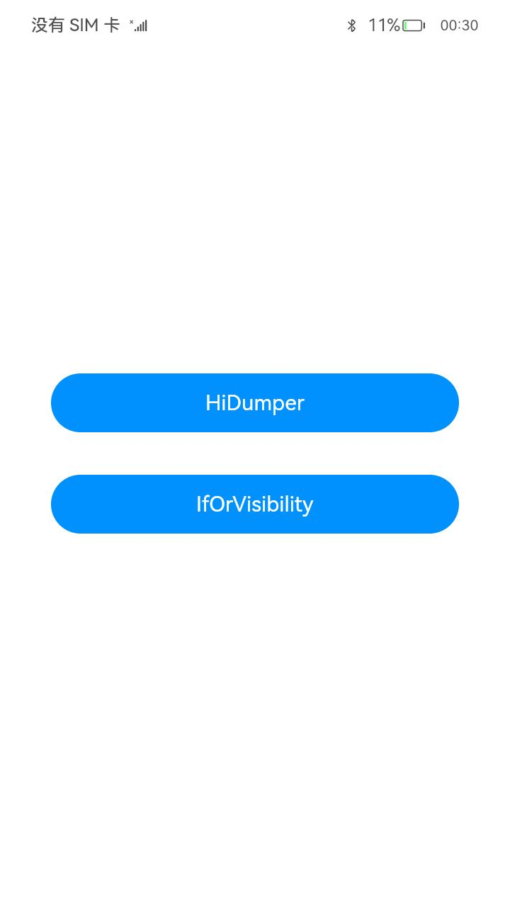

# 性能示例

### 介绍

本示例集成了条件渲染、动态加载以及HiDumper等场景来介绍如何提升应用性能。

### 效果预览
| 性能示例主页                                    | 场景主页                                             | 正例场景页                                     | 反例场景页                                |
| ------------------------------------- |--------------------------------------------------| -------------------------------------- | ----------------------------------- |
|  |  |  |  |

### 工程目录

```
features
|---/hiDumper/src/main/ets          // 列表类功能HAR共享包
|   |---/view    
|   |   |---ConditionView.ets                  // 显隐切换模块      
|   |   |---GridView.ets                       // 查看组件树模块
|   |   |---HidumperHomeView.ets               // 场景主页面模块           
|   |   |---VisibilityView.ets                 // 查看Visibility属性模块
|---/ifOrVisibility/src/main/ets    // 列表类功能HAR共享包
|   |---/util                                                              
|   |   |---/Constants.ets                          // 常量
|   |---/model                                                               
|   |   |---/SceneData.ets                          // 数据类型
|   |   |---/SceneMsg.ets                           // 本地数据
|   |---/view    
|   |   |---HidumperHomeView.ets                     // 场景主页面模块
|   |   |---/IfForStartUp    
|   |   |   |---BetterUseIf.ets                      // 首页渲染：条件渲染模块            
|   |   |   |---WorseUseVisibility.ets               // 首页渲染：显隐控制模块
|   |   |---/Reusable    
|   |   |   |---AlignContentFlex.ets                 // Text子组件           
|   |   |   |---IfWithoutReusable.ets                // 复杂子树：条件渲染+模块
|   |   |   |---IfWithReusable.ets                   // 复杂子树：条件渲染+组件复用模块     
|   |   |   |---MockComplexReusableSubBranch.ets     // 模拟复用复杂子组件
|   |   |   |---MockComplexSubBranch.ets             // 模拟复杂子组件
|   |   |---/StackForRenderControl    
|   |   |   |---RenderControlWithoutStack.ets        // 部分修改：条件渲染+容器限制模块         
|   |   |   |---RenderControlWithStack.ets           // 部分修改：条件渲染模块
|   |   |---/VisibilityForAnimate    
|   |   |   |---BetterUseVisibility.ets              // 频繁切换：显隐控制模块           
|   |   |   |---WorseUseIf.ets                       // 频繁切换：条件渲染
products/phone/entry/src/main/ets
|---/entryability
|   |---EntryAbility.ts                    // 封装整个模块启用，监听Ability对应的窗口等逻辑
|---/model                                                               
|   |---/DataType                          // 数据类型
|   |---/MockData                          // 本地数据
|---pages 
|   |---/hiDumper
|   |   |---ConditionPage.ets              // 显隐切换页面                
|   |   |---GridPage.ets                   // 查看组件树页面
|   |   |---HidumperHomePage.ets           // 场景主页面                   
|   |   |---VisibilityPage.ets             // 查看Visibility属性页面
|---/ifOrVisibility
|   |   |---IfOrVisibilityPage.ets             // 合理选择条件渲染首页
|   |   |---AnimateBetterUseVisibility.ets     // 频繁切换：显隐控制页面            
|   |   |---AnimateWorseUseIf.ets              // 频繁切换：条件渲染页面 
|   |   |---IfBetterWithReusable.ets           // 首页渲染：条件渲染页面                  
|   |   |---IfWorseWithoutReusable.ets         // 首页渲染：显隐控制页面
|   |   |---RenderControlBetterWithStack.ets   // 部分修改：条件渲染+容器限制页面               
|   |   |---RenderControlWorseWithoutStack.ets // 部分修改：条件渲染页面
|   |   |---StartBetterUseIf.ets               // 复杂子树：条件渲染+组件复用页面               
|   |   |---StartWorseUseVisibility.ets        // 复杂子树：条件渲染页面
|   |---/Index                                 // 性能示例首页                             
|---/utils
|   |---Logger.ets                         // 封装整个日志
```

### 具体实现

* HiDumper正例场景与反例场景两个模块:  
  
  * 正例场景  
    
    * 在ProfitScene的IconItem上添加动画，在IconView上使用到renderGroup接口(renderGroup(value: boolean): T)得到收益。  
    * 源码链接：[ProfitScene.ets](feature/renderGroup/src/main/ets/pages/ProfitScene.ets)，[IconView.ts](renderGroup/src/main/ets/view/IconView.ets)
  
  * 反例场景  
    
    * 在IconView的Image上添加动画，在NonIconView上使用到renderGroup接口(renderGroup(value: boolean): T)得到负收益。  
    * 源码链接：[NonProfitScene.ets](renderGroup/src/main/ets/pages/NonProfitScene.ets)，[NonIconView.ts](renderGroup/src/main/ets/view/NonIconView.ets)  
* ifOrVisibility四个场景，分别正反例，八个页面：
  * 针对显示和隐藏间频繁切换的场景
    * 反例：使用条件循环实现显示和隐藏间的切换； [WorseUseIf.ets](feature\ifOrVisibility\src\main\ets\view\VisibilityForAnimate\WorseUseIf.ets) 
    * 正例：使用显隐控制实现显示和隐藏间的切换； [BetterUseVisibility.ets](feature\ifOrVisibility\src\main\ets\view\VisibilityForAnimate\BetterUseVisibility.ets) 

  * 针对应用冷启动，加载绘制首页
    * 反例：对于首页初始时，不需要显示的组件，通过显隐控制进行隐藏； [WorseUseVisibility.ets](feature\ifOrVisibility\src\main\ets\view\IfForStartUp\WorseUseVisibility.ets) 
    * 正例：对于首页初始时，不需要显示的组件，通过条件渲染进行隐藏； [BetterUseIf.ets](feature\ifOrVisibility\src\main\ets\view\IfForStartUp\BetterUseIf.ets) 
  * 针对反复切换条件渲染的控制分支，但切换项仅涉及页面中少部分组件的场景
    * 反例：没有使用容器限制条件渲染组件的刷新范围； [RenderControlWithoutStack.ets](feature\ifOrVisibility\src\main\ets\view\StackForRenderControl\RenderControlWithoutStack.ets) 
    * 正例：使用容器限制条件渲染组件的刷新范围； [RenderControlWithStack.ets](feature\ifOrVisibility\src\main\ets\view\StackForRenderControl\RenderControlWithStack.ets) 

  * 针对反复切换条件渲染的控制分支，且控制分支中的每种分支内，组件子树结构都比较复杂的场景
    * 反例：没有使用组件复用实现条件渲染控制分支中的复杂子组件； [IfWithoutReusable.ets](feature\ifOrVisibility\src\main\ets\view\Reusable\IfWithoutReusable.ets) 
    * 正例：使用组件复用实现条件渲染控制分支中的复杂子组件； [IfWithReusable.ets](feature\ifOrVisibility\src\main\ets\view\Reusable\IfWithReusable.ets) 


### 相关权限

不涉及。  

### 依赖

不涉及。  

### 约束与限制

1.本示例已适配API version 10版本SDK，SDK版本号(API Version 10 Release),镜像版本号(4.0Release)。

2.本示例需要使用DevEco Studio 版本号(4.0Release)及以上版本才可编译运行。

### 下载

如需单独下载本工程，执行如下命令：  

```

```