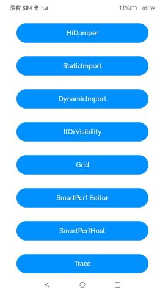

# 性能示例

### 介绍

本示例集成了条件渲染、动态加载以及HiDumper等场景来介绍如何提升应用性能。

### 效果预览
| 性能示例主页                          | 
|---------------------------------|
|  | 

HiDumper使用说明：  
1.点击性能示例主页的**HiDumper**按钮，进入**HiDumper查看组件信息**场景页。

1.点击HiDumper查看组件信息场景页的**查看应用组件树**进入场景页。

2.点击HiDumper查看组件信息场景页的**查看if/else组件**按钮，在场景中点击**显隐切换**按钮，查看图片显示隐藏。

3.点击HiDumper查看组件信息场景页的**查看visibility属性**按钮，在场景中依次点击**Visible**、**Hidden**、**Visible**、**None**，查看图片显示和隐藏。

常规加载页面使用说明：

1.点击性能示例主页的**StaticImport**按钮，进入**常规加载入口**场景页。

2.点击常规加载入口的**点击跳转常规加载案例**按钮，进入**常规加载主页**。

3.点击常规加载主页的**pageOne**按钮，进入**常规加载子页面**。

动态加载页面使用说明：

1.点击性能示例主页的**DynamicImport**按钮，进入**动态加载入口**场景页。

2.点击动态加载入口页的**点击跳转动态加载案例**按钮，进入**动态加载主页**。

3.点击动态加载主页的**pageOne**按钮，进入**动态加载子页面**。

ifOrVisibility使用说明：

1.点击性能示例主页的**ifOrVisibility**按钮，进入**合理选择条件渲染合显隐控制**场景页，其下有四组场景，八个页面。

2.分别点击**频繁切换：显隐控制页面** ，**频繁切换：条件渲染页面** ，进入频繁切换场景，可以通过点击**Switch visible and hidden**按钮，实现组件显示与隐藏间的切换，对比完成时延。

3.分别点击**首页渲染：条件渲染页面** ，**首页渲染：显隐控制页面**，进入首页渲染场景，可以通过点击**Show the Hidden on start**按钮，可以显示首页渲染时，初始被隐藏的组件，对比首页加载渲染完成时延。

4.分别点击**部分修改：条件渲染+容器限制页面**、**部分修改：条件渲染模块**，进入部分修改场景，可以通过点击**Switch Hidden and Show**按钮，可以对长列表中Text组件做部分修改，对比完成时延。

5.分别点击**复杂子树：条件渲染+组件复用页面**、**复杂子树：条件渲染页面**，进入复杂子树场景，可以通过点击**Change FlexAlign**按钮，可以Flex组件中子组件布局方式，对比布局修改完成时延。

Grid高性能使用说明：

1.点击性能示例主页的**使用LazyFoEach,cachedCount,组件复用**按钮，进入**懒加载+cachedCount+组件复用页面**场景页。

2.点击性能示例主页的**使用columnStart**按钮，进入**使用columnStart，columnEnd页面**场景页，点击**scrollToIndex:1900**按钮，通过性能打点方式，查看滑动耗时。

3.点击性能示例主页的**使用GridLayoutOptions**按钮，进入**使用GridLayoutOptions页面**场景页，点击**scrollToIndex:1900**按钮，通过性能打点方式，查看滑动耗时。

SmartPerfEditor使用说明：

1.打开显隐切换页面，点击**显示/隐藏Image**按钮，使用DrawingDoc录制回放功能抓取绘制信息。

SmartPerfHost使用说明：  

1.点击smartPerfHost示例主页的**SmartPerfHost**按钮，进入**SmartPerfHost查看组件信息**场景页。

2.点击SmartPerfHost查看FrameTimeline优化前场景页的**FrameTimeline优化前代码**按钮进入场景页。

3.点击SmartPerfHost查看FrameTimeline优化后场景页的**FrameTimeline优化后代码**按钮进入场景页。

4.点击SmartPerfHost查看AppStartup优化前场景页的**AppStartup优化前代码**按钮进入场景页。

5.点击SmartPerfHost查看AppStartup优化前场景页的**AppStartup优化后代码**按钮进入场景页。

Trace使用说明：

1.点击性能示例主页的**Trace**按钮，进入**懒加载示例**场景页。

BackgroundTask使用说明：

1.点击性能示例主页的**BackgroundTask**按钮，进入**后台任务**场景页，包括**短时任务**和**长时任务**两个子页面，同意授予通知权限。

2.点击**短时任务**按钮进入场景页，点击**开始计算**按钮执行任务。

3.点击**长时任务**按钮进入场景页，授予通知权限和定位权限，和点击**开启定位服务**按钮开启定位，点击**关闭定位服务**关闭定位。

WaterFlow使用说明：

1.点击性能示例主页的**WaterFlow**按钮，进入**WaterFlow**场景页

多线程共享内存页面使用说明：

1.点击性能示例主页的**MemoryShared**按钮，进入**多线程共享内存入口**场景页。

2.点击多线程共享内存入口页的**原子操作对比**按钮，进入**原子操作主页**。

3.点击多线程共享内存入口页的**锁的使用**按钮，进入**锁的使用子页面**。

Native跨线程调用使用说明：

1.点击性能示例主页的**NativeThreadsCallJS**按钮，进入**Native跨线程调用**场景页

2.点击Native跨线程调用页的**threadSafeTest**按钮，验证使用安全函数跨线程调用。

3.点击Native跨线程调用页的**libuvTest**按钮，验证使用libuv跨线程调用。

多线程间大数据传输使用说明：

1.点击性能示例主页的**ThreadDataTransfer**按钮，进入**多线程数据传输入口**场景页。

2.拖动**任务数**滑动条调整线程任务数，点击**传参方式**按钮，改变线程传参方式。

3.拖动**饱和度**滑动条，调整图片饱和度。

主线程和子线程的通信使用说明：

1.点击性能示例主页面的**ThreadCommunication**按钮，进入**主线程和子线程通信**场景页。

2.点击**场景一：独立的耗时任务**按钮，进入**独立的耗时任务**场景页，点击**加载图片**按钮。

3.点击**场景二：多个任务执行结果统一返回**按钮，进入**多个任务执行结果统一返回**场景页，点击**加载图片**按钮。

4.点击**场景三：TaskPool和主线程的即时通信**按钮，进入**TaskPool和主线程的即时通信**场景页，点击**加载图片**按钮。

5.点击**场景四：Worker和主线程的即时通信**按钮，进入**Worker和主线程的即时通信**场景页，点击**将图片变成4个**按钮。

6.点击**场景五：子线程同步调用主线程的接口**按钮，进入**子线程同步调用主线程的接口**场景页，点击**加载图片**按钮。

Web组件提升性能使用说明：

1.连接网络后点击性能示例主页的**WebPerformance**按钮，进入**Web组件提升性能**场景页。

2.点击**常规Web首页**按钮进入常规加载Web首页。

3.点击**进入网页**按钮进入常规Web组件页。

4.点击**下一页**按钮进入常规Web切换页。

5.点击**优化Web首页**按钮进入优化加载Web首页。

6.点击**进入网页**按钮进入优化Web组件页。

7.点击**下一页**按钮进入优化Web切换页。

### 工程目录

```
features
|---/dynamicImport/src/main/ets                      // 动态加载HAR共享包
|---|---/pages    
|   |   |---DynamicContentPageOne.ets                // 动态加载子页面     
|   |   |---DynamicEntryView.ets                     // 动态加载入口页面           
|   |   |---DynaHome.ets                             // 动态加载主页
|---/grid/src/main/ets                               // grid类功能HAR共享包
|   |---/view    
|   |   |---GridView.ets                             // 场景主页面模块       
|   |   |---GridLazyForEachView.ets                  // 懒加载+cachedCount+组件复用模块
|   |   |---GridColumnStartView.ets                  // 使用columnStart，columnEnd模块     
|   |   |---GridLayoutOptionsView.ets                // 使用GridLayoutOptions模块
|---/hiDumper/src/main/ets                           // 列表类功能HAR共享包
|   |---/view    
|   |   |---ConditionView.ets                        // 显隐切换模块      
|   |   |---GridView.ets                             // 查看组件树模块
|   |   |---HidumperHomeView.ets                     // 场景主页面模块           
|   |   |---VisibilityView.ets                       // 查看Visibility属性模块
|---/ifOrVisibility/src/main/ets                     // 列表类功能HAR共享包
|   |---/util                                                              
|   |   |---/Constants.ets                           // 常量
|   |---/model                                                               
|   |   |---/SceneData.ets                           // 数据类型
|   |   |---/SceneMsg.ets                            // 本地数据
|   |---/view    
|   |   |---HidumperHomeView.ets                      // 场景主页面模块
|   |   |---/IfForStartUp    
|   |   |   |---BetterUseIf.ets                       // 首页渲染：条件渲染模块            
|   |   |   |---WorseUseVisibility.ets                // 首页渲染：显隐控制模块
|   |   |---/Reusable    
|   |   |   |---AlignContentFlex.ets                  // Text子组件           
|   |   |   |---IfWithoutReusable.ets                 // 复杂子树：条件渲染+模块
|   |   |   |---IfWithReusable.ets                    // 复杂子树：条件渲染+组件复用模块     
|   |   |   |---MockComplexReusableSubBranch.ets      // 模拟复用复杂子组件
|   |   |   |---MockComplexSubBranch.ets              // 模拟复杂子组件
|   |   |---/StackForRenderControl    
|   |   |   |---RenderControlWithoutStack.ets         // 部分修改：条件渲染+容器限制模块         
|   |   |   |---RenderControlWithStack.ets            // 部分修改：条件渲染模块
|   |   |---/VisibilityForAnimate    
|   |   |   |---BetterUseVisibility.ets               // 频繁切换：显隐控制模块           
|   |   |   |---WorseUseIf.ets                        // 频繁切换：条件渲染
|---/smartPerfEditor/src/main/ets                     // 显隐类功能HAR共享包
|   |---/view    
|   |   |---SmartPerfEditorView.ets                   // 显隐切换模块  
|---/smartPerfHost/src/main/ets                       // SmartPerfHost功能HAR共享包
|   |---/view    
|   |   |---AppStartupBeforeOptimization.ets          // 冷启动耗时优化前模块      
|   |   |---AppStartupAfterOptimization.ets           // 冷启动耗时优化后模块
|   |   |---FrameTimelineBeforeOptimization.ets       // 丢帧测试优化前模块
|   |   |---FrameTimelineAfterOptimization.ets        // 丢帧测试优化后模块
|   |   |---SmartPerfHostHomeView.ets                 // 场景主页面模块   
|---/staticImport/src/main/ets                        // 常规加载HAR共享包
|---|---/pages    
|   |   |---StaticContentPageOne.ets                  // 常规加载子页面     
|   |   |---StaticContentPageTwo.ets                  // 常规加载子页面
|   |   |---StaticEntryView.ets                       // 常规加载入口页面           
|   |   |---StaticHome.ets                            // 常规加载主页
|---/ThreadCommunication/src/main/ets                 // 主线程和子线程通信
|---|---/pages    
|   |   |---IconItemSource.ets                        // 图片信息类     
|   |   |---IconView.ets                              // 图片Item组件     
|   |   |---IndependentTask.ets                       // 独立的耗时任务页面     
|   |   |---MultiTask.ets                             // 多任务统一返回页面     
|   |   |---TaskSendDataUsage.ets                     // TaskPool和主线程的即时通信页面
|   |   |---ThreadCommunicationHomePage.ets           // 主线程和子线程通信入口页面           
|   |   |---WorkerCallGlobalUsage.ets                 // 子线程同步调用主线程的接口页面
|   |   |---WorkerUsage.ets                           // Worker和主线程的即时通信页面
|---/trace/src/main/ets                               // Trace功能HAR共享包
|---|---/pages    
|   |   |---LazyForEachPage.ets                       // 懒加载示例场景页面     
|---|---/view                
|   |   |---IconView.ets                              // 懒加载示例场景子页面 
|---|---/viewmodel          
|   |   |---BasicDataSource.ets                       // 封装列表数据方法
|---/backgroundTask/src/main/ets                      // backgroundTask类功能HAR共享包
|   |---/view    
|   |   |---BackgroundTaskHomeView.ets                // 场景主页面模块       
|   |   |---TransientTaskView.ets                     // 短时任务页面
|   |   |---LongTermTaskView.ets                      // 长时任务页面
---/waterFlow/src/main/ets                            // waterFlow功能HAR共享包
|   |---/pages    
|   |   |---Index.ets                                 // 场景主页面模块       
|   |   |---WaterFlowDataSource.ets                   // 数据源
---/nativeThreadsCallJS/src/main/ets                  // native跨线程调用功能HAR共享包
|   |---/pages    
|   |   |---Index.ets                                 // 场景主页面模块
---/nativeThreadsCallJS/src/main/cpp                  // native跨线程调用功能native功能模块
|   |---/types 
|   |   |---hello.cpp                                 // 场景native功能代码
products/phone/entry/src/main/ets
|---/entryability
|   |---EntryAbility.ts                               // 封装整个模块启用，监听Ability对应的窗口等逻辑
|---/model                                                               
|   |---/DataType.ets                                 // 数据类型
|   |---/MockData.ets                                 // 本地数据
|---pages 
|   |---/dynamicImport
|   |   |---DynamicEntryView.ets                      // 动态加载入口页面
|   |   |---DynamicHome.ets                           // 动态加载主页
|   |   |---DynamicContentPageOne.ets                 // 动态加载内容页 
|   |---/grid
|   |   |---GridPage.ets                              // 场景主页面                 
|   |   |---GridLazyForEachPage.etss                  // 懒加载+cachedCount+组件复用页面
|   |   |---GridColumnStartPage.ets                   // 使用columnStart，columnEnd页面           
|   |   |---GridLayoutOptionsPage.ets                 // 使用GridLayoutOptions页面
|   |---/hiDumper
|   |   |---ConditionPage.ets                         // 显隐切换页面                
|   |   |---GridPage.ets                              // 查看组件树页面
|   |   |---HidumperHomePage.ets                      // 场景主页面                   
|   |   |---VisibilityPage.ets                        // 查看Visibility属性页面
|   |---/ifOrVisibility
|   |   |---IfOrVisibilityPage.ets                    // 合理选择条件渲染首页
|   |   |---AnimateBetterUseVisibility.ets            // 频繁切换：显隐控制页面            
|   |   |---AnimateWorseUseIf.ets                     // 频繁切换：条件渲染页面 
|   |   |---IfBetterWithReusable.ets                  // 首页渲染：条件渲染页面                  
|   |   |---IfWorseWithoutReusable.ets                // 首页渲染：显隐控制页面
|   |   |---RenderControlBetterWithStack.ets          // 部分修改：条件渲染+容器限制页面               
|   |   |---RenderControlWorseWithoutStack.ets        // 部分修改：条件渲染页面
|   |   |---StartBetterUseIf.ets                      // 复杂子树：条件渲染+组件复用页面               
|   |   |---StartWorseUseVisibility.ets               // 复杂子树：条件渲染页面  
|   |---/smartPerfEditor
|   |   |---SmartPerfEditorPage.ets                   // 显隐切换页面     
|   |---/smartPerfHost
|   |   |---AppStartupBeforeOptimizationPage.ets      // 冷启动耗时优化前页面                
|   |   |---AppStartupAfterOptimizationPage.ets       // 冷启动耗时优化后页面                
|   |   |---FrameTimelineBeforeOptimizationPage.ets   // 丢帧测试优化前页面
|   |   |---FrameTimelineAfterOptimizationPage.ets    // 丢帧测试优化后页面
|   |   |---SmartPerfHostPage.ets                     // 场景主页面                       
|   |---/staticImport
|   |   |---StaticEntryView.ets                       // 常规加载入口页面              
|   |   |---StaticHome.ets                            // 常规加载主页
|   |---/backgroundTask
|   |   |---BackgroundTaskPage.ets                    // 后台任务入口页面              
|   |   |---TransientTask.ets                         // 短时任务页面
|   |   |---LongTermTask.ets                          // 长时任务页面
|   |---/ThreadCommunication
|   |---|---/workers
|   |   |---|---Worker.ts                             // worker子线程   
|   |   |---IndependentTaskPage.ets                   // 独立的耗时任务页面     
|   |   |---MultiTaskPage.ets                         // 多任务统一返回页面     
|   |   |---TaskSendDataUsagePage.ets                 // TaskPool和主线程的即时通信页面     
|   |   |---ThreadCommunicationHomePage.ets           // 主线程和子线程通信入口页面     
|   |   |---WorkerCallGlobalUsagePage.ets             // 子线程同步调用主线程的接口页面     
|   |   |---WorkerUsagePage.ets                       // Worker和主线程的即时通信页面     
|   |---/trace
|   |   |---TracePage.ets                             // 懒加载示例首页     
|   |---/ThreadDataTransfer
|   |   |---ThreadDataTransferHomePage.ets            // 线程间大数据传输首页              
|   |---/waterFlow
|   |   |---WaterFlowPage.ets                         // WaterFlow示例首页                                                                                                                                       
|   |---/memoryShared
|   |   |---AtomicsUsage.ets                          // 原子操作页面              
|   |   |---LockUsage.ets                             // 锁应用页面 
|   |   |---MemorySharedHome.ets                      // 多线程共享内存入口页面           
|   |---/nativeThreadsCallJS
|   |   |---NativeThreadsCallJS.ets                   // native跨线程调用示例首页    
|   |---/webPerformance
|   |   |---WebHomePage.ets                           // Web提升性能示例首页
|   |   |---WebBrowserPage.ets                        // Web组件网页
|   |   |---WebInitializedPage.ets                    // Web优化性能主页
|   |   |---WebUninitializedPage.ets                  // Web常规主页
|   |---/Index                                                                     
|---/utils
|   |---Logger.ets                                    // 封装整个日志

```

### 具体实现

* HiDumper场景模块

  * 查看组件树
    * 在页面上添加Grid，每个GridItem嵌套多个Stack，然后通过HiDumper抓取组件树信息。
    * 源码链接：[GridView.ets](feature/hiDumper/src/main/ets/view/GridView.ets)
    
  * 查看if/else组件
    * 在页面上添加**显隐切换**按钮，添加一张图片，点击按钮后通过HiDumper抓取组件树信息。
    * 源码链接：[ConditionView.ets](feature/hiDumper/src/main/ets/view/ConditionView.ets)
    
  * 查看visibility属性
    * 在页面上添加**Visible**、**Hidden**、**None**按钮，添加一张图片，点击按钮后通过HiDumper抓取组件树信息。
    * 源码链接：[VisibilityView.ets](feature/hiDumper/src/main/ets/view/VisibilityView.ets)

* Navigation常规加载页面模块

  * 在Navigation组件加载内容页时，使用`import`常规加载子页面。
  * 源码链接：[StaticHome.ets](feature/staticImport/src/main/ets/pages/StaticHome.ets)

* Navigation动态加载页面模块

  * 在Navigation组件加载内容页时，使用`await import`实现动态按需加载。
  * 源码链接：[DynamicHome.ets](feature/dynamicImport/src/main/ets/pages/DynamicHome.ets)

* IfOrVisibility四个场景，分别正反例，八个页面：
  * 针对显示和隐藏间频繁切换的场景
    * 反例：使用条件循环实现显示和隐藏间的切换； [WorseUseIf.ets](feature\ifOrVisibility\src\main\ets\view\VisibilityForAnimate\WorseUseIf.ets) 
    * 正例：使用显隐控制实现显示和隐藏间的切换； [BetterUseVisibility.ets](feature\ifOrVisibility\src\main\ets\view\VisibilityForAnimate\BetterUseVisibility.ets) 

  * 针对应用冷启动，加载绘制首页
    * 反例：对于首页初始时，不需要显示的组件，通过显隐控制进行隐藏； [WorseUseVisibility.ets](feature\ifOrVisibility\src\main\ets\view\IfForStartUp\WorseUseVisibility.ets) 
    * 正例：对于首页初始时，不需要显示的组件，通过条件渲染进行隐藏； [BetterUseIf.ets](feature\ifOrVisibility\src\main\ets\view\IfForStartUp\BetterUseIf.ets) 
  * 针对反复切换条件渲染的控制分支，但切换项仅涉及页面中少部分组件的场景
    * 反例：没有使用容器限制条件渲染组件的刷新范围； [RenderControlWithoutStack.ets](feature\ifOrVisibility\src\main\ets\view\StackForRenderControl\RenderControlWithoutStack.ets) 
    * 正例：使用容器限制条件渲染组件的刷新范围； [RenderControlWithStack.ets](feature\ifOrVisibility\src\main\ets\view\StackForRenderControl\RenderControlWithStack.ets) 

  * 针对反复切换条件渲染的控制分支，且控制分支中的每种分支内，组件子树结构都比较复杂的场景
    * 反例：没有使用组件复用实现条件渲染控制分支中的复杂子组件； [IfWithoutReusable.ets](feature\ifOrVisibility\src\main\ets\view\Reusable\IfWithoutReusable.ets) 
    * 正例：使用组件复用实现条件渲染控制分支中的复杂子组件； [IfWithReusable.ets](feature\ifOrVisibility\src\main\ets\view\Reusable\IfWithReusable.ets)
    
* 高性能Grid二个场景，三个页面：
  * 针对Grid中使用懒加载，cachedCount，组件复用的场景
    * 在页面上添加Grid，GridItem使用懒加载，设置cachedCount，同时对GridItem中的子组件使用组件复用； [GridColumnStartView.ets](feature\grid\src\main\ets\view\GridLazyForEachView.ets)

  * 针对Grid中使用scrollToIndex滑动到指定位置的场景
    * 反例：使用columnStart，columnEnd设置GridItem大小，使用scrollToIndex滑动到指定GirdItem，通过性能打点方式查看滑动耗时情况； [GridColumnStartView.ets](feature\grid\src\main\ets\view\GridColumnStartView.ets)
    * 正例：使用GridLayoutOptions设置GridItem大小，使用scrollToIndex滑动到指定GirdItem，通过性能打点方式查看滑动耗时情况； [GridLayoutOptionsView.ets](feature\grid\src\main\ets\view\GridLayoutOptionsView.ets)

* SmartPerfEditor一个场景，一个页面：
  * 针对显示图片中查看是否存在冗余绘制的场景
    * 在页面上添加显隐切换按钮，点击按钮后，显示一张图片，通过DrawingDoc录制回放功能抓取绘制信息； [SmartPerfEditorView.ets](feature\smartPerfEditor\src\main\ets\view\SmartPerfEditorView.ets)

* SmartPerfHost页面模块
  * 应用冷启动，加载绘制页面
    * 应用优化前[AppStartupBeforeOptimization.ets](feature/smartPerfEditor/src/main/ets/view/AppStartupBeforeOptimization.ets)
    * 应用优化后[AppStartupAfterOptimization.ets](feature/smartPerfEditor/src/main/ets/view/AppStartupAfterOptimization.ets)
  * 列表场景丢帧问题优化
    * 应用优化前[FrameTimelineBeforeOptimization.ets](feature/smartPerfEditor/src/main/ets/view/FrameTimelineBeforeOptimization.ets)
    * 应用优化后[FrameTimelineAfterOptimization.ets](feature/smartPerfEditor/src/main/ets/view/FrameTimelineAfterOptimization.ets)

* 后台任务页面模块
  * 短时任务
    * 申请短时任务，应用后台执行耗时计算任务
    * 源码链接：[TransientTaskView.ets](feature/backgroundTask/src/main/ets/view/TransientTaskView.ets)
  * 长时任务
    * 模拟后台导航定位场景，申请定位类型长时任务，使用@ohos.geoLocationManager实现位置定位功能，必须在联网环境才能获取定位数据
    * 源码链接：[LongTermTaskView.ets](feature/backgroundTask/src/main/ets/view/LongTermTaskView.ets)

* 多线程共享内存页面模块
  * 原子操作场景
    * 使用原子或非原子操作，实现多线程操作累加器
    * 源码链接：[AtomicsUsage.ets](feature/memoryShared/src/main/ets/pages/AtomicsUsage.ets)
  * 锁应用场景
    * 使用或不适用锁，实现多线程写入文件
    * 源码链接：[LockUsage.ets](feature/memoryShared/src/main/ets/pages/LockUsage.ets)
    
* 多线程间大数据传输页面模块
  * 图片调整饱和度
    * 通过不同参数，实现多线程修改图片
    * 源码链接：[TreadUtil.ets](feature/ThreadDataTransfer/src/main/ets/utils/TreadUtil.ets)

* Web提升性能页面模块
  * 常规场景
    * 使用Web组件常规实现网页加载
    * 源码链接：[WebUninitializedPage.ets](feature/webPerformance/src/main/ets/pages/WebUninitialized.ets)
  * 优化场景
    * 使用预加载预连接提升web性能
    * 源码链接：[WebInitializedPage.ets](feature/webPerformance/src/main/ets/pages/WebInitialized.ets)

* 主线程和子线程间的通信
  * 将独立的耗时任务放在子线程中执行
    * 使用TaskPool实现
    * 源码链接：[IndependentTask.ets](feature/ThreadCommunication/src/main/ets/pages/IndependentTask.ets)
  * 多个任务一并返回结果
    * 使用TaskPool+TaskGroup实现
    * 源码链接：[MultiTask.ets](feature/ThreadCommunication/src/main/ets/pages/MultiTask.ets)
  * Task和主线程的数据通信
    * 使用TaskPool中的sendData()和onReceiveData()接口实现
    * 源码链接：[TaskSendDataUsage.ets](feature/ThreadCommunication/src/main/ets/pages/TaskSendDataUsage.ets)
  * 子线程同步调用主线程的接口
    * 在Worker中使用callGlobalCallObjectMethod()接口实现
    * 源码链接：
      * [WorkerCallGlobalUsage.ets](feature/ThreadCommunication/src/main/ets/pages/WorkerCallGlobalUsage.ets)
      * [Worker.ts](product/phone/entry/src/main/ets/pages/ThreadCommunication/workers/Worker.ts)
  * Worker和主线程的数据通信
    * 使用Worker的postMessage()和onmessage()接口实现
    * 源码链接：
      * [WorkerUsage.ets](feature/ThreadCommunication/src/main/ets/pages/WorkerUsage.ets)
      * [Worker.ts](product/phone/entry/src/main/ets/pages/ThreadCommunication/workers/Worker.ts)

### 相关权限

ohos.permission.INTERNET
ohos.permission.LOCATION
ohos.permission.LOCATION_IN_BACKGROUND
ohos.permission.APPROXIMATELY_LOCATION
ohos.permission.KEEP_BACKGROUND_RUNNING

### 依赖

不涉及。  

### 约束与限制

1.本示例已适配API version 10版本SDK，SDK版本号(API Version 10 Release),镜像版本号(4.0Release)。

2.本示例需要使用DevEco Studio 版本号(4.0Release)及以上版本才可编译运行。

### 下载

如需单独下载本工程，执行如下命令：  

```

 git init
 git config core.sparsecheckout true
 echo code/Performance/PerformanceLibrary/ > .git/info/sparse-checkout
 git remote add origin https://gitee.com/openharmony/applications_app_samples.git
 git pull origin master

```