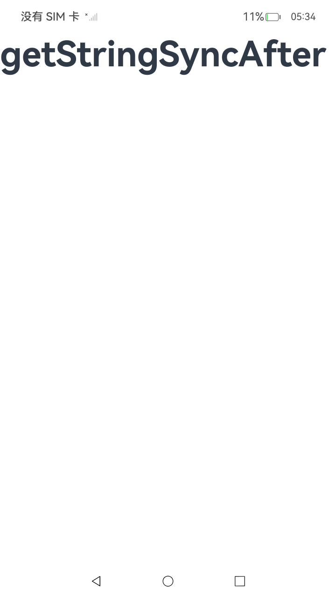
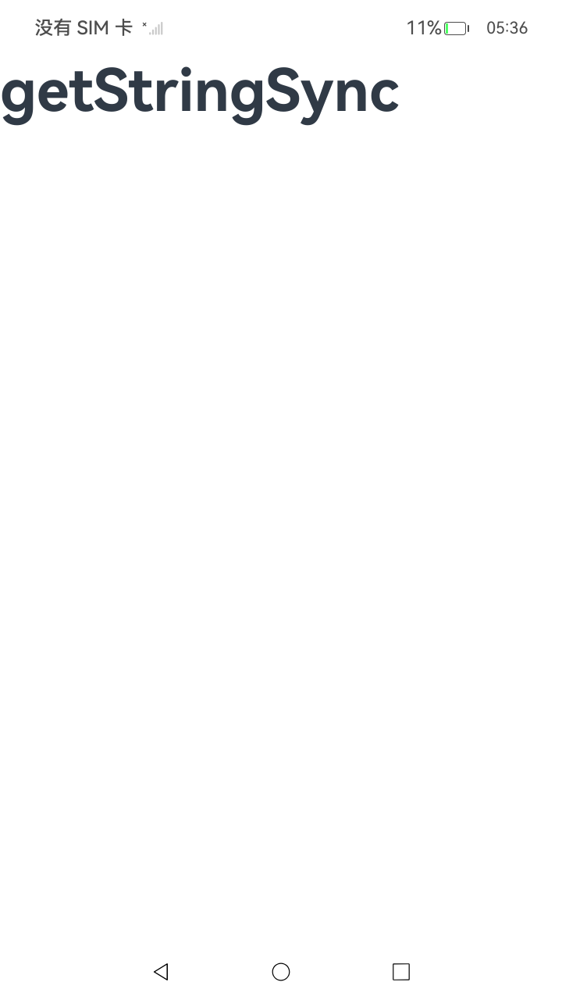
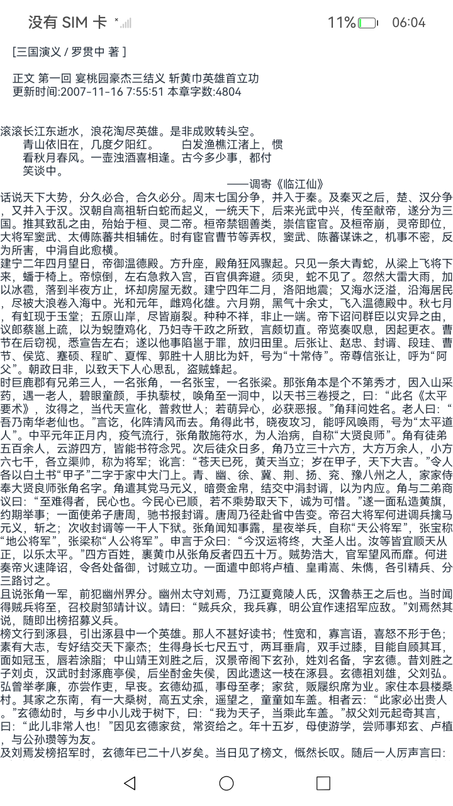
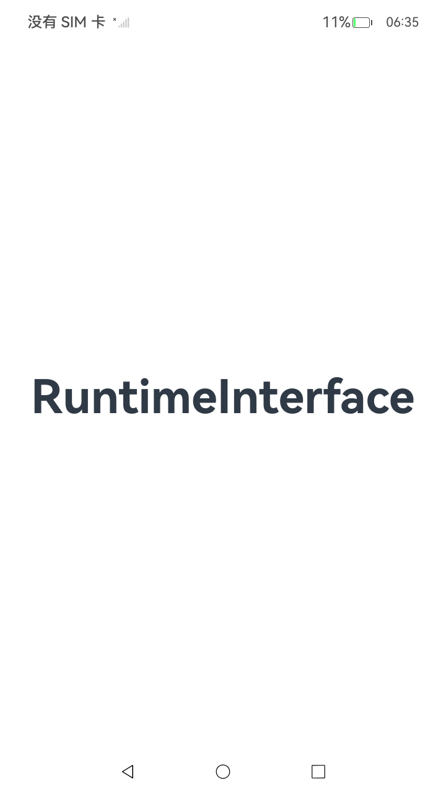

# 合理使用系统提供的接口
## 简介
在应用开发中，经常会调用系统提供的接口，比如读取本地文件、处理服务端数据等等。若对接口使用不合理，可能引起延迟、卡顿、丢帧等性能问题。本文以如下系统提供的接口为例，总结了使用中的注意事项。

- [ResourceManager](https://developer.huawei.com/consumer/cn/doc/harmonyos-references-V5/js-apis-resource-manager-V5#resourcemanager)的getXXXSync接口
- [wordBreak](https://developer.huawei.com/consumer/cn/doc/harmonyos-references-V5/ts-basic-components-text-V5#wordbreak11)属性
- [IFAA](https://developer.huawei.com/consumer/cn/doc/harmonyos-references-V5/onlineauthentication-ifaa-api-V5)免密认证获取匿名化ID
- [Localization Kit](https://developer.huawei.com/consumer/cn/doc/harmonyos-references-V5/js-apis-intl-V5)接口替换ArkTS运行时接口


## 使用说明
### ResourceManager的getXXXSync接口
 

ResourceManager通过getXXXSync接口获取资源的方式有两种：通过resource对象```resourceManager.getStringSync($r('app.string.test'))```和通过id```resourceManager.getStringSync($r('app.string.test').id)```。
通过resource对象的方式在获取过程中发生了一次拷贝，通过id的方式只是对原对象的引用。
以[getStringSync](https://developer.huawei.com/consumer/cn/doc/harmonyos-references-V5/js-apis-resource-manager-V5#getstringsync10)为例，参数为资源信息时比参数为资源ID值时耗时更多，**当需要使用类似方法时，使用资源ID值作为参数更优**。

#### 通过resource对象获取([源码示例链接](entry/src/main/ets/pages/GetStringSync.ets))

```ts
@Entry
@Component
struct Index {
  @State message: string = 'getStringSync';

  aboutToAppear(): void {
    hiTraceMeter.startTrace('getStringSync', 1);
    // getStringSync接口的入参直接使用资源，未使用资源ID
    getContext().resourceManager.getStringSync($r('app.string.test'));
    hiTraceMeter.finishTrace('getStringSync', 1);
  }

  build() {
    RelativeContainer() {
      Text(this.message)
        .fontSize(50)
        .fontWeight(FontWeight.Bold)
    }
    .height('100%')
    .width('100%')
  }
}
```
#### 通过id获取([源码示例链接](entry/src/main/ets/pages/GetStringSyncAfter.ets))

```ts
@Entry
@Component
struct Index {
  @State message: string = 'getStringSyncAfter';

  aboutToAppear(): void {
    hiTraceMeter.startTrace('getStringSyncAfter', 2);
    // getStringSync接口的入参使用了资源ID
    getContext().resourceManager.getStringSync($r('app.string.test').id);
    hiTraceMeter.finishTrace('getStringSyncAfter', 2);
  }

  build() {
    RelativeContainer() {
      Text(this.message)
        .fontSize(50)
        .fontWeight(FontWeight.Bold)
    }
    .height('100%')
    .width('100%')
  }
}
```

### wordBreak属性



零宽空格（Zero Width Space, ZWSP）是一个特殊的Unicode字符。它是一个不可见的字符，其宽度为零，不占用任何可见空间。在文本处理系统中，尽管它在视觉上是不可见的，但它在文本中确实存在，并可以作为潜在的断点，即允许在此位置断开行。这意味着如果一行文本过长需要自动换行时，文本可以在零宽空格的位置进行折行，而不影响单词的完整性。

虽然零宽空格在许多情况下都是有用的，但它也可能引起问题，特别是在文本处理和数据清洗中。不注意这些看不见的字符可能导致数据的意外错误、搜索失败、数据不一致等问题。因此，在处理来自不同源的文本数据时，了解和考虑这些不可见字符是非常重要的。

避免在文本组件内使用零宽空格(\u200b)的形式来设置断行规则，推荐使用[wordBreak](https://developer.huawei.com/consumer/cn/doc/harmonyos-references-V5/ts-basic-components-text-V5#wordbreak11)，**wordBreak在使用性能方面优于零宽空格。例如推荐用法为：Text(this.diskName).wordBreak(WordBreak.BREAK_ALL)**。

#### 反例([源码示例链接](entry/src/main/ets/pages/UsingZeroWidthSpace.ets))

```ts
@CustomDialog
export struct DiskFormatDialog {
  private diskName: string = '';
  build() {
    Column() {
      Text(this.diskName.split("").join("\u200B"))
      .textAlign(TextAlign.Start)
    }
  }
}
```

#### 正例([源码示例链接](entry/src/main/ets/pages/UsingWordBreak.ets))

```ts
@CustomDialog
export struct DiskFormatDialog {
  private diskName: string = '';
  build() {
    Column() {
      Text(this.diskName)
      .textAlign(TextAlign.Start)
      .wordBreak(WordBreak.BREAK_ALL)
    }
  }
}
```

### IFAA免密认证获取匿名化ID
 

在应用开发中，开发者可以使用IFAA免密认证模块实现免密登录，免密支付等业务场景，其中在主线程中使用同步接口getAnonymousIdSync获取IFAA免密认证的匿名化ID时，容易阻塞主线程操作，带来性能问题。**建议开发者使用异步接口getAnonymousId进行替换，异步获取IFAA免密认证的匿名化ID**。

#### 使用同步接口getAnonymousIdSync([源码示例链接](entry/src/main/ets/pages/GetAnonymousIdSync.ets))
```ts
import { hiTraceMeter } from '@kit.PerformanceAnalysisKit';
import { ifaa } from '@kit.OnlineAuthenticationKit';

// 开发者需要按照IIFAA的TLV格式构造入参，并转换为Uint8Array参数；此处arg需要开发者替换为真实入参。
let arg = new Uint8Array([0]);

@Entry
@Component
export struct GetAnonymousId {
  @State message: string = 'getAnonymousId';

  build() {
    RelativeContainer() {
      Text(this.message)
        .fontSize(50)
        .fontWeight(FontWeight.Bold)
        .onClick(()=>{
          hiTraceMeter.startTrace('getAnonymousId', 1);
          ifaa.getAnonymousId(arg).then((getAnonIdResult: Uint8Array)=>{
          })
          hiTraceMeter.finishTrace('getAnonymousId', 1);
        })
    }
    .height('100%')
    .width('100%')
  }
}
```

#### 使用异步接口getAnonymousId([源码示例链接](entry/src/main/ets/pages/GetAnonymousId.ets))
```ts
import { hiTraceMeter } from '@kit.PerformanceAnalysisKit';
import { ifaa } from '@kit.OnlineAuthenticationKit';

// 开发者需要按照IIFAA的TLV格式构造入参，并转换为Uint8Array参数；此处arg需要开发者替换为真实入参。
let arg = new Uint8Array([0]);

@Entry
@Component
export struct GetAnonymousIdSync {
  @State message: string = 'getAnonymousIdSync';

  build() {
    RelativeContainer() {
      Text(this.message)
        .fontSize(50)
        .fontWeight(FontWeight.Bold)
        .onClick(()=>{
          hiTraceMeter.startTrace('getAnonymousIdSync', 1);
          let getAnonIdResult: Uint8Array = ifaa.getAnonymousIdSync(arg);
          hiTraceMeter.finishTrace('getAnonymousIdSync', 1);
        })
    }
    .height('100%')
    .width('100%')
  }
}
```

### 国际化使用Localization Kit接口替换ArkTS运行时接口

 

在应用国际化处理时，由于ArkTS运行时兼容TS/JS，所以开发者可以直接使用国际化接口Intl实现包括时间日期格式化、数字格式化、排序格式化等国际化处理，而不需要导入额外模块。此外，开发者也可以使用Localization Kit接口intl实现相同功能。

但是，在分别使用Localization Kit接口intl和ArkTS运行时接口Intl创建同类对象时，Localization Kit接口的耗时更短，性能更优。并且在多次创建时，随着创建次数的增加，二者的耗时差异会更加明显。**建议开发者在进行国际化开发时，使用Localization Kit模块提供的接口替换ArkTS运行时接口，减少执行耗时**。

#### 使用ArkTS运行时接口Intl([源码示例链接](entry/src/main/ets/pages/RuntimeInterface.ets))

下面使用ArkTS运行时接口Intl执行100次对象创建，此时Intl不需要import导入，可以直接使用。

```ts
// 导入自定义打点模块
import { hiTraceMeter } from '@kit.PerformanceAnalysisKit';

// 循环创建100次RelativeTimeFormat对象，记录每次创建的耗时和总执行耗时
hiTraceMeter.startTrace('RelativeTimeFormat-100', 1);
for (let i = 0; i < 100; i++) {
  hiTraceMeter.startTrace('RelativeTimeFormat-single', 2);
  let relativeTimeFormat = new Intl.RelativeTimeFormat('zh-CN', { numeric: 'auto' });
  hiTraceMeter.finishTrace('RelativeTimeFormat-single', 2);
}
hiTraceMeter.finishTrace('RelativeTimeFormat-100', 1);

// 同样的过程创建DateTimeFormat、NumberFormat等其他类的实例
```

#### 使用Localization Kit接口intl([源码示例链接](entry/src/main/ets/pages/LocalizationKitInterface.ets))

使用Localization Kit接口替换ArkTS运行时接口创建100次同类对象，使用前需要先从Localization Kit导入intl。示例代码如下:

```ts
// 导入自定义打点模块
import { hiTraceMeter } from '@kit.PerformanceAnalysisKit';
// 导入国际化接口intl
import { intl } from '@kit.LocalizationKit';

// 循环创建100次RelativeTimeFormat对象，记录每次创建的耗时和总执行耗时
hiTraceMeter.startTrace('RelativeTimeFormat-100', 1);
for (let i = 0; i < 100; i++) {
  hiTraceMeter.startTrace('RelativeTimeFormat-single', 2);
  let relativeTimeFormat = new intl.RelativeTimeFormat('zh-CN', { numeric: 'auto' });
  hiTraceMeter.finishTrace('RelativeTimeFormat-single', 2);
}
hiTraceMeter.finishTrace('RelativeTimeFormat-100', 1);

// 同样的过程创建DateTimeFormat、NumberFormat等其他类的实例
```

## 工程目录

```
├──entry/src/main/ets
│  ├──entryability
│  │  └──EntryAbility.ets                   // 程序入口类
│  ├──pages
│  │  ├──Index.ets                          // 主页
│  │  ├──GetAnonymousId.ets                 // 异步获取IFAA免密认证的匿名化ID
│  │  └──GetAnonymousIdSync.ets             // 同步获取IFAA免密认证的匿名化ID
│  │  ├──GetStringSync.ets                  // 通过资源管理获取资源
│  │  └──GetStringSyncAfter.ets             // 通过id获取资源
│  │  ├──LocalizationKitInterface.ets       // LocalityKit国际化
│  │  └──RuntimeInterface.ets               // Intl国际化
│  │  ├──UsingWordBreak.ets                 // wordBreak属性断行
│  │  └──UsingZeroWidthSpace.ets            // 零宽空格断行
└──entry/src/main/resources                 // 应用静态资源目录
```

## 具体实现
1. ResourceManager通过getXXXSync接口获取资源的方式：通过resource对象```resourceManager.getStringSync($r('app.string.test'))```和通过id```resourceManager.getStringSync($r('app.string.test').id)```，通过id获取资源的性能优于通过resource对象获取资源对象。
2. 在文本处理和数据清洗中，零宽空格字符可能导致数据的意外错误、搜索失败、数据不一致等问题，建议使用wordBreak避免出现该问题；推荐用例：Text(this.diskName).wordBreak(WordBreak.BREAK_ALL)。
3. 主线程中使用同步接口getAnonymousIdSync获取IFAA免密认证的匿名化ID时，容易阻塞主线程操作，带来性能问题，建议使用异步接口getAnonymousId进行替换，异步获取IFAA免密认证的匿名化ID。
4. 在分别使用Localization Kit接口intl和ArkTS运行时接口Intl创建同类对象时，Localization Kit接口的耗时更短，性能更优；并且在多次创建时，随着创建次数的增加，二者的耗时差异会更加明显。建议在进行国际化开发时，使用Localization Kit模块提供的接口替换ArkTS运行时接口，减少执行耗时。

## 相关权限
不涉及

## 约束与限制
1. 本示例仅支持标准系统上运行。
2. 本示例已适配API20版本SDK，SDK版本号(API Version 20 Release)。
3. 本示例需要使用DevEco Studio 版本号(DevEco Studio 6.0.1 Beta1)及以上版本才可编译运行。