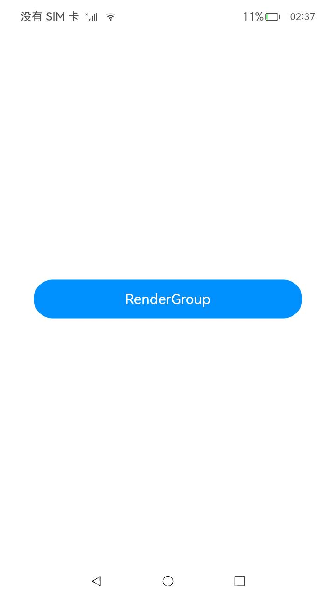
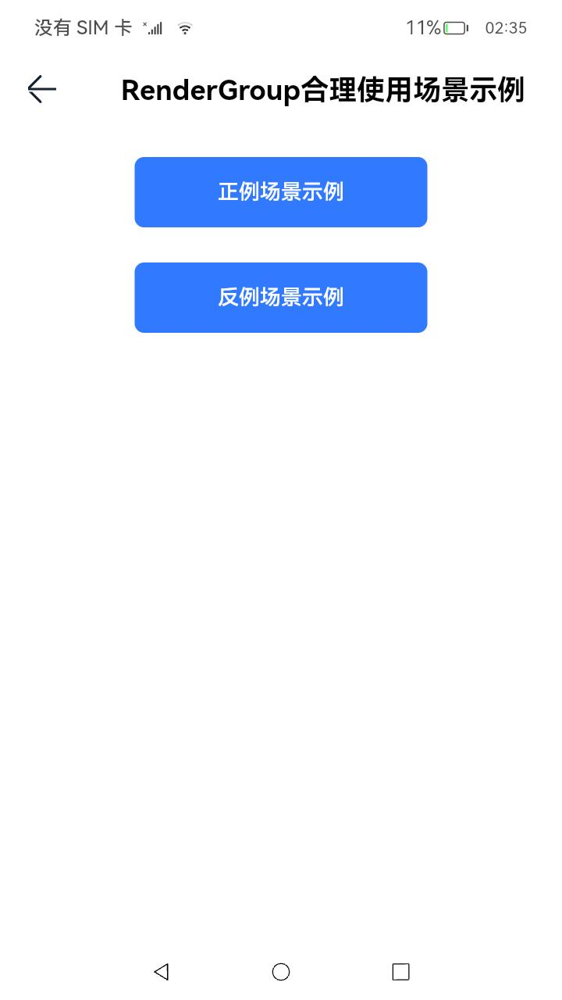
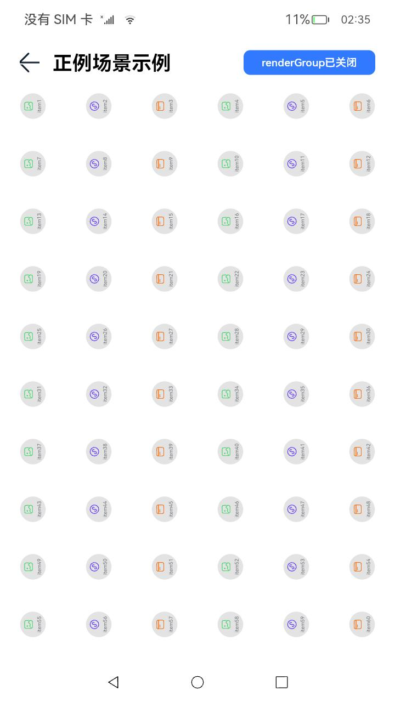
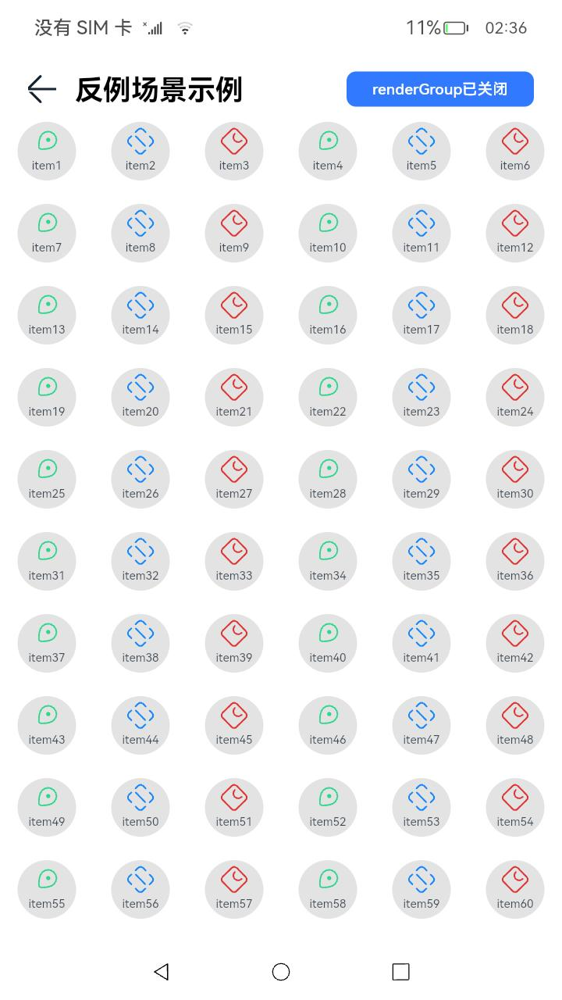

# 性能示例

### 介绍

本示例使用renderGroup接口实现了在单一页面上存在大量应用动效的组件时，使用renderGroup方法来解决卡顿问题，从而提升绘制能力。  

renderGroup原理说明：首次绘制组件时，若组件被标记为启用renderGroup状态，将对组件和其子组件进行离屏绘制，将绘制结果进行缓存。以后当需要重新绘制组件时，就会优先使用缓存而不必重新绘制了。从而降低绘制负载，优化渲染性能。

### 效果预览
| 性能示例主页                                    | 场景主页                                             | 正例场景页                                     | 反例场景页                                |
| ------------------------------------- |--------------------------------------------------| -------------------------------------- | ----------------------------------- |
|  |  |  |  |

使用说明  

1.点击性能示例主页面的**RenderGroup**按钮，在场景界面中点击**正例场景示例**，进入正例场景页，可以点击renderGroup开关按钮，可以通过Profiler分析性能数据。  

2.点击性能示例主页面的**RenderGroup**按钮，在场景界面中点击**反例场景示例**，进入反例场景页，可以点击renderGroup开关按钮，可以通过Profiler分析性能数据。

### 工程目录

```
features/renderGroup/src/main/ets          // 列表类功能HAR共享包
|---/pages    
|   |---NonProfitScene.ets                 // 反例场景页面            
|   |---ProfitScene.ets                    // 正例场景页面
|---/utils
|   |---Logger.ets                         // 封装整个日志
|---/view
|   |---IconView.ets                       // 正例场景模块
|   |---NonIconView.ets                    // 反例场景模块
products/phone/entry/src/main/ets
|---/entryability
|   |---EntryAbility.ts                    // 封装整个模块启用，监听Ability对应的窗口等逻辑
|---/model                                                               
|   |---/DataType                          // 数据类型
|   |---/MockData                          // 本地数据
|---pages 
|   |---/renderGroup
|   |   |---NonProfitScenePage.ets         // 反例场景页面
|   |   |---ProfitScenePage.ets            // 正例场景页面
|   |   |---RenderGroupHomePage.ets        // 场景主页面
|   |---/Index                             // 性能示例首页                              
|---/utils
|   |---Logger.ets                         // 封装整个日志

```

### 具体实现

* 本示例分成正例场景与反例场景两个模块  
  
  * 正例场景  
    
    * 在ProfitScene的IconItem上添加动画，在IconView上使用到renderGroup接口(renderGroup(value: boolean): T)得到收益。  
    * 源码链接：[ProfitScene.ets](feature/renderGroup/src/main/ets/pages/ProfitScene.ets)，[IconView.ts](renderGroup/src/main/ets/view/IconView.ets)
  
  * 反例场景  
    
    * 在IconView的Image上添加动画，在NonIconView上使用到renderGroup接口(renderGroup(value: boolean): T)得到负收益。  
    * 源码链接：[NonProfitScene.ets](renderGroup/src/main/ets/pages/NonProfitScene.ets)，[NonIconView.ts](renderGroup/src/main/ets/view/NonIconView.ets)  

### 相关权限

不涉及。  

### 依赖

不涉及。  

### 约束与限制

1.本示例已适配API version 10版本SDK，SDK版本号(API Version 10 Release),镜像版本号(4.0Release)。

2.本示例需要使用DevEco Studio 版本号(4.0Release)及以上版本才可编译运行。

### 下载

如需单独下载本工程，执行如下命令：  

```
git init  
git config core.sparsecheckout true  
echo code/Performance/renderGroup/ > .git/info/sparse-checkout  
git remote add origin https://gitee.com/openharmony/applications_app_samples.git  
git pull origin master  
```