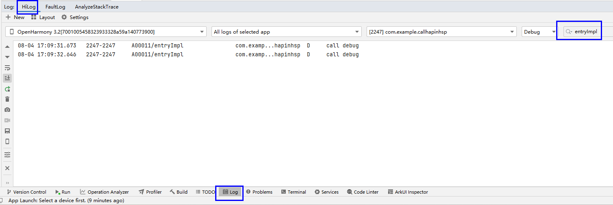
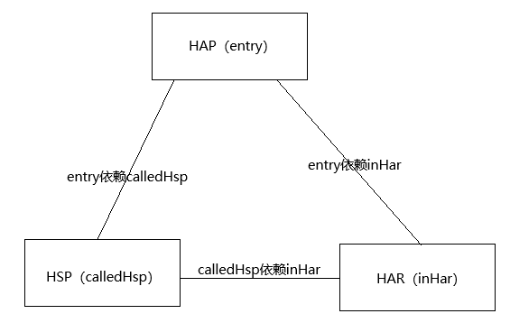

# HSP调用HAP指导

### 介绍

HSP无法直接通过依赖引用HAP，如果想实现在HSP中调用HAP的方法，本文给出一个解决方案供开发者使用，方案实现原理参考钩子函数。

### 效果预览

1. 查看应用运行结果。


2. 点击“click_to_hsp_index”跳转到calledHsp的页面，然后点击“calledHspIndex logger.debug”。


3. 查看日志运行情况。



### 工程目录



```
calledHsp/
|   |--- src/main/
|        |--- module.json5                            // calledHsp模块配置hsp类型："type": "shared"
|             |---ets
|                 |---utils/LoggerUtils.ets           // log实现的注册和调用log的方法
|                 |---pages/index.ets                 // 调用log接口打印日志
entry/src/
|   |--- main/
|        |--- module.json5                            // entry模块配置hap类型："type": "entry"
|             |---ets/
|                 |---entryability/EntryAbility.ets   // 应用启动的onCreate方法调用hsp提供的注册方法注册entry里面日志的实现
|                 |---loggerImpl/EntryLoggerImpl.ets  // log的方法具体实现。
|                 |---pages/index.ets                 // entry主应用入口，内含首页组件以及发起hsp跳转逻辑
inHar/
|   |--- src/main/
|        |--- module.json5                            // inhar模块配置har类型："type": "har"
|             |---ets/interfaces/iLogger.ets          // 定义接口和对应的方法
|   |---index.ets                                     // 暴露iLogger接口
``` 


### 具体实现

1. inHar提供接口定义。
2. entry依赖HAR，实现了inHar的定义接口，依赖了calledHsp，并向calledHsp注册了接口实现类。
3. calledHsp提供接口注册方法，调用HAP中的实现。

#### 新增工程和模块

### 相关权限

不涉及。

### 依赖

不涉及。

### 约束与限制

1.本示例仅支持在标准系统上运行。

2.本示例已适配API version 15 版本SDK

3.本示例需要使用DevEco Studio 5.0.3 Release (Build Version: 5.0.9.300, built on March 13, 2025)及以上版本才可编译运行。

### 下载

如需单独下载本工程，执行如下命令：
```

git init  
git config core.sparsecheckout true  
echo code/Project/ApplicationHap/CallHapInHsp/ > .git/info/sparse-checkout  
git remote add origin https://gitee.com/openharmony/applications_app_samples.git  
git pull origin master

```
