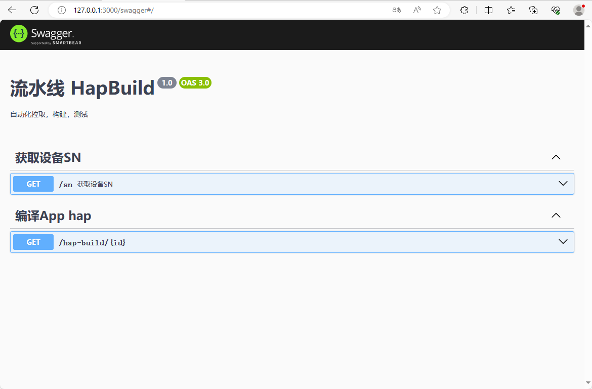

# 流水线预测试工具

## 介绍

本示例主要展示了流水线预测试工具的使用示例，主要介绍了自动化构建及测试的实现原理。

## 效果预览



## 安装教程

按照[部署文档](./deplydoc.md)安装部署项目。

## 使用说明

1. 打开浏览器访问127.0.0.1:3000/swagger。

2. 在`/sn`下点击`Try it out`，再点击`Execute`，即可获得`/sn`接口返回的连接开发板的sn号。

3. 在`/hap-build/{PRId}`下点击`Try it out`，输入想要构建、测试的PRId，再点击`Execute`等待构建、测试任务结束可以看到接口返回构建和测试的结果，同时在PR下方的评论区也会有评论。

## 工程目录

```
|-- HapBuild
|   |--ci                                         // PR修改文件处理模块
|       |-- config.dev.ts
|       `-- src
|           |-- app.controller.ts                 // /sn接口
|           |-- hap-build
|           |   |-- hap-build.controller.ts       // /hap-build/{PRId}接口
|           |   `-- utils
|           |       |-- buildListProject.ts       // 安装测试应用
|           |       |-- checkProjectIfInFull.ts   // 判断涉及项目使用SDk类型
|           |       |-- editLinuxContains.ts      // 修改配置文件
|           |       |-- getModifyFileList.ts      // 下载PR修改文件
|           |       `-- getProjectPath.ts         // 获取PR修改项目路径
|           |-- main.ts
|           `-- util
|               `-- index.ts                      // 发送评论、执行脚本工具函数
|   |--compile-tool                               // 编译工具
|       |-- bin   
|           |-- compile-ohpm-ci.sh                // 编译脚本        
|           |-- compile-ut-ohpm.sh                // 初始化目录结构以及拉取代码脚本  
|           |-- init-sdk.sh                       // 初始化SDK脚本
|           |-- update-sdk.sh                     // 更新SDK脚本
|       |-- config                                // 配置文件
|           |-- init_sdk.config                     
|           |-- samples_master.config            
|           |-- ut_samples_master.config               
|           |-- ut_samples_master_ohpm.config    
|       `-- tool   
|           |-- sign-tool                         // 签名工具                        
|-- deplydoc.md                               // 部署文档
|-- screenshots                               // 文档截图
`-- test-tool
    |-- CombinationConfig.json                // 联合测试应用列表
    |-- FA_Model_And_Lower_Case_List.json     // FA模型应用列表
    |-- InstallAndTestSpecial_ci.py           // 安装测试应用脚本
    |-- LinuxContains.py                      // 安装测试配置文件
    |-- install_list_capability.json          // 特殊安装配置文件
    `-- special_list.json                     // 特殊安装应用列表
```

## 具体实现

1. 执行hdc命令`hdc list targets`获取当前连接开发板sn号，[源码参考](./ci/src/app.controller.ts)。

2. 使用gitee官方web hook读取PR修改文件列表并将修改写入本地sample仓中，再根据修改文件路径找出对应的项目，使用[编译工具](./compile-tool)中`compile-ohpm-ci.sh`脚本编译项目中的`entry`及`ohostest`包。

3. [InstallAndTestSpecial_ci.py](./test-tool//InstallAndTestSpecial_ci.py)脚本来安装entry包、ohosTest测试包以及拉起自动化测试用例。

## 相关权限

不涉及

## 依赖

- Ubuntu22.04.02 LTS
- Node16及以上
- Java jdk11
- Python3

## 约束与限制

本示例需要按照[部署文档](./deplydoc.md)成功搭建环境才可顺利运行。

## 下载

如需单独下载本工程，执行如下命令：

```
git init
git config core.sparsecheckout true
echo code/Project/HapBuild > .git/info/sparse-checkout
git remote add origin https://gitee.com/openharmony/applications_app_samples.git
git pull origin master
```
