# 流水线工具部署文档

## wsl ubuntu 安装

### 开发者模式开启

安装首先要启用windows的开发者模式，左下角搜索 `开发者设置`并启用。


### 启用windows功能

左下角搜索 `启用或关闭windows功能`，勾选 `适用于Linux的windows子系统`。


### linux-Ubuntu 下载

桌面左下角搜索 `Microsoft store`打开商店, 搜索linux，下载Ubuntu22.04.02 LTS。


下载完成后直接双击启动，会自动安装，一两分钟后安装完毕，按提示设置**用户名**、**密码**。

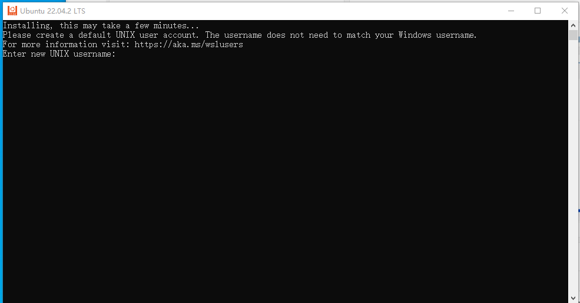

## ubuntu环境配置

### 基本指令下载

在ubuntu命令行工具中输入以下命令安装工具。

```
sudo apt-get update
sudo apt-get install git-lfs bison flex gnupg build-essential zip curl zlib1g-dev gcc-multilib g++-multilib libc6-dev-i386 lib32ncurses-dev x11proto-core-dev libx11-dev libc++1 lib32z1-dev ccache libgl1-mesa-dev libxml2-utils xsltproc unzip m4 libtinfo5 bc genext2fs liblz4-tool libssl-dev ruby gdb libelf-dev libxcursor-dev libxrandr-dev libxinerama-dev
```

### 安装JDK

```
sudo apt-get update
sudo apt-get install openjdk-11-jdk
```

安装完毕后输入 `java -version`验证


### 安装node

```
cd ~
mkdir Node
cd Node
wget https://nodejs.org/download/release/v16.19.1/node-v16.19.1-linux-x64.tar.xz
tar -xvf node-v16.19.1-linux-x64.tar.xz
```


### 配置node环境变量

```
cd node-v16.19.1-linux-x64
pwd
```

右键复制输出的路径，按照以下命令打开配置文件编辑，将userName替换为真实的用户名。

```
vim ~/.bashrc

// 添加以下内容
export NODE_HOME=/home/userName/Node/node-v16.19.1-linux-x64
export PATH=$NODE_HOME:$PATH
export NODE_HOME_BIN=/home/userName/Node/node-v16.19.1-linux-x64/bin
export PATH=$NODE_HOME_BIN:$PATH
```

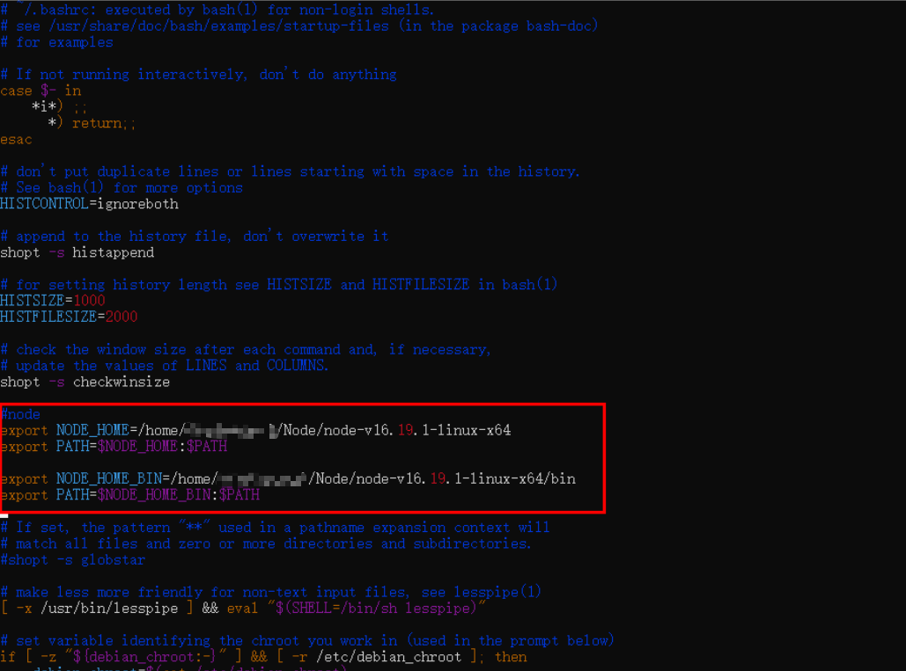

编辑完键盘按esc 然后输入 `:wq`回车保存。

输入以下命令重载入环境变量，并验证。

```
source ~/.bashrc
node -v
```


### 安装ohpm工具

下载ohpm工具压缩包并解压

```
wget "https://contentcenter-vali-drcn.dbankcdn.cn/pvt_2/DeveloperAlliance_package_901_9/a6/v3/cXARnGbKTt-4sPEi3GcnJA/ohcommandline-tools-linux-2.0.0.1.zip?HW-CC-KV=V1&HW-CC-Date=20230512T075353Z&HW-CC-Expire=315360000&HW-CC-Sign=C82B51F3C9F107AB460EC26392E25B2E20EF1A6CAD10A26929769B21B8C8D5B6" -O ohpmTool.zip
unzip ohpmTool.zip
```

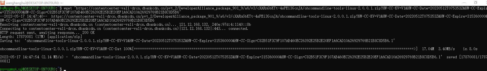

初始化ohpm

```
cd oh-command-line-tools/ohpm/bin/
pwd
./init
```

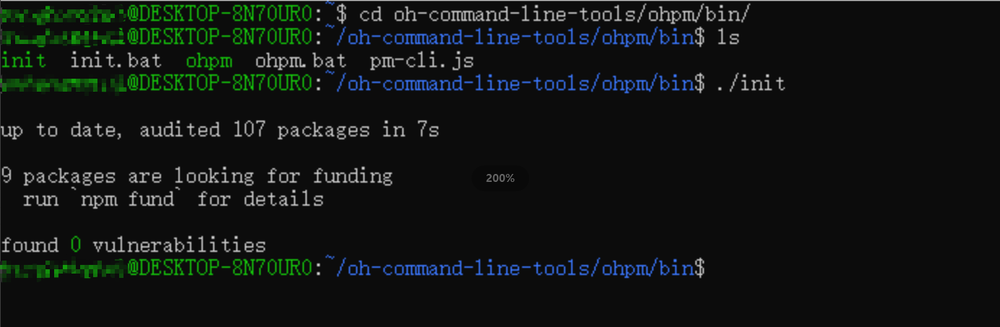
复制一下上面pwd输出的结果，然后手动添加ohpm的目录到环境变量。

```
vim ~/.bashrc

// 添加以下内容
export OHPM_HOME=/home/userName/oh-command-line-tools/ohpm/bin
export PATH=$OHPM_HOME:$PATH
```


重新加载环境变量，并验证。

```
source ~/.bashrc
cd ~
ohpm
```

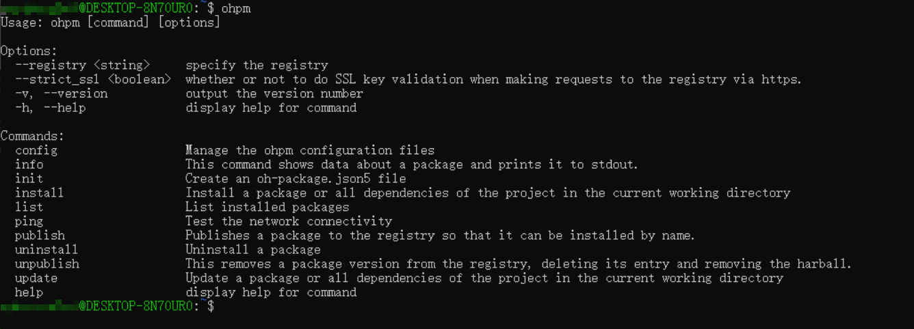

## HapBuild工具下载

```
cd ~
git init
git config core.sparsecheckout true
echo code/Project/HapBuild > .git/info/sparse-checkout
git remote add origin https://gitee.com/openharmony/applications_app_samples.git
git pull origin master
```

### 下载SDK

```
cd ~/code/Project/HapBuild/compile-tool/bin
sudo chmod +x init-sdk.sh
./init-sdk.sh
```

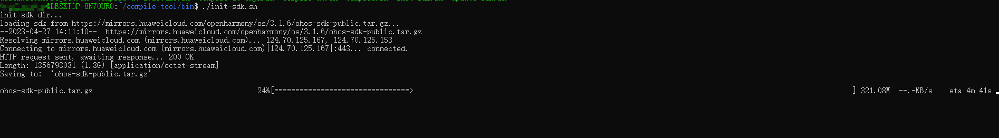

执行完以上命令后开始下载SDK,一共要下6个SDK耗时较长。

下载完SDK后手动添加hdc的目录到环境变量。

```
cd ~/code/Project/HapBuild/compile-tool/sdk-full/10/toolchains
pwd
vim ~/.bashrc

// 把pwd输出的路径添加到下面
#hdc
export HDC_HOME=/home/userName/code/Project/HapBuild/compile-tool/sdk-full/10/toolchains
export PATH=$HDC_HOME:$PATH
```

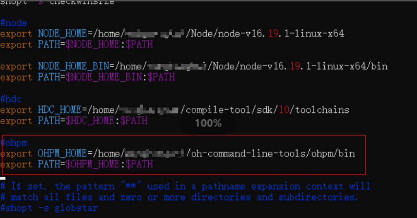

重新加载环境变量，并验证。

```
source ~/.bashrc
cd ~
hdc
```

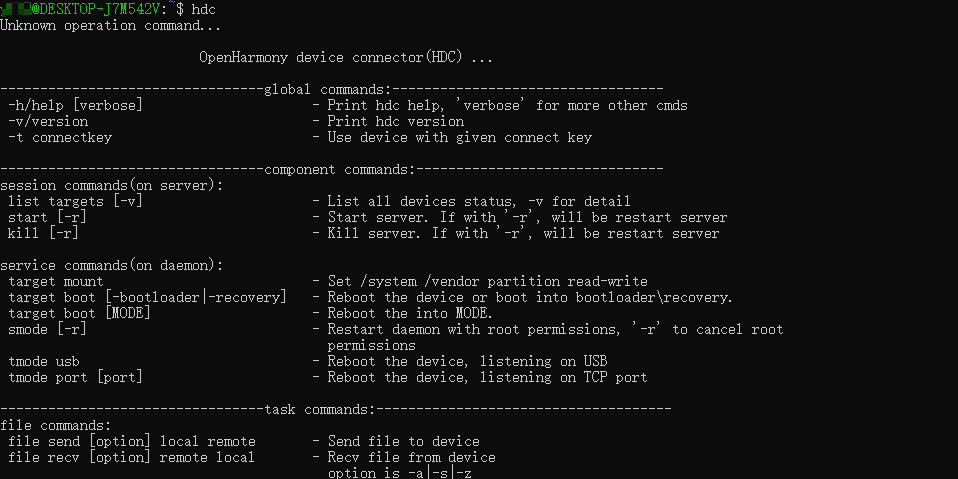

### 给shell脚本增加权限

```
cd ~/code/Project/HapBuild/compile-tool/bin
sudo chmod +x compile-ut-ohpm.sh compile-ohpm-ci.sh init-sdk.sh update-sdk.sh
```

### 初始化本地sample仓

```
cd ~
$PWD/code/Project/HapBuild/compile-tool/bin/compile-ut-ohpm.sh --p=$PWD/code/Project/HapBuild/compile-tool/config/ut_samples_master.config --compile_dir=code
```

注意：这一步是为了让本地存有代码,所以仓库克隆完毕即可Ctrl + C退出。

### 修改项目配置文件

打开项目路径下的 `ci/config.dev.ts`编辑后台服务配置文件，修改配置文件路径为真实路径。

打开gitee官网[申请私人令牌](https://gitee.com/profile/personal_access_tokens)，将申请到的私人令牌复制，替换 `accessToken`。

```
vim ~/code/Project/HapBuild/ci/config.dev.ts

// 将accessToken替换成从gitee上申请的私人令牌，将userName改为真实用户名
export const ACCESS_TOKEN = 'accessToken';
export const PROJECT_PATH = '/home/userName/code/Project/HapBuild/compile-tool/projects/ut_samples_master';
export const CONFIG_PATH = '/home/userName/code/Project/HapBuild/compile-tool/config/ut_samples_master.config';
export const COMPILE_SH_PATH = '/home/userName/code/Project/HapBuild/compile-tool/bin/compile-ohpm-ci.sh';
export const SIGN_HAP_PATH = '/home/userName/code/Project/HapBuild/compile-tool/out/ut_samples_master/full-sdk/hap-out-with-signed';
export const TEST_TOOL_PATH = '/home/userName/code/Project/HapBuild/test-tool/InstallAndTestSpecial_ci.py';
export const CONTAINS_PATH = '/home/userName/code/Project/HapBuild/test-tool/LinuxContains.py';
export const SIGN_FULL_PATH = '/home/userName/code/Project/HapBuild/compile-tool/out/ut_samples_master/full-sdk/hap-out-with-signed/';
export const SIGN_PUBLIC_PATH = '/home/userName/code/Project/HapBuild/compile-tool/out/ut_samples_master/public-sdk/hap-out-with-signed/';
```

修改完成后保存退出。

打开项目路径下的 `test-tool/LinuxContains.py`编辑测试脚本配置文件。

```
sudo chmod +x ~/code/Project/HapBuild/test-tool/LinuxContains.py
vim ~/code/Project/HapBuild/test-tool/LinuxContains.py

// 将userName改为真实用户名
SIGN_HAP_PATH = r'/home/userName/code/Project/HapBuild/compile-tool/out/ut_samples_master/full-sdk/hap-out-with-signed/'
FA_MODAL_AND_LOWER_CASE_LIST = r'/home/userName/code/Project/HapBuild/test-tool/FA_Model_And_Lower_Case_List.json'
INSTALL_LIST_CAPABILITY = r'/home/userName/code/Project/HapBuild/ci/install_list_capability.json'
SAVE_XML_PATH = r'/home/userName/code/Project/HapBuild/test-tool'
COMBIN_CONFIG = r'/home/userName/code/Project/HapBuild/test-tool/CombinationConfig.json'
SPECIAL_LIST = r'/home/userName/code/Project/HapBuild/test-tool/special_list.json'
SPECIAL_HAP = r'code_UI_JsComponentCollection_JsComponentCollection;code_SuperFeature_MultiDeviceAppDev_JsAdaptiveCapabilities;code_BasicFeature_FileManagement_FileShare_SandboxShare;code_SystemFeature_DeviceManagement_DeviceManagementCollection;code_BasicFeature_Security_PaySecurely_paySDK;code_SystemFeature_ApplicationModels_Launcher;code_SuperFeature_DistributedAppDev_JsDistributedMusicPlayer;code_SuperFeature_DistributedAppDev_DistributeCalc;code_Solutions_Tools_JsClock;code_BasicFeature_Notification_CustomNotificationBadge'
TARGET_PATH = r'code_Solutions_Game_DistributedDataGobang'
```

### 下载依赖

下载测试脚本所需python环境及python依赖。

```
cd ~
sudo apt update
sudo apt install python3
```

检测是否安装完成。

```
python3 --version
```

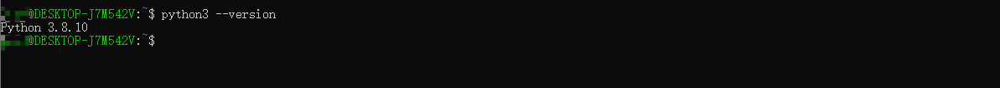

下载依赖。

```
sudo apt update
sudo apt install python3-pip
pip install paramiko
```

## 运行ci模块

初始化ci，下载依赖。

```
cd ~/code/Project/HapBuild/ci
npm i -g @nestjs/cli
npm i
npm run build
npm install pm2 -g
```

> pm2如果安装不上可以尝试清除 npm 缓存 `npm cache clean --force`，再使用淘宝npm镜像 `npm config set registry https://registry.npm.taobao.org/`，最后再尝试安装 `npm install pm2 -g`。

运行项目。

```
cd ~/code/Project/HapBuild/ci
pm2 start dist/src/main.js
```

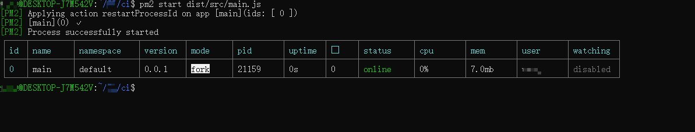

使用以下命令可以看到项目的运行情况。

```
pm2 status
```

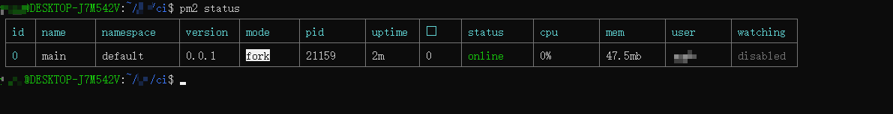

使用以下命令停止该项目。

```
pm2 stop dist/src/main.js
```

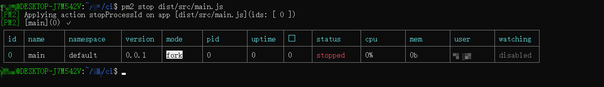

## 浏览器访问验证

在浏览器上输入网址：http://127.0.0.1:3000/swagger