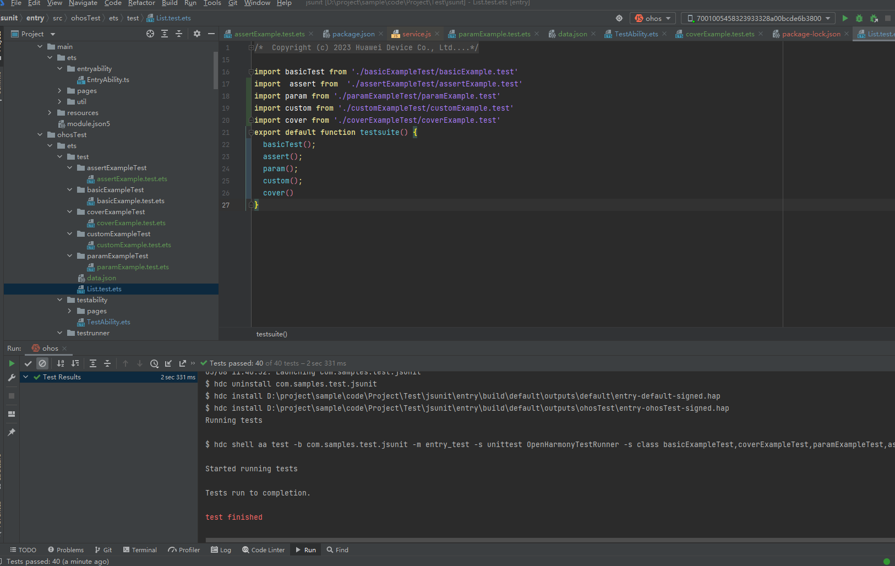
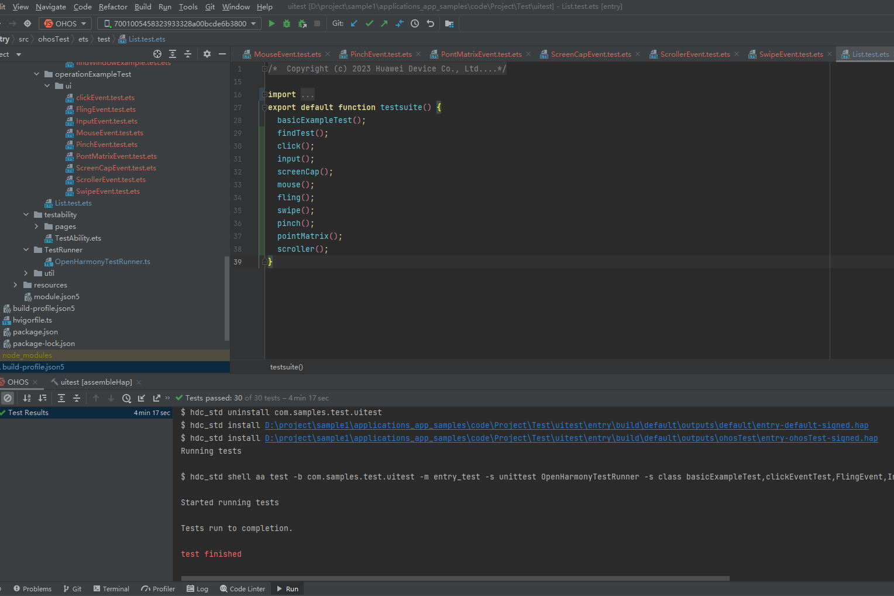

# 测试框架
## 介绍 
本示例展示测试框架的使用示例，主要介绍了单元测试框架和UI测试框架的使用示例。

测试框架arkxtest的详细介绍请[参考](https://gitee.com/openharmony/testfwk_arkxtest)。


## 效果预览





使用说明
- 将jsunit或uitest目录下的项目工程整体导入到DevEco Studio开发工具中。
- 查看ohostest目录下的测试代码实现。
- 在DevEco Studio中执行测试用例代码查看执行效果，执行方式请[参考](https://developer.harmonyos.com/cn/docs/documentation/doc-guides/ohos-openharmony-test-framework-0000001263160453)。

## 工程目录 

```
Test 
  |-----jsunit  单元测试框架示例
  |-----uitest  UI测试框架示例
```

## 具体实现

### jsunit单元测试框架示例内容
-  单元测试框架基础使用示例。

### uitestUI测试框架示例内容

- UI测试框架基础使用示例。

>  相关功能实现，请查看具体代码实现

## 相关权限
不涉及

## 依赖
不涉及

## 约束与限制
1.本示例仅支持标准系统上运行。

2.本示例从API version 9 版本SDK起开始支持，历史SDK版本不适用. 

3.本示例需要使用DevEco Studio 3.1 Beta2 (Build Version: 3.1.0.400, built on April 7, 2023)及以上版本才可编译运行。

## 下载

如需单独下载本工程，执行如下命令：

```
git init
git config core.sparsecheckout true
echo code/Project/Test > .git/info/sparse-checkout
git remote add origin https://gitee.com/openharmony/applications_app_samples.git
git pull origin master
```
