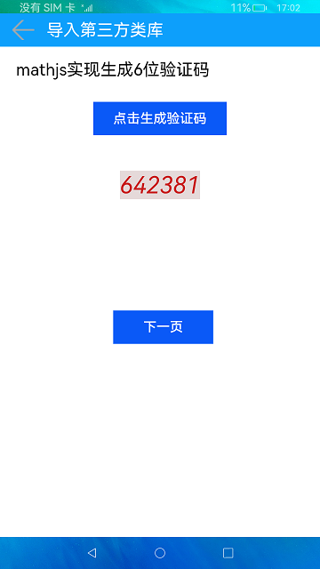
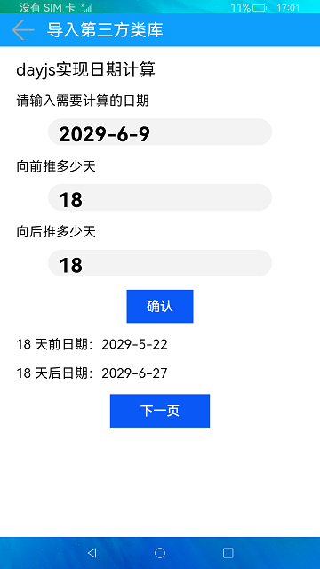
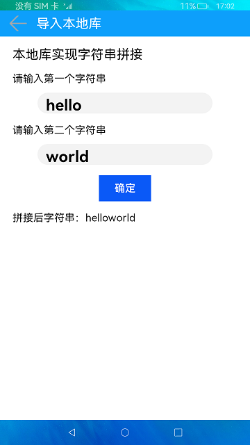

# npm的使用

### 介绍

本示例展示了npm引用第三方js类库和本地库，主要展示了mathjs、dayjs和本地库应用，此示例不涉及接口，  
但第三方js库需要引入npm依赖包，本地库只需要在idea中新建Module文件即可实现。


### 效果预览
|主页(math.js)|子页面(day.js)|子页面(本地库字符串拼接)|
|---      |---      |---      |
||||

使用说明

1.首页是对mathjs的应用，点击**点击生成验证码**，下方会生成六位随机验证码，点击一次，验证码会刷新一次，点击**返回**，退出该程序。

2.点击**下一页**按钮，页面跳转到第二页对dayjs的应用，按照提示条件必需输入要计算的日期，至少填写一个向前或者向后推多少天，点击**确认**按钮，下方会显示出计算的结果，点击**返回**按钮，返回到第一页对mathjs的应用。

3.点击**下一页**按钮，页面跳转到第三页对本地库的应用，按照提示必须输入两个字符串，点击**确定**，下方会显示两个字符串拼接后的字符串。点击**返回**按钮，返回第二页对dayjs的应用。

### 工程目录

```
entry/
|---package.json                        // 主模块里引入新增的第三方模块：修改dependencies属性，例如新增的"@ohos/library": "../library"               
|   |---src/main/ets/pages              // 定义页面组件
|---pages
|   |---DatePage.ets                    // 子页面date.js，使用时需import该组件，例如：import {ThirdTitleBar} from '@ohos/library'
|   |---Index.html                      // 首页math.js，使用时需import该组件。
|   |---LocalLibrary.ets                // 子页面字符串拼接，使用时需import该组件。
library/                                // 新引入的第三方module
|---package.json                        // 修改name属性，例如“name”：“@ohos/library”
|---index.ets                           // 统一暴漏接口
|   |---src/main/components/MainPage    
|       |---MathString.ts               // 具体定义引用第三方模块实现的功能，例如：字符串拼接
``` 

#### 相关概念

npm：npm引用第三方js类库和本地库。

### 具体实现
#### 第三方js类库和本地库使用区别

1.第三方js库需要引入npm依赖包，  
2.本地库只需要在idea中新建Module文件即可实现，操作如下，源码参考[Index.ets](https://gitee.com/openharmony/applications_app_samples/blob/master/code/Project/ThirdPartyLibrary/Npm/entry/src/main/ets/pages/Index.ets)

#### 第三方js类库导入步骤

1.打开Terminal窗口，通过如下指令进入到entry目录。

    cd entry

2.以引入“dayjs”为例，执行以下指令进行安装。

    npm install dayjs --save

3.命令执行完成后在需要应用dayjs库的ets文件中引入该库。

    import dayjs from 'dayjs'

#### 本地库新建步骤

1.右键点击工程名，选择New，选择Module，选择Ohos library方式创建，修改Module的名称，点击finish。

2.在新建的Module目录下，编辑Package.json中的“name”属性，比如：“name”：“@ohos/library”。

3.在新建的Module目录下，编辑Index.ets，将需要export的公共组件或者接口添加进去。

4.在entry目录下，编辑Package.json中的“dependencies”属性，新增新建的Module作为依赖，比如："@ohos/library": "../library"。[源码](https://gitee.com/openharmony/applications_app_samples/blob/master/code/Project/ThirdPartyLibrary/Npm/entry/package.json) 参考

5.在entry目录下，在需要用到新建Module里面公共组件或者接口时，import该组件进而应用，比如：import {ThirdTitleBar} from '@ohos/library'。

### 相关权限

不涉及。

### 依赖

不涉及。

### 约束与限制

1.本示例仅支持在标准系统上运行。

2.本示例仅支持已经开源纯逻辑第三方库的导入。

3.本示例已适配API version 9版本SDK，版本号：3.2.11.9；

4.本示例需要使用DevEco Studio 3.1 Canary1 (Build Version: 3.1.0.100)及以上版本才可编译运行。

### 下载

如需单独下载本工程，执行如下命令：

````
git init
git config core.sparsecheckout true
echo code/Project/ThirdPartyLibrary/Npm/ > .git/info/sparse-checkout
git remote add origin https://gitee.com/openharmony/applications_app_samples.git
git pull origin master
````
