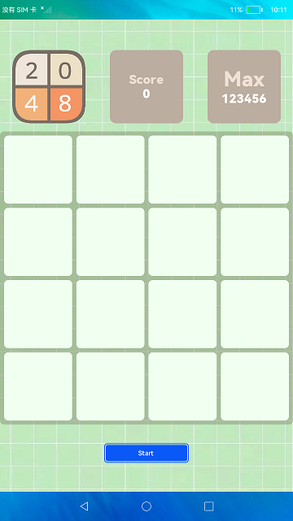
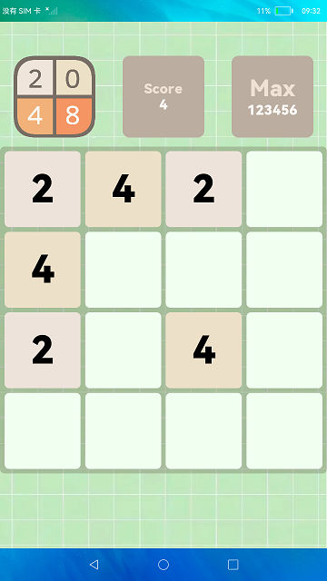
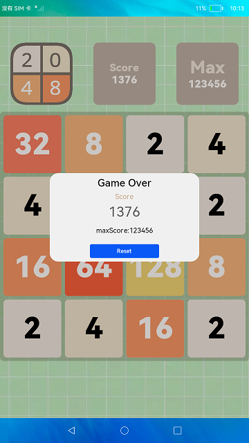

# 游戏2048

### 介绍

本示例使用Grid组件，实现了2048小游戏功能。

使用说明

1.每次可以选择上下左右其中一个方向去滑动，每滑动一次，所有的数字方块都会往滑动的方向靠拢外，系统也会在空白的地方随机出现一个数字方块， 相同数字的方块在靠拢、相撞时会相加。

2.当所有数字方块都无法有效滑动时，游戏结束。

### 效果预览

|首页|游戏中|游戏结束|
|-------|-------|-------|
|||

### 相关权限

不涉及。

### 依赖

不涉及。

### 约束与限制

1.本示例仅支持在标准系统上运行。

2.本示例需要使用DevEco Studio 3.1 Canary1 (Build Version: 3.1.0.100)及以上版本才可编译运行。

3.本示例已适配API10版本SDK，版本号：4.0.5.1。

