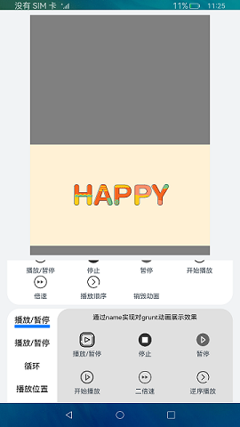

# Lottie动画

### 介绍

本示例展示了lottie对动画的操作功能。引入[Lottie模块](https://gitee.com/openharmony/docs/blob/master/zh-cn/application-dev/reference/arkui-ts/ts-components-canvas-lottie.md)，实现控制动画的播放、暂停、倍速播放、播放顺序、播放到指定帧停止或从指定帧开始播放、侦听事件等功能，动画资源路径必须是json格式。

### 效果预览

|首页|
|-------|
||

使用说明：
1. 进入页面默认开始2016动画，点击**请选择**进行选择动画资源;
2. 上面部分播放暂停是对两个动画进行控制，下面部分播放暂停功能是对grunt动画控制;
3. 点击销毁动画功能之后需要重新选择动画资源才可以进行其余功能操作。

### 工程目录
```
entry/src/main/ets/
|---common
|   |---data.json                           // 2016新年动画
|   |---grunt.json                          // grunt动画
|---pages
|   |---Lottie.ets                          // 首页
|---utils                                  
|   |---Logger.ts                           // 日志工具
```

### 具体实现
* 页面中使用了Lottie对象控制动画的一系列操作，源码参考[Lottie.ets](entry/src/main/ets/pages/Lottie.ets):
    * 初始化动画：在canvas的onReady里使用loadAnimation加载动画，须提前声明Animator(‘__lottie_ets’)对象，并在Canvas完成布局后调用；
    * Lottie动画操作：lottie.play播放动画，lottie.pause暂停播放，lottie.setDirection设置播放顺序，详细接口描述见[Lottie模块](https://gitee.com/openharmony/docs/blob/master/zh-cn/application-dev/reference/arkui-ts/ts-components-canvas-lottie.md)
### 相关权限

不涉及。

### 约束与限制

1. 本示例支持标准系统上运行，支持设备：RK3568;
2. 本示例已适配API10版本SDK，版本号：4.0.5.1;
3. 本示例需要使用DevEco Studio 3.1 Canary1 (Build Version: 3.1.0.100)及以上版本才可编译运行;
4. 本示例需要使用animator.d.ts系统权限的系统接口。使用Full SDK时需要手动从[镜像站点]((https://docs.openharmony.cn/pages/v3.2Beta/zh-cn/release-notes/OpenHarmony-v3.2-beta4.md/))获取，并在DevEco Studio中替换，具体操作可参考[替换指南](https://gitee.com/openharmony/docs/blob/master/zh-cn/application-dev/quick-start/full-sdk-switch-guide.md)。

### 下载
如需单独下载本工程，执行如下命令：
```
git init
git config core.sparsecheckout true
echo code/Solutions/Game/Lottie/ > .git/info/sparse-checkout
git remote add origin https://gitee.com/openharmony/applications_app_samples.git
git pull origin master
```