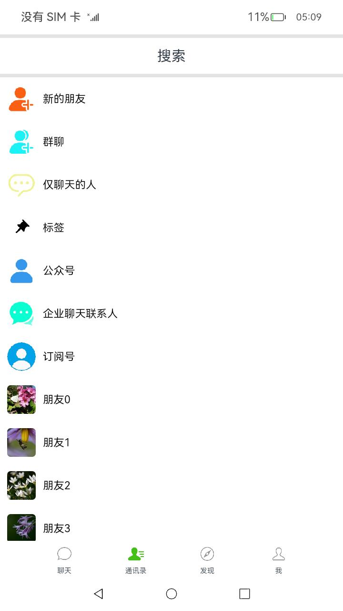
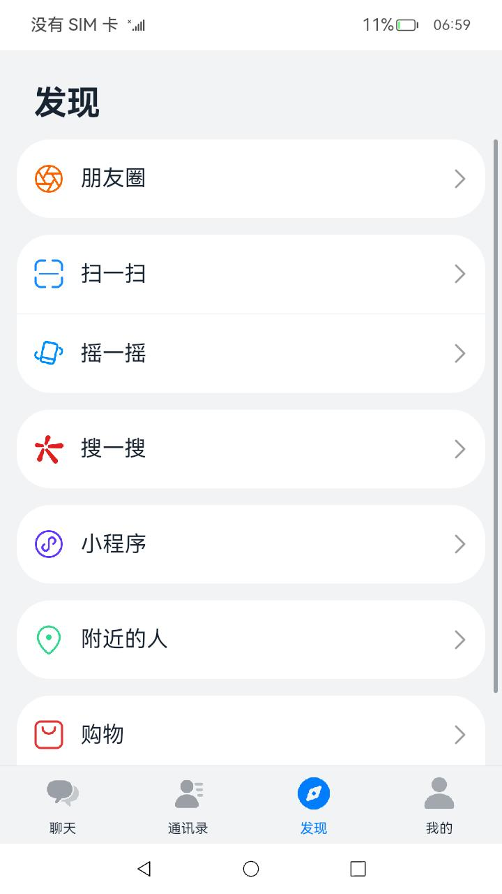
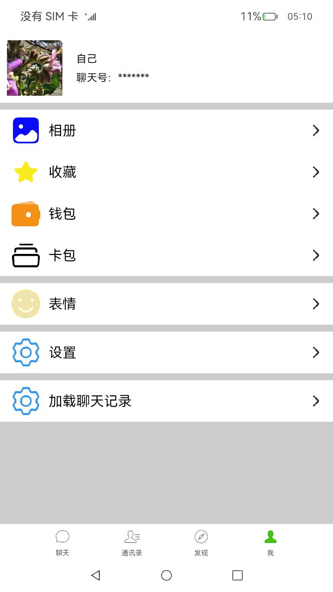

# 聊天实例应用

### 介绍

这是一个仿聊天类应用，使用了静态布局搭建了不同的页面。为了优化内存与性能体验，在部分list场景使用了懒加载。  

本示例用到了与用户进行交互的Ability的能力接口[@ohos.ability.featureAbility](https://gitee.com/openharmony/docs/blob/master/zh-cn/application-dev/reference/apis/js-apis-ability-featureAbility.md) 。  

图片处理能力接口[@ohos.multimedia.image](https://gitee.com/openharmony/docs/blob/master/zh-cn/application-dev/reference/apis/js-apis-image.md )。  

文件存储管理能力接口[@ohos.fileio](https://gitee.com/openharmony/docs/blob/master/zh-cn/application-dev/reference/apis/js-apis-fileio.md) 。  

以键值对形式轻量级存储能力接口[@ohos.data.storage](https://gitee.com/openharmony/docs/blob/master/zh-cn/application-dev/reference/apis/js-apis-data-storage.md )。

### 效果预览
|主页|通讯录|发现|个人页面|
|-------|-------|-------|-------|
|||||

使用说明

1.应用包含“聊天”、”通讯录“、”发现“、”我“四个主页面，使用Tabs组件实现模块的切换，“聊天”和“通讯录”模块使用了LazyForEach懒加载功能。

2.聊天内容页面右上角的图标点击进入聊天信息页面。

3.二级及以上页面左上角都有一个返回按钮。

4.搜索按钮点击进入搜索界面，搜索页面的“取消”点击会返回。

5.首页右上角的图标点击会弹出窗口，可以选择进入”添加好友“和”发起群聊”页面。

6.聊天内容页面的下方输入框点击可以输入内容，表情的图标点击可以发送图片。

7.“发现”页面的“聊天社区”点击会进入“聊天社区”页面，聊天社区页面的图片可以点击进入图片单独的页面对图片进行缩放操作，然后可以进行移动操作。

8.“我”页面的第一条item点击可以进入“个人信息”页面。

9.“我”页面的“设置”item点击可以进入“设置”页面 ，“负载开关”页面使用了轻量级存储，可以使应用退出时记住当前状态，下次打开恢复当前状态。


### 工程目录
```
entry/src/main/MainAbility
|---/common
|   |---BasicDataSource.ets                // 封装整个FeatureAbility模块启用，监听Ability对应的窗口等逻辑
|---/components                                 
|   |---Header.ets                         // 定义应用头部导航栏
|---/pages                                  
|   |---AddFriendsPage.ets                 // 添加好友页面                               
|   |---ChatDetailPage.ets                 // 具体的某一聊天页面            
|   |---ChatListPage.ets                   // 整体聊天页面
|   |---ChatNewsPage.ets                   // 更多操作页面（包含删除聊天记录等）
|   |---CreateGroupChatPage.ets            // 创建群聊页面
|   |---DiscoverPage.ets                   // 发现页面
|   |---FriendsMomentsPage.ets             // 聊天社区页面
|   |---FriendsPage.ets                    // 通讯录页面
|   |---FullImagePage.ets                  // 聊天社区可缩放图片页面
|   |---Index.ets                          // 首页
|   |---MsgBase.ets                        // 组件传值定义页面
|   |---SearchPage.ets                     // 搜索页面
|   |---Setting.ets                        // 设置页面
|   |---SettingPage.ets                    // 我的页面
|   |---SwitchControl.ets                  // 定义负载开关相关的读写文件
|   |---SwitchPage.ets                     // 负载开关页面
|   |---UserInfo.ets                       // 个人信息页
|---resources/images                       // 放置图片，icon资源等           
                                            
```
#### 相关概念

懒加载：开发框架提供数据懒加载（LazyForEach组件）从提供的数据源中按需迭代数据，并在每次迭代过程中创建相应的组件。

### 具体实现
1、定义要跳转子页面：在entry/pages/index.ets中通过TabContent()定义要跳转的子页面，[源码参考](https://gitee.com/openharmony/applications_app_samples/blob/master/code/Solutions/IM/Chat/entry/src/main/ets/MainAbility/pages/Index.ets)   
例如：跳转通讯录界面：TabContent() {
FriendsPage() }。  
2、使用LazyForEach数据懒加载对“聊天”和“通讯录”模块进行数据渲染：当LazyForEach在滚动容器中使用，框架会根据滚动容器可视区域按需创建组件，当组件划出可视区域外时，框架会进行组件销毁回收以降低内存占用，[源码参考](https://gitee.com/openharmony/applications_app_samples/blob/master/code/Solutions/IM/Chat/entry/src/main/ets/MainAbility/pages/FriendsPage.ets )。  
3、页面之间的跳转通过在config.json中先配置好相关路由，并通过router.push()进行页面跳转,例如：跳转到搜索页面router.push({ url: 'pages/SearchPage' })。  
4、页面组件加载前，通过fileio.readSync以同步的方式读取数据，利用[@ohos.ability.featureAbility](https://gitee.com/openharmony/docs/blob/master/zh-cn/application-dev/reference/apis/js-apis-ability-featureAbility.md )并通过featureAbility.getWant()拉起Ability对应的Want。  
5、缓存用户数据状态，将数据轻量存储：先通过let context = featureAbility.getContext()获取上下文，通过context.getFilesDir().then((filePath) => {dataStorage.getStorageSync()})拿用户的缓存数据，将数据写入通过storage.putSync(key, val)，并将数据持久化储存：storage.flushSync()。  
6、对图片进行缩放操作：通过手指操作前后的距离变化进行计算页面重新渲染。[源码参考](https://gitee.com/openharmony/applications_app_samples/blob/master/code/Solutions/IM/Chat/entry/src/main/ets/MainAbility/pages/FullImagePage.ets )。  


### 相关权限

不涉及。

### 依赖

不涉及。

### 约束与限制

1.本示例已适配API version 9版本SDK，版本号：3.2.11.9。

2.本示例需要使用DevEco Studio 3.1 Canary1 (Build Version: 3.1.0.100)及以上才可编译运行。

### 下载

如需单独下载本工程，执行如下命令：

````
git init
git config core.sparsecheckout true
echo code/Solutions/IM/Chat/ > .git/info/sparse-checkout
git remote add origin https://gitee.com/openharmony/applications_app_samples.git
git pull origin master
````