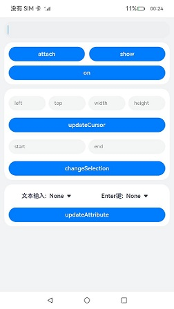

# 自绘编辑框

### 介绍
本示例通过输入法框架实现自会编辑框，可以绑定输入法应用，从输入法应用输入内容，显示和隐藏输入法。

### 效果预览

|               主页               |
| :---------------------------------------: |
|        |

使用说明

1.点击编辑框可以绑定并拉起输入法，可以从输入法键盘输入内容到编辑框。

2.可以点击**attach**/**dettach**、**show**/**hide**、**on**/**off**按钮来绑定/解绑、显示/隐藏、开启监听/关闭监听。

3.输入光标信息后点击**updateCursor**向输入法应用发送光标信息，发送成功会右toast提示。

4.输入选中文本的开始和结束位置，点击**changeSelection**可以选中文本。

5.选择文本输入类型和Enter键类型后，点击**updateAttribute**可以更新拉起的输入法的输入类型和Enter键类型，依赖输入法应用是否适配。

### 工程目录

```
CustomInputText
├── AppScope                                    
│   └── app.json5                               //APP信息配置文件
├── entry/src/main                              //应用首页
│   ├── ets
│   │   ├── entryability
│   │   ├── components                          //自定义组件
│   │   │   ├── CustomInputText.ets             //自绘编辑框组件
│   │   ├── pages
│   │   │   ├── Index.ets                       //主页
│   │   ├── utils
│   │   │   ├── Logger.ets                      //日志工具类
│   │   │   ├── InputAttributeInit.ets          //编辑框属性工具类
│   └── module.json5

```

### 具体实现

* 自绘编辑框
  * 使用输入法框架实现组件绑定输入法应用，监听输入法事件，显示和隐藏输入法，发送光标和编辑框属性到输入法应用功能。
  * 源码链接：[Index.ets](./entry/src/main/ets/pages/Index.ets)，[CustomInputText.ets](./entry/src/main/ets/components/CustomInputText.ets)
  * 参考接口：[@ohos.inputMethod](https://gitee.com/openharmony/docs/blob/master/zh-cn/application-dev/reference/apis/js-apis-inputmethod.md)

### 相关权限

不涉及。

### 依赖

不涉及。

### 约束与限制

1.本示例仅支持标准系统上运行。

2.本示例支持API10版本SDK，SDK版本号(API Version 10 Release),镜像版本号(4.0Release) 。

3.本示例需要使用DevEco Studio 版本号(4.0Release)及以上版本才可编译运行。

###  下载

如需单独下载本工程，执行如下命令：

```
git init
git config core.sparsecheckout true
echo code/Solutions/InputMethod/CustomInputText/ > .git/info/sparse-checkout
git remote add origin https://gitee.com/openharmony/applications_app_samples.git
git pull origin master
```