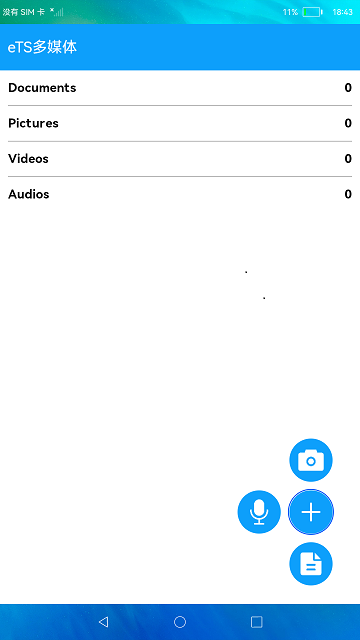

# 相机和媒体库

### 介绍

此Demo展示如何在ArkTS中调用相机拍照和录像，以及如何使用媒体库接口进行媒体文件的增、删、改、查操作。  

本示例用到了权限管理能力[@ohos.abilityAccessCtrl](https://gitee.com/openharmony/docs/blob/master/zh-cn/application-dev/reference/apis/js-apis-abilityAccessCtrl.md )

相机模块能力接口[@ohos.multimedia.camera](https://gitee.com/openharmony/docs/blob/master/zh-cn/application-dev/reference/apis/js-apis-camera.md )  

图片处理接口[@ohos.multimedia.image](https://gitee.com/openharmony/docs/blob/master/zh-cn/application-dev/reference/apis/js-apis-image.md ) 

音视频相关媒体业务能力接口[@ohos.multimedia.media](https://gitee.com/openharmony/docs/blob/master/zh-cn/application-dev/reference/apis/js-apis-media.md )  

媒体库管理接口[@ohos.multimedia.medialibrary](https://gitee.com/openharmony/docs/blob/master/zh-cn/application-dev/reference/apis/js-apis-medialibrary.md )  

设备信息能力接口[@ohos.deviceInfo](https://gitee.com/openharmony/docs/blob/master/zh-cn/application-dev/reference/apis/js-apis-device-info.md )  

文件存储管理能力接口[@ohos.fileio](https://gitee.com/openharmony/docs/blob/master/zh-cn/application-dev/reference/apis/js-apis-fileio.md )  

弹窗能力接口[@ohos.prompt](https://gitee.com/openharmony/docs/blob/master/zh-cn/application-dev/reference/apis/js-apis-prompt.md )  

### 效果预览
|首页|
|-------|
||

使用说明

1.启动应用，在权限弹窗中授权后返回应用，首页显示当前设备的相册信息，首页监听相册变化会刷新相册列表。

2.点击 **+** 按钮，弹出相机、录音、文本文件三个图标。

3.安装相机应用[Camera](lib/CameraPage-1.0.0.hap)应用后，点击**相机**图标，进入相机界面，默认是拍照模式，点击底部拍照按钮可以拍照，拍照完成会在底部左侧显示照片预览图。点击**录像**切换到录像模式，点击底部按钮开始录像，点击结束按钮结束录像，结束录像后底部左侧显示视频图标。点击系统**Back**键或界面顶部**返回**按钮返回首页。

4.点击**录音**图标进入录音界面，点击右侧**开始**按钮开始录音，按钮变为暂停按钮，点击可以暂停和继续录音，点击左侧**结束**按钮结束录音返回首页。

5.点击**文本**图标进入文本编辑界面，输入文本内容后点击**Save**按钮，会创建并写入文本文件，完成后返回首页。

6.点击相册进入文件列表界面，展示相册内的文件，列表中有**删除**和**重命名**按钮，点击可以删除文件和重命名文件。

7.安装视频播放[VideoPlayer](lib/VideoPlayer.hap)应用后，点击视频文件可以调起视频播放界面播放该视频。

#### 相关概念

媒体库管理：媒体库管理提供接口对公共媒体资源文件进行管理，包括文件的增、删、改、查等。
相机：相机模块支持相机相关基础功能的开发，主要包括预览、拍照、录像等。

### 工程目录
```
entry/src/main/ets/
|---MainAbility
|   |---MainAbility.ts                      // 主程序入口，应用启动时获取相应权限
|---pages
|   |---index.ets                           // 首页
|   |---AlbumPage.ets                       // 相册页面
|   |---CameraPage.ets                      // 相机页面
|   |---RecordPage.ets                      // 录音页面
|   |---DocumentPage.ets                    // 存储文件页面
|---model                                  
|   |---CameraService.ts                    // 相机模块（拍照录像模式）
|   |---DateTimeUtil.ts                     // 日期工具包
|   |---MediaUtils.ts                       // 媒体工具模块
|   |---RecordModel.ts                      // 录音模块（底层能力实现）
|   |---TimeUtils.ts                        // 时间工具包
|---view                                    
|   |---BasicDataSource.ets                 // 初始化媒体服务数组
|   |---MediaItem.ets                       // 定义具体的某一媒体模块页面 
|   |---MediaView.ets                       // 媒体模块的前置模块(判断是否有展示的媒体内容)
|   |---RenameDialog.ets                    // 重命名文件模块 
|   |---TitleBar.ets                        // 标题栏                                                           
```

### 具体实现

* 布局原理：定义@ObjectLink 装饰的数组变量album存放资源文件，使用list()组件中ListItem()循环数组展示，加号Button()，点击后触发 animateTo({ duration: 500, curve: Curve.Ease })控制动画展示,[源码参考](entry/src/main/ets/pages/Index.ets )。    
* 获取资源文件：通过引入媒体库实例（入口）接口@ohos.multimedia.medialibrary，例如通过this.getFileAssetsFromType(mediaLibrary.MediaType.FILE)获取FILE类型的文件资源，并通过albums.push()添加至album数组中。  
* 展示系统资源文件：当album内的值被修改时，只会让用 @ObjectLink 装饰的变量album所在的组件被刷新，当前组件不会刷新。
* 录音功能：通过引入音视频接口@ohos.multimedia.media，例如通过media.createAudioRecorder()创建音频录制的实例来控制音频的录制，通过this.audioRecorder.on('prepare', () => {this.audioRecorder.start()})异步方式开始音频录制,[源码参考](entry/src/main/ets/model/RecordModel.ts )。
* 拍照录像功能：通过引入相机模块接口@ohos.multimedia.camera，例如通过this.cameraManager.createCaptureSession()创建相机入口的实例来控制拍照和录像，通过this.captureSession.start()开始会话工作,[源码参考](entry/src/main/ets/model/CameraService.ts )。
  

### 相关权限
相机权限：[ohos.permission.CAMERA](https://gitee.com/openharmony/docs/blob/master/zh-cn/application-dev/security/permission-list.md#ohospermissioncamera )  
麦克风权限：[ohos.permission.MICROPHONE](https://gitee.com/openharmony/docs/blob/master/zh-cn/application-dev/security/permission-list.md#ohospermissionmicrophone)    
访问媒体文件地理位置信息权限：[ohos.permission.MEDIA_LOCATION](https://gitee.com/openharmony/docs/blob/master/zh-cn/application-dev/security/permission-list.md#ohospermissionmedia_location )   
读取公共媒体文件权限：[ohos.permission.READ_MEDIA](https://gitee.com/openharmony/docs/blob/master/zh-cn/application-dev/security/permission-list.md#ohospermissionread_media )   
读写公共媒体文件权限：[ohos.permission.WRITE_MEDIA](https://gitee.com/openharmony/docs/blob/master/zh-cn/application-dev/security/permission-list.md#ohospermissionwrite_media )

### 依赖

不涉及

### 约束与限制

1.本示例仅支持标准系统上运行。

2.本示例为Stage模型，已适配API version 9版本SDK，版本号：3.2.11.9；

3.本示例需要使用DevEco Studio 3.1 Beta2 (Build Version: 3.1.0.400, built on April 7, 2023)及以上版本才可编译运行。

### 下载

如需单独下载本工程，执行如下命令：

````
git init
git config core.sparsecheckout true
echo code/Solutions/Media/MultiMedia/ > .git/info/sparse-checkout
git remote add origin https://gitee.com/openharmony/applications_app_samples.git
git pull origin master
````