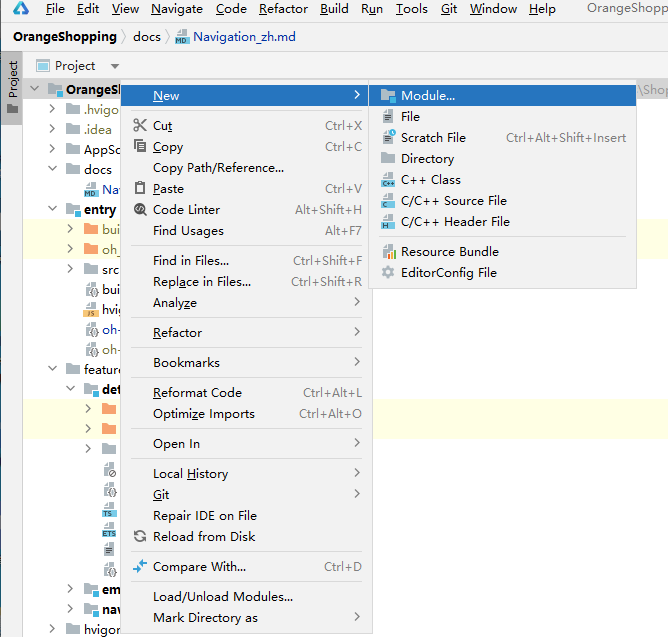
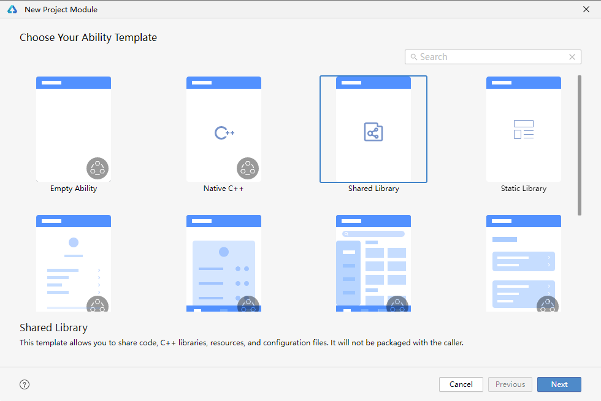
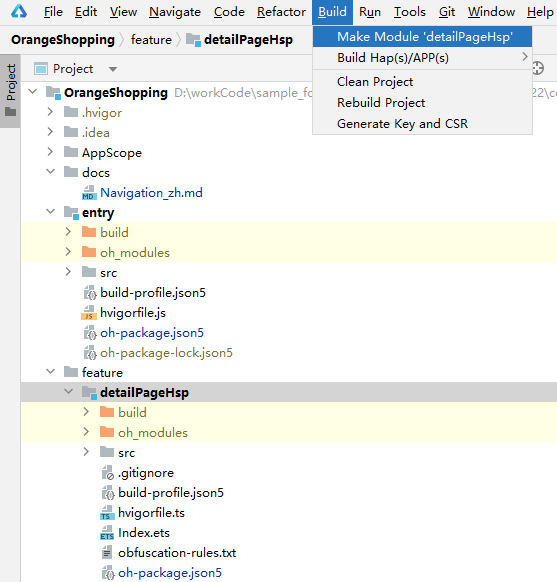
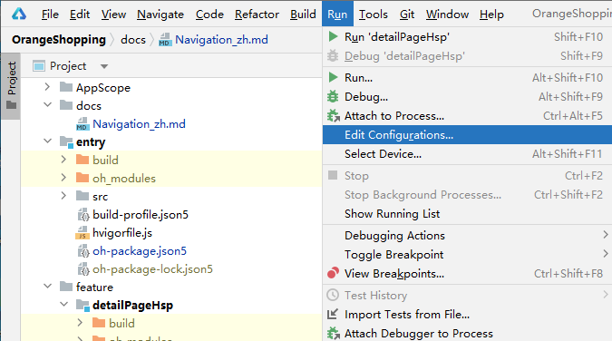
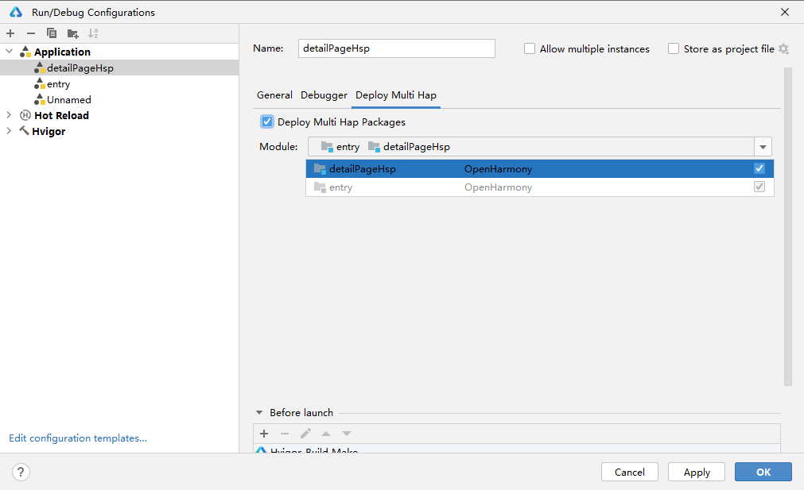

# Navigation开发示例应用

## 简介

在应用开发时，我们常常遇到，需要在应用内多页面跳转场景时中使用`Navigation`导航组件做统一的页面跳转管理，它提供了一系列属性方法来设置页面的标题栏、工具栏以及菜单栏的各种展示样式。除此之外还拥有动态加载，NavPathStack路由跳转，跨包引用Hsp等能力。

本文就以Navigation开发示例应用为例，来展开讲解Navigation以上的技术点，帮助开发者快速学习。

## 场景概述

ArkUI中，应用内导航组件Navigation一般作为Page页面的根容器，Navigation组件主要包含主页和内容页。

主页由标题栏、内容区和工具栏组成，其中内容区默认首页显示导航内容(Navigation的子组件) 或非首页显示(NavDestination的子组件)，首页和非首页通过路由进行切换。

Navigation的路由切换的方式有两种，本次示例主要介绍NavPathStack的使用。

* 在API Version 9上，首页导航内容需要配合NavRouter组件实现页面路由。
* 从API Version 10开始，首页推荐使用NavPathStack配合NavDestination属性进行页面路由。

> 通过本篇文章的学习，你将学会：
>
> 1.如何使用**NavPathStack路由转场**
>
> 2.如何在**Navigation中跨包引用Hsp**
>
> 3.如何在**Navigation中使用动态加载**

## Router场景与Navigation适用场景对比

| 组件  | 适用场景 | 特点                | 转场动画效果对比 |
|-----|------|-------------------|----------|
| Router | 模块间与模块内页面切换  | 通过每个页面的url实现模块间解耦 | 页面平推转场效果 |
| Navigation | 模块内页面切换  | 通过组件级路由统一路由管理     | 向右折叠转场效果 |

## 使用NavPathStack路由转场
NavPathStack是Navigation路由栈，通过对栈内元素的操作，完成页面的路由转场。详细API如下表, [详细API说明文档](https://gitee.com/openharmony/docs/blob/master/zh-cn/application-dev/reference/arkui-ts/ts-basic-components-navigation.md)：

| API             | 描述                                                        |
| --------------- | ----------------------------------------------------------- |
| pushPath        | 将info指定的NavDestination页面信息入栈。                    |
| pushPathByName  | 将name指定的NavDestination页面信息入栈，传递的数据为param。 |
| pop             | 弹出路由栈栈顶元素。                                        |
| popToName       | 回退路由栈到第一个名为name的NavDestination页面。            |
| popToIndex      | 回退路由栈到index指定的NavDestination页面。                 |
| moveToTop       | 将第一个名为name的NavDestination页面移到栈顶。              |
| moveIndexToTop  | 将index指定的NavDestination页面移到栈顶。                   |
| clear           | 清除栈中所有页面。                                          |
| getAllPathName  | 获取栈中所有NavDestination页面的名称。                      |
| getParamByIndex | 获取index指定的NavDestination页面的参数信息。               |
| getParamByName  | 获取全部名为name的NavDestination页面的参数信息。            |
| getIndexByName  | 获取全部名为name的NavDestination页面的位置索引。            |


### 实现思路

NavPathStack通过pushPath跳转页面，通过pop返回：  
1. 通过pushPath跳转，如” **主页** &gt; **商品详情页** “，源码参考[DetailPage.ets](../feature/detailPageHsp/src/main/ets/main/DetailPage.ets)

```
this.pageStack.pushPath({ name: 'GoodsDetailView', param: item })
```

2. NavPathStack通过pop返回，从” **详情页** &gt; **返回到主页** “，源码参考[Detail.ets](../entry/src/main/ets/pages/Detail.ets)

```
.onBackPressed(() => { 
   this.pageStack.pop(); 
   return true;
})
```

### 开发步骤

1. 在pageMap组件中定义需要用到的页面，定义NavPathStack对象，并用@provide传递给全部子组件，在entry模块的Home页面build()中，定义Navigation容器并设置navDestination()属性加载PageMap组件，并将需要使用容器的组件引入并调用，[源码参考](../entry/src/main/ets/pages/Home.ets)

```javascript
import { NavigationHomePage } from '@ohos/navigation-component';

@Provide('pageStack') pageStack: NavPathStack = new NavPathStack();

@Builder
PageMap(name: string, param: NavPathStack) {
  if (name === 'DetailPage') {
    // 商品列表详情页
    this.detailPageLoader();
  } else if (name === 'SetPage') {
    // 设置页
    SetPage()
  } else if (name === "Live") {
    // 直播页
    Live()
  }
}

build() {
  Navigation(this.pageStack) {
    NavigationHomePage();
  }
  .hideTitleBar(true)
  .navDestination(this.PageMap)
}
```

2. 在NavigationHomePage中定义NavDestination并包括需要被加载的组件，[源码参考](../feature/navigationHome/src/main/ets/main/NavigationHomePage.ets)

```javascript
export struct NavigationHomePage {

NavDestination() {
  MainPage()
 }
}
```

3. 在DetailPage中@Consume引入pageStack，通过NavPathStack的api触发切换组件，[源码参考](../feature/detailPageHsp/src/main/ets/main/DetailPage.ets)

```javascript
@Consume('pageStack') pageStack: NavPathStack;

.onClick(() => {
 this.pageStack.pushPath({ name: 'GoodsDetailView', param: item })
 })
```

4. 在Detail中，通过pop出栈，返回前页，[源码参考](../entry/src/main/ets/pages/Detail.ets)

```javascript
@Consume('pageStack') pageStack: NavPathStack;
.onBackPressed(() => {
   this.pageStack.pop();
   return true;
})
```

## Navigation中跨包引用Hsp

本示例以创建一个Hsp包detailPageHsp模块为例，并介绍如何混合编译工程[Hsp包介绍及详细操作步骤](https://docs.openharmony.cn/pages/v4.0/zh-cn/application-dev/quick-start/in-app-hsp.md/)

### 实现思路

创建一个Hsp类型的detailPageHsp模块，并在entry中引用创建的Hsp模块。

### 开发步骤

1. 创建Hsp模块。
- 在根目录右键新创建module为**Shared Library**类型的Hsp模块，并将模块命名为detailPageHsp并拖拽至feature文件夹下做包的统一管理，如下图示；

    
- 选择module为**Shared Library**类型的Hsp模块。  
  

  
2. 定义Hsp出口：在创建后的Hsp包内编写业务代码，并在index.ets中export组件。[源码参考](../feature/detailPageHsp/Index.ets)；
* 引用方如何使用Hsp：entry模块通过在oh-package.json5文件中加入定义的Hsp依赖。[源码参考](../entry/oh-package.json5)；
```javascript
"dependencies": {
   "@ohos/details-page-hsp": "file:../feature/detailPageHsp",
}
```
* Hap中使用：在组件中引入依赖。[源码参考](../entry/src/main/ets/pages/Detail.ets)；
```javascript
import { DetailPage } from '@ohos/details-page-hsp';

build(){
  NavDestination() { 
    DetailPage();
  }
}
```
3. 编译时，需选中detailPageHsp模块，在ide的工具栏窗口，点击“**Build** &gt; **Make Module 'detailPageHsp'** ”，进行编译构建，生成Hsp，如下图示。  
   

4. 运行时，需要在运行模块处在Ide的工具栏窗口，点击“**Run** &gt; **Edit Configurations** ”，配置edit Configuration，如下图示。
   
- 勾选**Deploy Multi Hap Packages**进行混合编译，即可运行。[详细步骤参考](https://docs.openharmony.cn/pages/v4.0/zh-cn/application-dev/quick-start/in-app-hsp.md/)
   
  


## Navigation中使用动态加载

* 本示例通过定义一个需要被动态加载的组件DetailPage，配合Navigation实现动态加载示例的演示。源码参考[DetailPage.ets](../feature/detailPageHsp/src/main/ets/main/DetailPage.ets)；

### 实现思路

* 定义一个DynamicLoader动态回调类作为容器，用来注册和调用动态加载函数。源码参考[DynamicLoader.ets](../feature/navigationHome/src/main/ets/common/DynamicLoader.ets)；
* 将DetailPage组件用DetailPageLoader函数封装，当DetailPageLoader被调用时，会渲染DetailPage页面。源码参考[DetailPageLoader.ets](../entry/src/main/ets/pages/DetailPageLoader.ets)；
* 在主页实现动态加载DetailPage的步骤如下：
  由于navDestination无法直接动态import组件（import是函数，组件中无法引用函数），此处采用声明@BuilderParam detailPageLoader函数，在点击时初始化此函数，此时navDestination中可以调用this.detailPageLoader()从而加载组件DetailPage。

### 开发步骤

1. 主页Home中定义组件加载函数@BuilderParam detailPageLoader: () => void，用来承接await import异步导入detailPageLoader的结果。源码参考[Home.ets](../entry/src/main/ets/pages/Home.ets)
```javascript
@BuilderParam detailPageLoader: () => void
```
2. 注册异步函数，点击时为detailPageLoader初始化,当满足key为DetailPage时，此时异步的加载DetailPageLoader，渲染DetailPage,源码参考[Home.ets](../entry/src/main/ets/pages/Home.ets)
```javascript
DynamicLoader.getInstance().register(
async (key: string) => {
  if (key === "DetailPage") { 
     let obj = await import("./DetailPageLoader");
     this.detailPageLoader = obj.DetailPageLoader;
  }
})
 ```
3. 定义NavDestination中动态加载函数，当存在跳转行为时，会调用此函数,源码参考[Home.ets](../entry/src/main/ets/pages/Home.ets)
```javascript
PageMap(name: string, param: NavPathStack) {
  if (name === 'DetailPage') {this.detailPageLoader();})
```
4. 按钮触发点击函数，调用detailPageLoader，此时真正的初始化@BuilderParam detailPageLoader，并通过Navigation中PageMap动态加载组件DetailPage,源码参考[GoodsList.ets](../feature/navigationHome/src/main/ets/components/good/GoodsList.ets)
```javascript
Column() {}
  .onClick(() => {
   // 动态加载组件
   DynamicLoader.getInstance().fire('DetailPage').then(()=>{
     this.active = true;
     this.pageStack.pushPathByName('DetailPage', item);
   })
})
 ```


## 运行效果

  


## 参考文档

[1] [桔子购物sample · OpenHarmony - Gitee.com](https://gitee.com/openharmony/applications_app_samples/tree/master/code/Solutions/Shopping/OrangeShopping)

[2] [Navigation组件 · OpenHarmony/docs - Gitee.com](https://gitee.com/openharmony/docs/blob/master/zh-cn/application-dev/reference/arkui-ts/ts-basic-components-navigation.md)