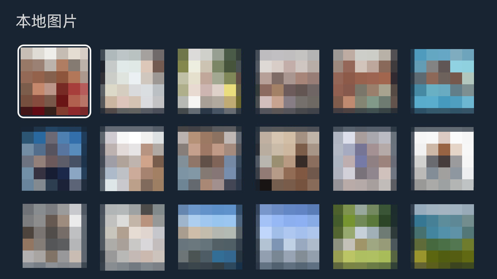
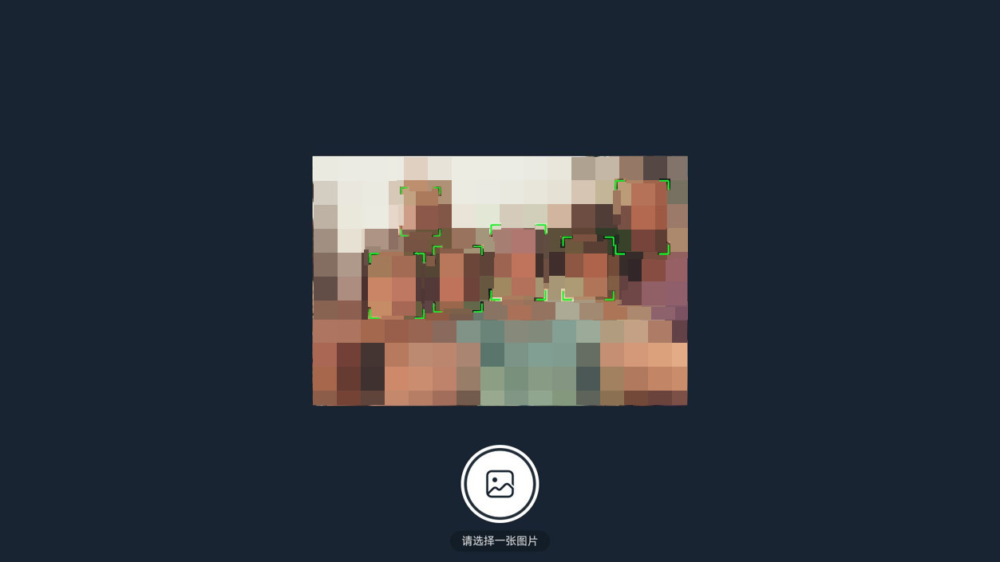

# applications_ai_face

#### 介绍

AI 人脸识别应用

#### 开发环境

- IDE:DevEco 5.0.3.900
- SDK:5.0.0.71

#### 功能需求

- 打开本机、分布式摄像头，实时识别人脸区域
- 读取本地图片列表
- 调用AI接口传入图片，绘制人脸区域
- 支持遥控器焦点
- 分布式认证、解绑

#### 首页

应用启动时，页面展示摄像头人脸识别、图片人脸识别和分布式认证三个功能的入口。

#### 摄像头人脸识别

首页选择摄像头人脸识别，进入后会自动拉起摄像头，并实时识别图像内的人脸区域

选择“多机位切换”按钮可进行摄像头切换，并实时识别图像内的人脸区域

#### 图片人脸识别

##### 1. 图片选择

在首页点击图片人脸识别按钮进入，展示本地图片列表，点击选中后会回到首页进行人脸识别。

##### 2. 图片人脸识别

在图片选择页面点击图片后进入，进入页面后，程序会将图片数据传入系统，系统识别完成后会将图片中的人脸区域圈出。

##### 3. 分布式认证

进入分布式认证页面，展示可信设备列表，点击“点击开始发现设备”按钮进行发现在线设备。选择设备可进行绑定、解绑操作。

