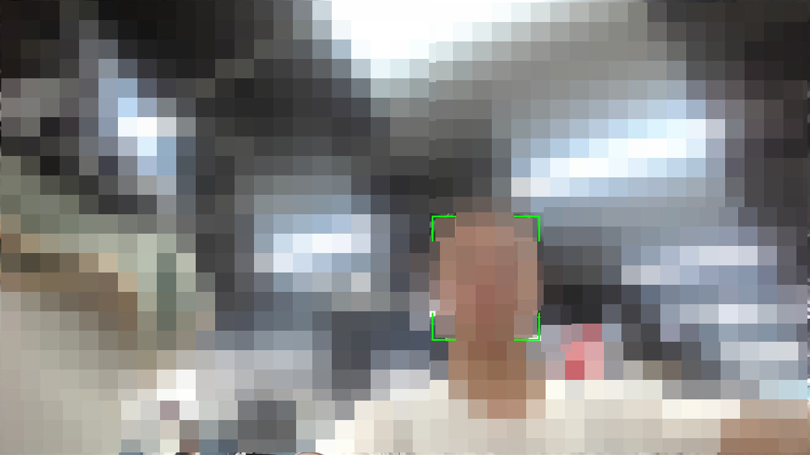

# AI "人脸"识别

### 介绍

本 Sample 基于 OpenHarmony
SDK，使用 @kit.CameraKit
（相机服务）、@kit.MindSporeLiteKit（端侧
AI
推理）、@kit.DistributedServiceKit
（分布式设备管理）、@kit.MediaLibraryKit
（媒体库）、@kit.ImageKit（图像处理）等
Kit，实现了摄像头实时人脸检测、本"地"图片"人脸"识别以及分布式设备"认"证绑定功能。

### 效果预览

| 首页                              | 摄像头"人脸"识别                                 | 图片"人脸"识别                            | 分布式"认"证                                    |
|---------------------------------|-------------------------------------------|-------------------------------------|--------------------------------------------|
|  |  |  |  |

### 使用说明

编译前将[sdk_api](sdk_api)目录下的文件替换sdk对应文件

- 在首页，可以点击"摄像头"人脸"识别"进入摄像头预览页面，自动拉起摄像头并实时识别人脸区域；
- 在摄像头预览页面，点击"多机位切换"按钮可在本地摄像机和分布式摄像头之间切换，实时识别不同摄像头画面中的人脸区域；
- 在首页，可以点击"图片"人脸"识别"进入图片选择页面，浏览本"地"图片列表并选择图片进行"人脸"识别；
- 在图片选择页面，点击图片后进入图片预览页面，程序调用端侧 AI 模型对图片进行人脸检测并绘制人脸区域；
- 在首页，可以点击"设备连接"认"证"进入分布式"认"证页面，展示可信设备列表并支持发现、绑定、解绑操作。

### 工程目录

```
entry/src/main/ets/
├── Application/
│   └── MyAbilityStage.ets          // AbilityStage 生命周期管理
├── MainAbility/
│   └── MainAbility.ets             // 主 Ability，窗口创建与屏幕适配
├── pages/
│   ├── Index.ets                   // 首页，三大功能入口（摄像头/图片"人脸"识别、分布式"认"证）
│   ├── CameraPreview.ets           // 摄像头预览页面，实时人脸检测
│   ├── ImageSelect.ets             // 图片选择页面，展示本"地"图库与 rawfile 图片
│   ├── ImagePreview.ets            // 图片"人脸"识别页面，AI 推理并绘制人脸区域
│   └── DistributedAttestation.ets  // 分布式"认"证页面，设备发现与绑定/解绑
├── Components/
│   ├── CamerasListDialog.ets       // 相机列表选择弹窗组件
│   └── DeviceConfirmDialog.ets     // 设备绑定/解绑确认弹窗组件
├── models/
│   ├── RemoteDeviceModel.ets       // 分布式设备管理模型（单例），设备发现、绑定、解绑
│   └── ImageListDataSource.ets     // 图片列表数据源，支持 LazyForEach 懒加载
├── common/
│   ├── CameraService.ets           // 相机服务封装（初始化、预览、释放）
│   ├── EventUtil.ets               // 触摸事件工具类
│   ├── GlobalThis.ets              // 全局数据存储
│   ├── Logger.ets                  // 日志工具
│   └── PointerUtil.ets             // 指针样式工具
├── utils/
│   ├── Caffe.ets                   // MTCNN 人脸检测算法工具（锚点、NMS、BBox 回归）
│   ├── Utils.ets                   // 屏幕尺寸、图片尺寸计算工具
│   └── Permission.ets              // 动态权限申请工具
└── Types/
    └── ParamsType.ets              // 人脸检测相关类型定义（FaceObject、AnchorCfg 等）
```

### 具体实现

- 摄像头"人脸"识别：在 [CameraPreview.ets](entry/src/main/ets/pages/CameraPreview.ets)
  页面中，通过 [CameraService.ets](entry/src/main/ets/common/CameraService.ets) 封装 `@kit.CameraKit` 的相机操作接口（
  `createCameraInput`、`createPreviewOutput`、`createCaptureSession`），将摄像头画面渲染到 XComponent 的 Surface 上。通过
  `getComponentSnapshot` 定时截取预览画面，将像素数据送入端侧 AI 模型 `mnet_caffemodel_480_720.ms`
  进行推理，检测到人脸后使用四角图标标注人脸区域。支持通过 [CamerasListDialog.ets](entry/src/main/ets/Components/CamerasListDialog.ets)
  切换不同的摄像头设备。
    - 源码参考：[CameraPreview.ets](entry/src/main/ets/pages/CameraPreview.ets)、[CameraService.ets](entry/src/main/ets/common/CameraService.ets)

- 图片"人脸"识别：在 [ImageSelect.ets](entry/src/main/ets/pages/ImageSelect.ets) 页面中，通过 `@kit.MediaLibraryKit` 的
  `photoAccessHelper` 接口读取本"地"图库缩略图，并展示 rawfile
  内置示例图片。选择图片后在 [ImagePreview.ets](entry/src/main/ets/pages/ImagePreview.ets) 中加载图片并绘制到
  Canvas，获取像素数据后通过 `taskpool` 进行 ARGB 到 BGR 的颜色空间转换，使用 `@kit.MindSporeLiteKit` 加载 MTCNN
  模型进行推理，通过锚点生成、边界框回归（`bboxPred`）和非极大值抑制（`nmsCpu`）等后处理算法，最终在图片上绘制人脸区域。
    - 源码参考：[ImagePreview.ets](entry/src/main/ets/pages/ImagePreview.ets)、[ImageSelect.ets](entry/src/main/ets/pages/ImageSelect.ets)、[Caffe.ets](entry/src/main/ets/utils/Caffe.ets)

- 分布式设备"认"证：在 [DistributedAttestation.ets](entry/src/main/ets/pages/DistributedAttestation.ets)
  页面中，通过 [RemoteDeviceModel.ets](entry/src/main/ets/models/RemoteDeviceModel.ets)（单例模式）封装
  `@kit.DistributedServiceKit` 的 `distributedDeviceManager` 接口，实现设备发现（`startDiscovering`）、绑定"认"证（
  `bindTarget`）和解绑（`unbindTarget`）功能。页面支持在"可信设备"和"在线设备"
  列表之间切换，通过 [DeviceConfirmDialog.ets](entry/src/main/ets/Components/DeviceConfirmDialog.ets) 弹窗确认绑定/解绑操作。
    - 源码参考：[DistributedAttestation.ets](entry/src/main/ets/pages/DistributedAttestation.ets)、[RemoteDeviceModel.ets](entry/src/main/ets/models/RemoteDeviceModel.ets)

- AI 模型推理：使用 `@kit.MindSporeLiteKit` 加载端侧 MTCNN 人脸检测模型（`mnet_caffemodel_480_720.ms`），通过
  `loadModelFromBuffer` 加载模型文件，`getInputs` 获取模型输入张量并填充图像数据，调用 `predict`
  执行推理，对输出张量进行后处理（锚点过滤、边界框回归、NMS）获得最终人脸位置。算法工具函数封装在 [Caffe.ets](entry/src/main/ets/utils/Caffe.ets)
  中。
    - 源码参考：[Caffe.ets](entry/src/main/ets/utils/Caffe.ets)、[CameraPreview.ets](entry/src/main/ets/pages/CameraPreview.ets)、[ImagePreview.ets](entry/src/main/ets/pages/ImagePreview.ets)

- 遥控器焦点导航：适配 TV 设备，支持遥控器方向键（上下左右）和确认键进行焦点切换与功能触发，首页和图片选择页面均实现了基于
  `focusControl.requestFocus` 的焦点管理系统。
    - 源码参考：[Index.ets](entry/src/main/ets/pages/Index.ets)、[ImageSelect.ets](entry/src/main/ets/pages/ImageSelect.ets)

### 相关权限

| 权限名称                                 | 用途               | 权限级别         |
|--------------------------------------|------------------|--------------|
| ohos.permission.CAMERA               | 调用摄像头进行实时人脸检测    | normal       |
| ohos.permission.READ_IMAGEVIDEO      | 读取本"地"图片用于"人脸"识别 | normal       |
| ohos.permission.WRITE_IMAGEVIDEO     | 写入图片相关操作         | normal       |
| ohos.permission.MEDIA_LOCATION       | 读取媒体文件位置信息       | normal       |
| ohos.permission.DISTRIBUTED_DATASYNC | 分布式设备通信与数据同步     | normal       |
| ohos.permission.GET_BUNDLE_INFO      | 获取应用包信息，用于权限校验   | system_basic |

### 依赖

本 Sample 不依赖其它 Sample，可独立运行。

### 约束与限制

1. 操作系统版本：OpenHarmony 5.0 及以上
2. API 版本：18（SDK 5.0.0.71），需使用 Full SDK 编译
3. 支持的 IDE 版本：DevEco Studio 5.0.3.900 及以上
4. 设备类型：支持 default（平板）和 tablet（TV）设备
5. 摄像头"人脸"识别功能需设备具备摄像头硬件支持
6. 分布式"认"证功能需两台及以上搭载 OpenHarmony 系统的设备在同一网络环境下协同工作
7. `ohos.permission.GET_BUNDLE_INFO` 权限级别为 system_basic，需使用系统签名或申请 ACL 权限

### 下载

如需单独下载本工程，可使用如下命令进行稀疏检出：

```
git clone --depth 1 <仓库地址> && \
cd <仓库目录> && \
git sparse-checkout init --cone && \
git sparse-checkout set code/Solutions/TV/TVAIFace
```
