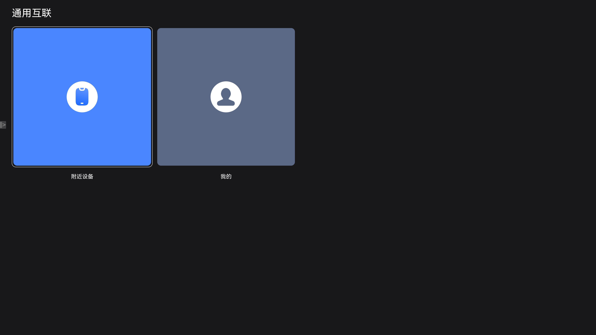
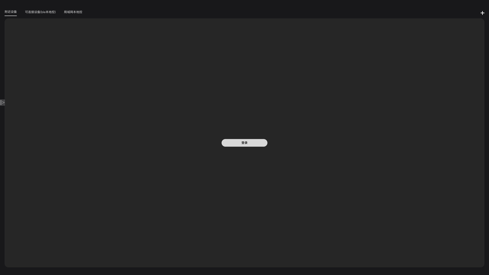
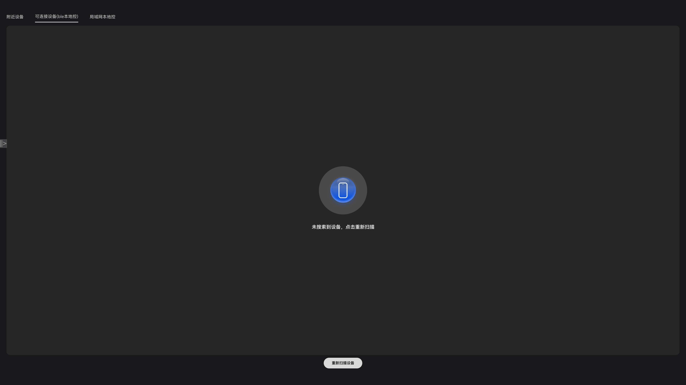

# TVConnect

## 介绍

TVConnect 是一款面向 OpenHarmony 生态的通用互联应用，能够运行在搭载 OpenHarmony 系统的大屏设备（TV）上。本示例以**通用互联**
为核心设计理念，致力于打破不同协议、不同品牌、不同形态设备之间的连接壁垒，为用户提供统一的、无缝的跨设备互联体验。

通过抽象统一的设备接入框架，TVConnect 屏蔽了底层通信协议的差异，将 BLE 蓝牙、WiFi、IoT-Connect、云端 MQTT
等多种连接方式纳入一致的管理体系，实现"一套接口、多协议接入"的通用互联能力。无论是近场发现还是远程云端控制，用户都能以相同的方式完成设备发现、连接、管理与场景联动。

本示例使用 Stage 模型，采用模块化架构设计，演示了以下 OpenHarmony 核心能力在通用互联场景中的综合应用：

- @ohos.bluetooth — BLE 蓝牙设备发现与连接，支撑近场通用互联
- @ohos.wifiManager — WiFi 设备配网与连接，扩展局域网互联能力
- @ohos.ability.featureAbility — 多设备协同与跨设备互联
- @ohos.data.relationalStore — 互联设备信息与场景数据的本地持久化存储
- @ohos.data.preferences — 用户互联偏好设置管理
- @ohos.net.http — HTTP 网络请求，支撑云端设备互联
- @ohos.multimodalInput.inputEventClient — 输入事件注入（TV 遥控器适配）
- [@hadss/hmrouter](https://ohos.openharmony.cn/hmrouter/) — 路由导航框架
- MQTT 协议 — 云端设备消息推送与控制，实现远程互联

主要功能围绕通用互联展开：多协议设备统一发现与连接（BLE/WiFi/IoT-Connect/云端）、互联设备库管理、跨设备场景联动配置、跨设备协同、个人中心管理等。

## 效果预览

| 首页                                | 附近设备                                       | 可信设备                                       |
|-----------------------------------|--------------------------------------------|--------------------------------------------|
|  |  |  

### 3.1 使用说明

1. 在搭载 OpenHarmony 系统的大屏设备（TV/RK3568）上安装应用
2. 第一次启动进入隐私协议页，同意后进入首页
3. 首页通过底部 Tab 切换"附近设备"、"设备库"、"场景库"、"个人中心"等功能模块
4. 在"附近设备"页面，可统一扫描并发现周边的 BLE/WiFi/IoT-Connect/云端设备，实现多协议通用互联发现
5. 在"设备库"页面，可查看已互联的设备列表、搜索设备、查看设备详情与连接状态
6. 在"场景库"页面，可创建跨设备场景联动规则，配置不同协议设备的触发条件与执行动作，实现自动化互联协同
7. 在"个人中心"页面，可管理用户信息、切换语言等

## 工程目录

```
TVConnect
├── product/tv                                  # 主 Entry 模块（TV 产品入口）
│   └── src/main
│       ├── ets                                 # ArkTS 源码目录
│       │   ├── entryability                    # EntryAbility 入口
│       │   │   └── EntryAbility.ets            # 应用生命周期管理、权限请求、路由初始化
│       │   ├── pages                           # 页面目录
│       │   │   ├── HomeIndex.ets               # 首页（HMNavigation 路由容器）
│       │   │   ├── LauncherPage.ets            # 启动隐私协议页
│       │   │   ├── ScenePage.ets               # 场景执行页面
│       │   │   ├── login/                      # 登录相关页面
│       │   │   ├── OrderExecution/             # 指令执行页面
│       │   │   └── ovble/                      # OV-BLE 相关页面
│       │   ├── view                            # 公共 UI 组件目录
│       │   ├── viewmodel                       # 数据模型与状态管理目录
│       │   └── hmrouter/                       # 路由拦截器与生命周期配置
│       ├── resources                           # 资源配置文件
│       │   ├── base/element/                   # 默认颜色/字符串资源
│       │   ├── en_US/element/                  # 英文资源
│       │   └── zh_CN/element/                  # 中文资源
│       └── module.json5                        # Entry 模块配置（权限声明、Ability 注册）
│
├── common                                      # 公共基础模块（通用互联基础设施）
│   └── src/main/ets
│       ├── constants/                          # 公共常量（CommonConstants、DeviceType、EventConstants 等）
│       ├── database/                           # 数据库抽象层（RDB 访问、实体定义、DAO 操作）
│       │   ├── entity/                         # 数据实体定义（Device、Scene、UserDate）
│       │   └── dao/                            # 数据访问对象（DeviceLibraryDao、SceneLibraryDao、UserLibraryDao）
│       ├── http/                               # HTTP 网络请求封装（HttpRequest、BaseEntry）
│       ├── inf/                                # 通用互联协议抽象接口层（核心）
│       │   ├── InfAccessManager.ets            # 接入管理器接口定义
│       │   ├── InfAccessManagerBluetooth.ets   # 蓝牙接入管理器
│       │   ├── InfAccessManagerWifi.ets        # WiFi 接入管理器
│       │   ├── InfDevicesBusiness.ets          # 设备业务状态模型
│       │   ├── InfDevicesConnector.ets         # 通用设备连接器接口
│       │   ├── InfDevicesController.ets        # 通用设备控制器接口
│       │   ├── InfDevicesDiscover.ets          # 通用设备发现接口
│       │   ├── InfDevicesParser.ets            # 设备数据解析器
│       │   └── TypeEnum.ets                    # 协议类型枚举（BLE/WiFi/IoT/Cloud）
│       ├── task/                               # 异步任务工具
│       └── utils/                              # 工具类（Logger、NetManager、PermissionUtil、DeviceUtils 等）
│
├── connect                                      # 多协议连接实现模块（通用互联协议层）
│   ├── connect_ble/                            # BLE 蓝牙协议模块
│   │   └── src/main/ets/components/connect/ble/
│   │       ├── BleDevice.ets                   # BLE 设备模型
│   │       ├── BleDevicesBusiness.ets          # BLE 设备业务逻辑
│   │       ├── BleDevicesConnector.ets         # BLE 设备连接器
│   │       ├── BleDevicesController.ets        # BLE 设备控制器
│   │       ├── BleDevicesDiscover.ets          # BLE 设备扫描发现
│   │       ├── BleDevicesParser.ets            # BLE 广播数据解析
│   │       ├── BleScanner.ets                  # BLE 扫描器
│   │       └── protocol/                       # BLE 协议封装（BlePackage、BlePackageManager 等）
│   ├── connect_wifi/                           # WiFi 协议模块
│   ├── connect_iot/                            # IoT-Connect 协议模块
│   ├── connect_cloud/                          # 云端连接模块（HTTP API + MQTT 消息引擎）
│   │   └── src/main/ets/components/connect/
│   │       ├── http/                           # HTTP 接口（HttpApi、ProjectDeviceModel）
│   │       └── mqtt/                           # MQTT 引擎（MqttEngine、MqttManager、MqttMessageDispatcher）
│   └── device_manager/                         # 统一设备管理器（通用互联调度中枢）
│       └── src/main/ets/components/device/manager/
│           ├── DeviceManager.ets               # 设备管理器工厂
│           └── DeviceManagerInterface.ets       # 设备管理器接口定义
│
├── features                                     # 功能特性模块
│   ├── nearbydevice/                           # 附近设备 Tab（通用互联发现入口）
│   │   └── src/main/ets/
│   │       ├── pages/                          # 多协议设备统一发现与连接页面
│   │       ├── view/                           # 设备卡片/列表组件
│   │       └── viewmodel/                      # 设备发现状态管理
│   ├── devicelibrary/                          # 设备库 Tab（互联设备管理中心）
│   │   └── src/main/ets/
│   │       ├── components/detail/              # 设备详情页
│   │       ├── components/library/             # 设备库列表页
│   │       ├── components/search/              # 设备搜索页
│   │       └── viewmodel/                      # 设备库状态管理
│   ├── scenelibrary/                           # 场景库 Tab（跨设备互联联动）
│   │   └── src/main/ets/
│   │       ├── pages/                          # 场景列表、添加场景、场景详情、设备选择等页面
│   │       ├── view/                           # 场景卡片组件
│   │       └── viewmodel/                      # 场景库状态管理
│   ├── mine/                                   # 个人中心 Tab
│   │   └── src/main/ets/
│   │       ├── components/                     # 个人中心页面组件
│   │       ├── model/                          # 国际化管理器、LibraryManager 工厂
│   │       └── viewmodel/                      # 个人中心状态管理
│   └── camera/                                 # 相机功能模块
│
├── figures/                                    # 图片资源目录
├── signature/                                  # 证书文件目录
├── LICENSE                                     # 开源许可文件
├── USERGUIDER.md                               # 横竖屏/DFX/国际化开发指导
└── ohosTest.md                                 # 测试用例归档
```

## 具体实现

本应用以**通用互联**为架构核心，采用模块化分层设计。通过 `common/inf/` 定义统一的设备接入抽象接口，将
BLE、WiFi、IoT-Connect、Cloud 等多种异构协议的设备发现、连接、控制能力归一化，由 `DeviceManager`
统一调度，上层业务无需感知底层协议差异，实现"一次开发、多协议互联"的通用连接能力。

### 5.1 应用入口与通用互联初始化

在 EntryAbility 中完成通用互联基础设施的初始化：权限请求、路由框架初始化、设备管理器创建（加载全部协议适配器）、网络状态监听注册、设备
ID 获取等。应用退出时终止自身进程以释放互联资源。

- [EntryAbility.ets](product/tv/src/main/ets/entryability/EntryAbility.ets)

### 5.2 通用互联设备接入框架

通用互联的核心在于通过抽象接口层（`common/inf/`）定义统一的设备接入规范，将 BLE、WiFi、IoT-Connect、Cloud
四种异构协议纳入相同的交互模型。各协议模块独立实现
Discover（发现）、Connector（连接）、Controller（控制）、Parser（解析）、Business（业务）接口，由 `DeviceManager`
工厂统一调度与路由。上层业务模块通过 `DeviceManager` 即可操作任意协议的设备，无需关心底层通信细节，真正实现通用互联。

-

接口定义：[InfDevicesDiscover.ets](common/src/main/ets/inf/InfDevicesDiscover.ets)、[InfDevicesConnector.ets](common/src/main/ets/inf/InfDevicesConnector.ets)、[InfDevicesController.ets](common/src/main/ets/inf/InfDevicesController.ets)
-
蓝牙实现：[BleDevicesDiscover.ets](connect/connect_ble/src/main/ets/components/connect/ble/BleDevicesDiscover.ets)、[BleDevicesConnector.ets](connect/connect_ble/src/main/ets/components/connect/ble/BleDevicesConnector.ets)

- 设备管理器：[DeviceManager.ets](connect/device_manager/src/main/ets/components/device/manager/DeviceManager.ets)

### 5.3 云端互联与 MQTT 消息推送

云端互联模块扩展了通用互联的边界，使远程设备也能纳入统一的互联管理体系。通过 [HttpApi](connect/connect_cloud/src/main/ets/components/connect/http/HttpApi.ets)
与云端服务器交互获取项目设备信息，通过 [MqttEngine](connect/connect_cloud/src/main/ets/components/connect/mqtt/MqttEngine.ets)
实现基于 MQTT 协议的实时消息订阅与发布，支撑远程设备状态同步和控制指令下发，打通本地近场互联与远程云端互联的最后一公里。

### 5.4 互联设备库管理

互联设备库模块基于关系型数据库（RDB）统一存储所有已互联设备的信息（无论其接入协议类型），提供设备添加、列表展示、搜索过滤和设备详情查看等功能，是通用互联体系中的设备资产管理中心。数据访问通过 [DeviceLibraryDao](common/src/main/ets/database/dao/DeviceLibraryDao.ets)
实现。

- 设备库页面：[DeviceLibraryPage](features/devicelibrary/src/main/ets/components/page/DeviceLibraryPage.ets)
- 状态管理：[DeviceLibraryManager](features/devicelibrary/src/main/ets/viewmodel/DeviceLibraryManager.ets)

### 5.5 跨设备场景联动

场景库模块是通用互联价值的集中体现——允许用户跨协议、跨设备创建自动化联动规则，包含触发条件和执行动作。例如"BLE
传感器检测到有人 → WiFi 灯打开 → 云端摄像头开始录像"
这样的跨协议联动场景。场景数据通过 [SceneLibraryDao](common/src/main/ets/database/dao/SceneLibraryDao.ets)
持久化存储，支持场景的创建、编辑、删除和执行。

- 场景库页面：[SceneLibraryPage](features/scenelibrary/src/main/ets/pages/SceneLibraryPage.ets)
- 添加场景：[AddScenePage](features/scenelibrary/src/main/ets/pages/AddScenePage.ets)
- 场景详情：[SceneDetailPage](features/scenelibrary/src/main/ets/pages/SceneDetailPage.ets)
 

#### 媒体查询 (@ohos.mediaquery)

媒体查询可根据不同设备类型或同设备不同状态修改应用的样式。当屏幕发生动态改变时（比如分屏、横竖屏切换），同步更新应用的页面布局时，可以使用媒体查询。
Stage模型下的示例：使用媒体查询，实现屏幕横竖屏切换时，给页面文本应用添加不同的内容和样式。

	import mediaquery from '@ohos.mediaquery';
	import window from '@ohos.window';
	import common from '@ohos.app.ability.common';

	@Entry
	@Component
	struct MediaQueryExample {
	  @State color: string = '#DB7093';
	  @State text: string = 'Portrait';
	  @State portraitFunc:mediaquery.MediaQueryResult|void|null = null;
	  // 当设备横屏时条件成立
	  listener:mediaquery.MediaQueryListener = mediaquery.matchMediaSync('(orientation: landscape)');

	  // 当满足媒体查询条件时，触发回调
	  onPortrait(mediaQueryResult:mediaquery.MediaQueryResult) {
	    if (mediaQueryResult.matches as boolean) { // 若设备为横屏状态，更改相应的页面布局
	      this.color = '#FFD700';
	      this.text = 'Landscape';
	    } else {
	      this.color = '#DB7093';
	      this.text = 'Portrait';
	    }
	  }

	  aboutToAppear() {
	    // 绑定当前应用实例
	    // 绑定回调函数
	    this.listener.on('change', (mediaQueryResult:mediaquery.MediaQueryResult) => { this.onPortrait(mediaQueryResult) });
	  }

	  // 改变设备横竖屏状态函数
	  private changeOrientation(isLandscape: boolean) {
	    // 获取UIAbility实例的上下文信息
	    let context:common.UIAbilityContext = getContext(this) as common.UIAbilityContext;
	    // 调用该接口手动改变设备横竖屏状态
	    window.getLastWindow(context).then((lastWindow) => {
	      lastWindow.setPreferredOrientation(isLandscape ? window.Orientation.LANDSCAPE : window.Orientation.PORTRAIT)
	    });
	  }

	  build() {
	    Column({ space: 50 }) {
	      Text(this.text).fontSize(50).fontColor(this.color)
	      Text('Landscape').fontSize(50).fontColor(this.color).backgroundColor(Color.Orange)
	        .onClick(() => {
	          this.changeOrientation(true);
	        })
	      Text('Portrait').fontSize(50).fontColor(this.color).backgroundColor(Color.Orange)
	        .onClick(() => {
	          this.changeOrientation(false);
	        })
	    }
	    .width('100%').height('100%')
	  }
	}

## 相关权限

| 权限名                                   | 权限说明         | 使用理由                   |
|---------------------------------------|--------------|------------------------|
| ohos.permission.INTERNET              | 网络访问权限       | 云端互联通信、HTTP 请求、MQTT 连接 |
| ohos.permission.GET_NETWORK_INFO      | 获取网络状态信息     | 通用互联网络连接状态监听与自适应       |
| ohos.permission.STORE_PERSISTENT_DATA | 持久化数据存储      | 互联设备信息、场景数据的本地存储       |
| ohos.permission.ACCESS_BLUETOOTH      | 蓝牙访问权限       | BLE 设备扫描、连接与近场互联通信     |
| ohos.permission.INJECT_INPUT_EVENT    | 输入事件注入（系统权限） | TV 遥控器适配与输入控制          |

## 依赖

本示例不依赖其它 Sample 工程，通过 HMS 模块化架构实现内部模块间的依赖引用：

- `@ohos/common` — 公共基础模块（常量、数据库、工具类、通用互联协议接口）
- `@ohos/device_manager` — 统一设备管理器模块（通用互联调度中枢）
- `@ohos/connect_ble` — BLE 蓝牙协议模块（近场互联）
- `@ohos/connect_wifi` — WiFi 协议模块（局域网互联）
- `@ohos/connect_iot` — IoT-Connect 协议模块（物联网互联）
- `@ohos/connect_cloud` — 云端连接模块（远程互联）
- `@ohos/nearbydevice` — 附近设备功能模块（多协议统一发现）
- `@ohos/devicelibrary` — 设备库功能模块（互联设备管理）
- `@ohos/scenelibrary` — 场景库功能模块（跨设备互联联动）
- `@ohos/mine` — 个人中心功能模块
- `@ohos/camera` — 相机功能模块

外部依赖：[`@hadss/hmrouter`](https://ohos.openharmony.cn/hmrouter/) — 路由导航框架

## 约束与限制

### 6.1 支持的操作系统版本和设备

- 支持的操作系统：OpenHarmony（标准系统）
- 支持的设备：RK3568 开发板、搭载 OpenHarmony 系统的 TV 大屏设备

### 6.2 API 版本与 SDK 版本

- 应用使用的 API 版本：API 18
- compileSdkVersion：18
- compatibleSdkVersion：18
- 编译架构：arm64-v8a
- 本应用不涉及 Full SDK，无需替换指南

### 6.3 支持的 IDE 版本

- 推荐使用 DevEco Studio NEXT Developer Beta1 (5.0.3.403) 及以上版本
- 开发工具自带 SDK 工具包，无需单独下载

### 6.4 高等级 APL 特殊签名说明

本应用需要 `ohos.permission.INJECT_INPUT_EVENT` 系统权限，该权限为 system_basic 级别，在 RK3568
等开发板上通过自动签名即可使用。如需在商用设备上运行，需申请对应权限级别的签名证书。

## 下载

如需单独下载本工程，可使用如下命令：

```bash
git init TVConnect
cd TVConnect
git config core.sparsecheckout true
echo code/Solutions/TV/TVConnect/ > .git/info/sparse-checkout
git remote add origin https://gitee.com/openharmony/applications_app_samples.git
git pull origin master
```

或直接克隆整个仓库后进入本目录：

```bash
git clone https://gitee.com/openharmony/applications_app_samples.git
cd applications_app_samples/code/Solutions/TV/TVConnect
```

## 参与贡献

1. Fork 本仓库
2. 新建 Feat_xxx 分支
3. 提交代码
4. 新建 Pull Request

## 许可

本项目基于 [Apache License 2.0](LICENSE) 许可。
