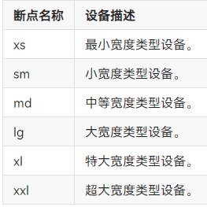

#开发指导
本文主要介绍一下横竖屏、DFX、国际化的开发方法。

## 横竖屏实现方法

横竖屏屏幕尺寸不一致，容纳元素也不一样。为了应对这种屏幕尺寸不确定性，应用开发可以采用，一次开发，多端部署的能力实现，其方案可以基于布局能力实现，也可以基于组件的属性能力实现，开发者根据不同场景选用不同方案，下面介绍实现方法。

### 布局实现横竖屏的不同呈现方式
#### 弹性布局 (Flex)

 弹性布局（Flex）提供更加有效的方式对容器中的子元素进行排列、对齐和分配剩余空间。常用于页面头部导航栏的均匀分布、页面框架的搭建、多行数据的排列等。
在弹性布局中，容器的子元素可以按照任意方向排列。通过设置参数direction，可以决定主轴的方向，从而控制子元素的排列方向，默认值FlexDirection.Row，主轴为水平方向。

		  Flex({ direction: FlexDirection.Row, alignItems: ItemAlign.Center, justifyContent: FlexAlign.SpaceBetween }) {
		    Button('OK', { type: ButtonType.Normal, stateEffect: true })
		      .borderRadius(8)
		      .backgroundColor(0x317aff)
		      .width(90)
		      .onClick(() => {
		        console.log('ButtonType.Normal')
		      })
		    Button({ type: ButtonType.Normal, stateEffect: true }) {
		      Row() {
		        LoadingProgress().width(20).height(20).margin({ left: 12 }).color(0xFFFFFF)
		        Text('loading').fontSize(12).fontColor(0xffffff).margin({ left: 5, right: 12 })
		      }.alignItems(VerticalAlign.Center)
		    }.borderRadius(8).backgroundColor(0x317aff).width(90).height(40)
		
		    Button('Disable', { type: ButtonType.Normal, stateEffect: false }).opacity(0.4)
		      .borderRadius(8).backgroundColor(0x317aff).width(90)
		  }

可以通过Flex组件的alignItems参数设置子元素在交叉轴的对齐方式，默认ItemAlign.Start，交叉轴方向首部对齐。

#### 栅格布局 (GridRow/GridCol)
GridRow为栅格容器组件，需与栅格子组件GridCol在栅格布局场景中联合使用。

栅格系统断点
栅格系统以设备的水平宽度（屏幕密度像素值，单位vp）作为断点依据，定义设备的宽度类型，形成了一套断点规则。开发者可根据需求在不同的断点区间实现不同的页面布局效果。

* 栅格系统断点：栅格系统以设备的水平宽度（屏幕密度像素值，单位vp）作为断点依据，定义设备的宽度类型，形成了一套断点规则。开发者可根据需求在不同的断点区间实现不同的页面布局效果。

在GridRow栅格组件中，允许开发者使用breakpoints自定义修改断点的取值范围，最多支持6个断点，除了默认的四个断点外，还可以启用xl，xxl两个断点，支持六种不同尺寸（xs, sm, md, lg, xl, xxl）设备的布局设置。

栅格子组件GridCol，必须作为栅格容器组件(GridRow)的子组件使用。

使用栅格的默认列数12列，即在未设置columns时，任何断点下，栅格布局被分成12列。通过断点设置将应用宽度分成六个区间，在各区间中，每个栅格子元素占用的列数均不同。

		@State bgColors: Color[] = [Color.Red, Color.Orange, Color.Yellow, Color.Green, Color.Pink, Color.Grey, Color.Blue, Color.Brown];
		...
		GridRow({
		  breakpoints: {
		    value: ['200vp', '300vp', '400vp', '500vp', '600vp'],
		    reference: BreakpointsReference.WindowSize
		  }
		}) {
		   ForEach(this.bgColors, (color:Color, index?:number|undefined) => {
		     GridCol({
		       span: {
		         xs: 2, // 在最小宽度类型设备上，栅格子组件占据的栅格容器2列。
		         sm: 3, // 在小宽度类型设备上，栅格子组件占据的栅格容器3列。
		         md: 4, // 在中等宽度类型设备上，栅格子组件占据的栅格容器4列。
		         lg: 6, // 在大宽度类型设备上，栅格子组件占据的栅格容器6列。
		         xl: 8, // 在特大宽度类型设备上，栅格子组件占据的栅格容器8列。
		         xxl: 12 // 在超大宽度类型设备上，栅格子组件占据的栅格容器12列。
		       }
		     }) {
		       Row() {
		         Text(`${index}`)
		       }.width("100%").height('50vp')
		     }.backgroundColor(color)
		   })
		}                                                                    
		                                 

#### 媒体查询 (@ohos.mediaquery)
 媒体查询可根据不同设备类型或同设备不同状态修改应用的样式。当屏幕发生动态改变时（比如分屏、横竖屏切换），同步更新应用的页面布局时，可以使用媒体查询。
Stage模型下的示例：使用媒体查询，实现屏幕横竖屏切换时，给页面文本应用添加不同的内容和样式。

	import mediaquery from '@ohos.mediaquery';
	import window from '@ohos.window';
	import common from '@ohos.app.ability.common';
	
	@Entry
	@Component
	struct MediaQueryExample {
	  @State color: string = '#DB7093';
	  @State text: string = 'Portrait';
	  @State portraitFunc:mediaquery.MediaQueryResult|void|null = null;
	  // 当设备横屏时条件成立
	  listener:mediaquery.MediaQueryListener = mediaquery.matchMediaSync('(orientation: landscape)');
	
	  // 当满足媒体查询条件时，触发回调
	  onPortrait(mediaQueryResult:mediaquery.MediaQueryResult) {
	    if (mediaQueryResult.matches as boolean) { // 若设备为横屏状态，更改相应的页面布局
	      this.color = '#FFD700';
	      this.text = 'Landscape';
	    } else {
	      this.color = '#DB7093';
	      this.text = 'Portrait';
	    }
	  }
	
	  aboutToAppear() {
	    // 绑定当前应用实例
	    // 绑定回调函数
	    this.listener.on('change', (mediaQueryResult:mediaquery.MediaQueryResult) => { this.onPortrait(mediaQueryResult) });
	  }
	
	  // 改变设备横竖屏状态函数
	  private changeOrientation(isLandscape: boolean) {
	    // 获取UIAbility实例的上下文信息
	    let context:common.UIAbilityContext = getContext(this) as common.UIAbilityContext;
	    // 调用该接口手动改变设备横竖屏状态
	    window.getLastWindow(context).then((lastWindow) => {
	      lastWindow.setPreferredOrientation(isLandscape ? window.Orientation.LANDSCAPE : window.Orientation.PORTRAIT)
	    });
	  }
	
	  build() {
	    Column({ space: 50 }) {
	      Text(this.text).fontSize(50).fontColor(this.color)
	      Text('Landscape').fontSize(50).fontColor(this.color).backgroundColor(Color.Orange)
	        .onClick(() => {
	          this.changeOrientation(true);
	        })
	      Text('Portrait').fontSize(50).fontColor(this.color).backgroundColor(Color.Orange)
	        .onClick(() => {
	          this.changeOrientation(false);
	        })
	    }
	    .width('100%').height('100%')
	  }
	}

### 组件属性实现横竖屏的不同呈现方式

#### justifyContent属性
justifyContent属性可以设置Row组件 、 Column组件 或 Flex组件中子元素在父容器主轴方向的布局。其中justifyContent属性设置为FlexAlign.SpaceEvenly可以实现子元素在父容器主轴方向等间距布局，相邻元素之间的间距、第一个元素与行首的间距、最后一个元素到行尾的间距都完全一样。
SpaceEvenly均分的示例代码如下：

	@Entry
	@Component
	struct EquipartitionCapabilitySample {
	  readonly list: number [] = [0, 1, 2, 3]
	  @State rate: number = 0.6
	
	  // 底部滑块，可以通过拖拽滑块改变容器尺寸
	  @Builder slider() {
	    Slider({ value: this.rate * 100, min: 30, max: 60, style: SliderStyle.OutSet })
	      .blockColor(Color.White)
	      .width('60%')
	      .onChange((value: number) => {
	        this.rate = value / 100
	      })
	      .position({ x: '20%', y: '80%' })
	  }
	
	  build() {
	    Column() {
	      Column() {
	        // 均匀分配父容器主轴方向的剩余空间
	        Row() {
	          ForEach(this.list, (item:number) => {
	            Column() {
	              Image($r("app.media.icon")).width(48).height(48).margin({ top: 8 })
	              Text('App name')
	                .width(64)
	                .height(30)
	                .lineHeight(15)
	                .fontSize(12)
	                .textAlign(TextAlign.Center)
	                .margin({ top: 8 })
	                .padding({ bottom: 15 })
	            }
	            .width(80)
	            .height(102)
	            .flexShrink(1)
	          })
	        }
	        .width('100%')
	        .justifyContent(FlexAlign.SpaceEvenly)
	        // 均匀分配父容器主轴方向的剩余空间
	        Row() {
	          ForEach(this.list, (item:number) => {
	            Column() {
	              Image($r("app.media.icon")).width(48).height(48).margin({ top: 8 })
	              Text('App name')
	                .width(64)
	                .height(30)
	                .lineHeight(15)
	                .fontSize(12)
	                .textAlign(TextAlign.Center)
	                .margin({ top: 8 })
	                .padding({ bottom: 15 })
	            }
	            .width(80)
	            .height(102)
	            .flexShrink(1)
	          })
	        }
	        .width('100%')
	        .justifyContent(FlexAlign.SpaceEvenly)
	      }
	      .width(this.rate * 100 + '%')
	      .height(222)
	      .padding({ top: 16 })
	      .backgroundColor('#FFFFFF')
	      .borderRadius(16)
	
	      this.slider()
	    }
	    .width('100%')
	    .height('100%')
	    .backgroundColor('#F1F3F5')
	    .justifyContent(FlexAlign.Center)
	    .alignItems(HorizontalAlign.Center)
	  }
	}

另外，ohos-connect\product\phone\src\main\ets\pages\CategoryPage.ets中Column设置了justifyContent属性为FlexAlign.Center，示例代码如下：

	  TabBottom(item: TabItem, index: number) {
	    Column() {
	      Image(this.categoryTabIndex === index ? item.imageActivated : item.imageOriginal)
	        .height($r('app.string.tab_image_size'))
	        .width($r('app.string.tab_image_size'))
	        .margin({
	          top: $r('app.string.tab_margin_top'),
	          bottom: $r('app.string.tab_margin_bottom')
	        })
	
	      Text(item.title)
	        .width(CommonConstants.FULL_WIDTH_PERCENT)
	        .height($r('app.string.tab_text_height'))
	        .fontSize($r('app.string.tab_text_font_size'))
	        .fontWeight(CommonConstants.TAB_ITEM_FONT_WEIGHT)
	        .fontColor(this.categoryTabIndex === index ?
	        $r('app.color.tab_text_activated') : $r('app.color.tab_text_normal'))
	        .textAlign(TextAlign.Center)
	        .margin({
	          bottom: $r('app.string.tab_text_margin_bottom')
	        })
	    }
	    .justifyContent(FlexAlign.Center)
	    .height(CommonConstants.FULL_HEIGHT_PERCENT)
	    .width(CommonConstants.FULL_WIDTH_PERCENT)
	  }

#### wrap属性
 wrap属性可以实现Flex折行布局，当横向布局尺寸不足以完整显示内容元素时，通过折行的方式，将元素显示在下方。
通过Flex组件warp参数实现自适应折行。 

	@Entry
	@Component
	struct WrapCapabilitySample {
	  @State rate: number = 0.7
	  readonly imageList: Resource [] = [
	    $r('app.media.flexWrap1'),
	    $r('app.media.flexWrap2'),
	    $r('app.media.flexWrap3'),
	    $r('app.media.flexWrap4'),
	    $r('app.media.flexWrap5'),
	    $r('app.media.flexWrap6')
	  ]
	
	  // 底部滑块，可以通过拖拽滑块改变容器尺寸
	  @Builder slider() {
	    Slider({ value: this.rate * 100, min: 50, max: 70, style: SliderStyle.OutSet })
	      .blockColor(Color.White)
	      .width('60%')
	      .onChange((value: number) => {
	        this.rate = value / 100
	      })
	      .position({ x: '20%', y: '87%' })
	  }
	
	  build() {
	    Flex({ justifyContent: FlexAlign.Center, direction: FlexDirection.Column }) {
	      Column() {
	        // 通过Flex组件warp参数实现自适应折行
	        Flex({
	          direction: FlexDirection.Row,
	          alignItems: ItemAlign.Center,
	          justifyContent: FlexAlign.Center,
	          wrap: FlexWrap.Wrap
	        }) {
	          ForEach(this.imageList, (item:Resource) => {
	            Image(item).width(183).height(138).padding(10)
	          })
	        }
	        .backgroundColor('#FFFFFF')
	        .padding(20)
	        .width(this.rate * 100 + '%')
	        .borderRadius(16)
	      }
	      .width('100%')
	
	      this.slider()
	    }.width('100%')
	    .height('100%')
	    .backgroundColor('#F1F3F5')
	  }
	}

#### displayPriority属性
displayPriority属性可以设置布局优先级，来控制显隐，当布局主轴方向剩余尺寸不足以满足全部元素时，按照布局优先级大小，从小到大依次隐藏，直到容器能够完整显示剩余元素。具有相同布局优先级的元素将同时显示或者隐藏。

父容器尺寸发生变化时，其子元素按照预设的优先级显示或隐藏。

	@Entry
	@Component
	struct HiddenCapabilitySample {
	  @State rate: number = 0.45
	
	  // 底部滑块，可以通过拖拽滑块改变容器尺寸
	  @Builder slider() {
	    Slider({ value: this.rate * 100, min: 10, max: 45, style: SliderStyle.OutSet })
	      .blockColor(Color.White)
	      .width('60%')
	      .height(50)
	      .onChange((value: number) => {
	        this.rate = value / 100
	      })
	      .position({ x: '20%', y: '80%' })
	  }
	
	  build() {
	    Column() {
	      Row() {
	        Image($r("app.media.favorite"))
	          .width(48)
	          .height(48)
	          .objectFit(ImageFit.Contain)
	          .margin({ left: 12, right: 12 })
	          .displayPriority(1)  // 布局优先级
	
	        Image($r("app.media.down"))
	          .width(48)
	          .height(48)
	          .objectFit(ImageFit.Contain)
	          .margin({ left: 12, right: 12 })
	          .displayPriority(2)  // 布局优先级
	
	        Image($r("app.media.pause"))
	          .width(48)
	          .height(48)
	          .objectFit(ImageFit.Contain)
	          .margin({ left: 12, right: 12 })
	          .displayPriority(3)  // 布局优先级
	
	        Image($r("app.media.next"))
	          .width(48)
	          .height(48)
	          .objectFit(ImageFit.Contain)
	          .margin({ left: 12, right: 12 })
	          .displayPriority(2)  // 布局优先级
	
	        Image($r("app.media.list"))
	          .width(48)
	          .height(48)
	          .objectFit(ImageFit.Contain)
	          .margin({ left: 12, right: 12 })
	          .displayPriority(1)  // 布局优先级
	      }
	      .width(this.rate * 100 + '%')
	      .height(96)
	      .borderRadius(16)
	      .backgroundColor('#FFFFFF')
	      .justifyContent(FlexAlign.Center)
	      .alignItems(VerticalAlign.Center)
	
	      this.slider()
	    }
	    .width('100%')
	    .height('100%')
	    .backgroundColor('#F1F3F5')
	    .justifyContent(FlexAlign.Center)
	    .alignItems(HorizontalAlign.Center)
	  }
	}

不同场景下，横竖屏实现的方案不一样，属性方式可以实现，布局方式也可以实现。布局可能存在二次分配布局的问题，此情况下属性方式性能较佳。

## 国际化实现方法
以应用工程ohos-connect中的TopComponent.ets页面(ohos-connect\product\phone\src\main\ets\view\TopComponent.ets)中的 “Text($r('app.string.sub_title'))”资源引用为例，介绍国际化实现方法。
### 定义中英文含义

* 定义字符：在ohos-connect\product\phone\src\main\resources\base\element\string.json中定义需要国际化的sub_title资源，定义其name、value。

	    {
	      "name": "grid_item_text",
	      "value": "Subclass"
	    },
	    {
	      "name": "sub_title",
	      "value": "Sub title"
	    },
	    {
	      "name": "title",
	      "value": "Category"
	    },

* 定义资源对应的英文描述：在\ohos-connect\product\phone\src\main\resources\en_US\element\string.json中定义sub_title资源的英文描述，对应其value的内容。

	    {
	      "name": "grid_item_text",
	      "value": "Subclass"
	    },
	    {
	      "name": "sub_title",
	      "value": "Sub title"
	    },
	    {
	      "name": "title",
	      "value": "Category"
	    },

* 定义资源对应的中文描述：在\ohos-connect\product\phone\src\main\resources\zh_CN\element\string.json中定义sub_title资源的中文描述，对应其value的内容。

	    {
	      "name": "grid_item_text",
	      "value": "子类"
	    },
	    {
	      "name": "sub_title",
	      "value": "子标题"
	    },
	    {
	      "name": "title",
	      "value": "分类"
	    },

### 引用已国际化的字符
使用时，使用“$r('app.string.sub_title')”这种方式引用已国际化的资源，即可实现不同语言系统不同显示的国际化需求。

      Text($r('app.string.sub_title'))
        .height($r('app.string.subtitle_height'))
        .fontColor($r('app.color.sub_text'))
        .fontSize($r('app.string.subtitle_font_size'))
        .fontWeight(CommonConstants.SUBTITLE_FONT_WEIGHT)
        .textAlign(TextAlign.Start)
    }      
		                                 

## DFX实现方法
### 自定义log格式

\ohos-connect\common\src\main\ets\utils\Logger.ets文件中已定义，代码如下：

	import hilog from '@ohos.hilog';
	
	/**
	 * Common log for all features.
	 *
	 * @param {string} prefix Identifies the log tag.
	 */
	
	
	let domain: number = 0xFF00;
	let prefix: string = 'OhosConnectLogger';
	let format: string = `%{public}s, %{public}s`;
	
	export class Logger {
	  static debug(...args: string[]) {
	    hilog.debug(domain, prefix, format, args);
	  }
	
	  static info(...args: string[]) {
	    hilog.info(domain, prefix, format, args);
	  }
	
	  static warn(...args: string[]) {
	    hilog.warn(domain, prefix, format, args);
	  }
	
	  static error(...args: string[]) {
	    hilog.error(domain, prefix, format, args);
	  }
	
	  static fatal(...args: string[]) {
	    hilog.fatal(domain, prefix, format, args);
	  }
	
	  static isLoggable(level: LogLevel) {
	    hilog.isLoggable(domain, prefix, level);
	  }
	}
	
	/**
	 * Log level define
	 *
	 * @syscap SystemCapability.HiviewDFX.HiLog
	 */
	enum LogLevel {
	  DEBUG = 3,
	  INFO = 4,
	  WARN = 5,
	  ERROR = 6,
	  FATAL = 7
	}

### 使用已定义的Logger进行打印
示例代码如下：

	import { CommonConstants, Logger } from '@ohos/common'
       ......

        AddScenePage({
          addClick: (type: number) => {
            router.pushUrl({
              url: "pages/ScenePage",
              params: {type: 3, category: type}
            }).catch((error: Error) => {
              Logger.error('LauncherPage pushUrl error ' + JSON.stringify(error));
            });
