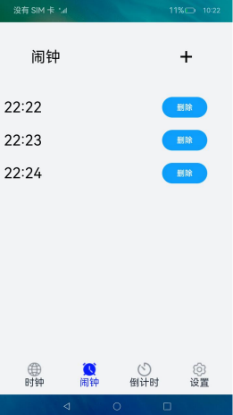
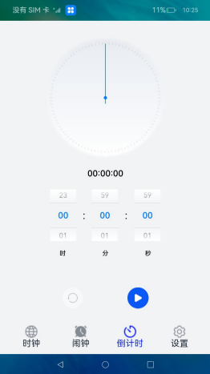

# 翻页时钟

### 介绍

本示例集中展示了时钟、闹钟、倒计时、设置屏幕亮度相关的场景，  
1、使用[@ohos.reminderAgentManager](https://gitee.com/openharmony/docs/blob/master/zh-cn/application-dev/reference/apis/js-apis-reminderAgentManager.md )完成闹钟的相关功能，  
2、使用animateTo完成翻页时钟动画，使用[@ohos.runningLock](https://gitee.com/openharmony/docs/blob/master/zh-cn/application-dev/reference/apis/js-apis-runninglock.md )完成屏幕常亮功能，  
3、设置屏幕亮度，使用[@ohos.brightness](https://gitee.com/openharmony/docs/blob/master/zh-cn/application-dev/reference/apis/js-apis-brightness.md )系统能力调节屏幕亮度，  
4、后台消息提醒，使用[@ohos.notificationManager](https://gitee.com/openharmony/docs/blob/master/zh-cn/application-dev/reference/apis/js-apis-notificationManager.md )系统能力做后台代理提醒。  
5、需要系统存储信息，使用用户首选项接口[@ohos.data.preferences](https://gitee.com/openharmony/docs/blob/master/zh-cn/application-dev/reference/apis/js-apis-data-preferences.md )。


### 效果预览

|首页|闹钟|倒计时|设置|
|----------------|----------------------|----------------------|----------------------|
| | | ||

使用说明

1.主页面有四个底部标签栏，时钟页面展示了数字翻页时钟功能。

2.闹钟功能点击**+**号可以创建一个闹钟，等闹钟时间到了会进行提醒。

3.倒计时功能。

4.设置相关功能需安装[Brightness](/lib/Brightness-1.0.0.hap)应用，设置里边实现的功能有全屏、调节屏幕亮度和不熄屏。

### 工程目录
```
entry/src/main/ets/
|---common
|   |---AlarmClock.ets                  // 闹钟组件
|   |---CountDown.ets                   // 倒计时组件
|   |---CustomDataPicker.ets            // 点击添加闹钟弹出来的时间选择器组件
|   |---DataSource.ets                  // 闹钟组件
|   |---FlipClock.ets                   // 翻转时钟组件
|   |---LockSwitch.ets                  // 屏幕常亮组件
|   |---Setting.ets                     // 设置组件
|---mock
|   |---TabData.ets                     // 放TabContent()资源：tabs()组件切换时，每个子tab用到的资源
|---model
|   |---StorageModel.ets                // 存储组件
|---pages
|   |---Index.ets                       // 首页
``` 


#### 相关概念

后台代理提醒：后台代理提醒主要提供后台提醒发布接口，开发者在应用开发时，可以调用这些接口去创建定时提醒，包括倒计时、日历、闹钟三种提醒类型。使用后台代理提醒能力后，应用可以被冻结或退出，计时和弹出提醒的功能将被后台系统服务代理。

### 具体实现
* 在entry/pages/index.ets中通过tabArray.TabType.num的值来加载每个TabContent()的资源，num:[0,1,2,3]分别加载翻页时钟，闹钟，倒计时，设置组件。[源码参考]( entry/src/main/ets/pages/Index.ets) 。
* 页面编写步骤：  
  1、定义以下四个页面组件 FlipClock()//翻转时钟 AlarmClock()// 闹钟CountDown()// 倒计时Setting()//设置  
  2、使用tabs()标签，将四个组件封装。
* 组件逻辑实现  
  1、时钟： 通过aboutToAppear()中new date()获取当前时间，通过获取date的时、分、秒，10位数通过math.floor()取整，个位数通过对10取余，从而实现对时间格式化，使用box标签，对获取到的数据进行渲染。  
  2、闹钟：   
   * a) 使用自定义对话控制器CustomDialogController，定义时间选择器，使用data.preferences存储设置的闹钟，并使用reminderAgentManager将其添加到系统中。
  import data_preferences from '@ohos.data.preferences'
  import reminderAgentManager from '@ohos.reminderAgentManager'  
  *  b) 页面从data.preferences获取添加的闹钟数据，通过Scroll()标签渲染，在标签row内，设置delete按钮，如果删除就调用以下函数取消系统时钟
  import reminderAgentManager from '@ohos.reminderAgentManager'
  reminderAgentManager.cancelReminder  
  3、倒计时  
  * a) 使用aboutToAppear()初始化界面布局，通过this.listener.on('change', portraitFunc)添加监听，  
  * b) 点击开始按钮触发以下函数开始计时，并修改按钮的样式为暂停，并将running=true，触发canvas样式
  countInSec = pickerH * 3600 + pickerM * 60 + pickerS //总计时计算
  this.timer = setInterval(this.timerCountDown.bind(this), 1000) //时间计算
  * c) 点击暂停按钮，时间暂停，并将按钮样式修改为开始  
  clearInterval(this.timer)
  this.isRunning = true
  this.isPausing = true
  this.startImg = $r('app.media.start')
  * d) 点击reset计时重置，将所有数据初始化  
  clearInterval(this.timer)
  this.isRunning = false
  this.isPausing = false
  this.progressVal = 0
  this.rotates = 0
  passSec = 0
  this.hoursTime = 0
  this.minuteTime = 0
  this.secondTime = 0
  pickerH = 0
  pickerM = 0
  pickerS = 0
  this.startImg = $r('app.media.start')
  this.resetImg = $r('app.media.resetccc')

### 相关权限

[ohos.permission.PUBLISH_AGENT_REMINDER](https://gitee.com/openharmony/docs/blob/master/zh-cn/application-dev/security/permission-list.md#ohospermissionpublish_agent_reminder)

[ohos.permission.RUNNING_LOCK](https://gitee.com/openharmony/docs/blob/master/zh-cn/application-dev/security/permission-list.md#ohospermissionrunning_lock)

[ohos.permission.NOTIFICATION_CONTROLLER](https://gitee.com/openharmony/docs/blob/master/zh-cn/application-dev/security/permission-list.md#ohospermissionnotification_controller)

### 依赖

不涉及。

### 约束与限制

1.本示例仅支持在标准系统上运行。

2.本示例需要使用DevEco Studio 3.1 Beta2 (Build Version: 3.1.0.400 , built on April 7, 2023)及以上版本才可编译运行。

3.本示例已适配API version 9版本SDK，版本号：3.2.11.9；

### 下载

如需单独下载本工程，执行如下命令：

````
git init
git config core.sparsecheckout true
echo code/Solutions/Tools/FlipClock/ > .git/info/sparse-checkout
git remote add origin https://gitee.com/openharmony/applications_app_samples.git
git pull origin master
````