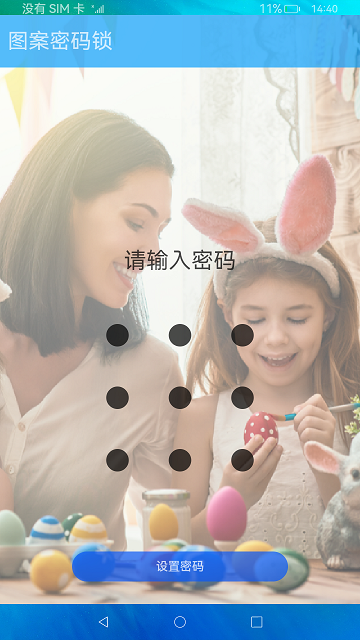
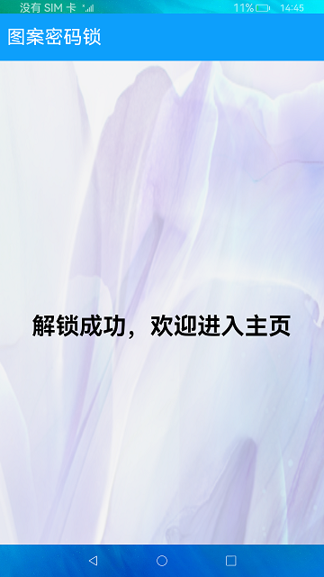

# 图案密码锁组件

### 介绍

本示例展示了图案密码锁组件的使用，实现了密码设置、验证和重置功能。

图案密码锁组件：以宫格图案的方式输入密码，用于密码验证。手指触碰图案密码锁时开始进入输入状态，手指离开屏幕时结束输入状态并向应用返回输入的密码。  

使用到用户首选项接口[@ohos.data.preferences](https://gitee.com/openharmony/docs/blob/master/zh-cn/application-dev/reference/apis/js-apis-data-preferences.md) 异步获取用户设定过的密码。


### 效果预览
|设置密码页|输入密码页|主页|
|---|---|---|
|  |  |  |

使用说明：

1.首次进入时需要设置密码，需要两次输入密码相同后点击**设置密码**进行设置，如果第二次输入密码和第一次输入密码不同，会提示重新输入。

2.设置密码后，需要输入密码解锁，退出应用后重新进入应用，需要再次输入密码验证，密码验证成功进入主页。

3.设置密码后，在输入密码界面有**重置密码**按钮，点击后需要输入旧密码，旧密码验证成功后开始设置新的密码。  

### 工程目录

```
entry/src/main/ets/        
|---model
|   |---PreferencesUtils.ts             // 定义用户存过的密码
|---pages
|   |---Home.ets                        // 输入密码成功后进入的首页页面
|   |---Index.ets                       // 密码锁页面，定义密码验证逻辑
```

### 具体实现
* 在pages/Home.ets中定义密码锁组件，通过定义两个变量isHasPass：是否已经设过密码;isReset：是否需要重置密码;
* 密码验证分为几种情况：[源码](entry/src/main/ets/pages/Home.ets) 参考。
  1. 首次进入页面， 通过aboutToAppear()初始化调用preferences.getPreferences()获取密码，此时defaultPassword='null'，isHassPass=false，需设置密码并确认密码；
  2. 已经设过密码： 通过aboutToAppear()初始化调用preferences.getPreferences()获取密码，此时defaultPassword='oldPassword'，isHassPass=true，页面渲染重置密码text()。
     需输入密码和defaultPassword比较，正确后跳转相应页面，若失败提示密码错误，需重新输入密码。
  3. 点击重置密码，此时组件清除旧密码，即defaultPassword='null'，此时无密码，走首次无密码流程。
* 在pages/index.ets中定义密码通过后的首页页面，[源码](entry/src/main/ets/pages/Index.ets) 参考。

### 相关权限

不涉及。

### 依赖

不涉及。

### 约束与限制

1.本示例仅支持标准系统上运行， 支持设备：RK3568 。

2.本示例为Stage模型， 已适配API version 9版本SDK，版本号：3.2.11.9 。

3.本示例需要使用DevEco Studio 3.1 Beta2 (Build Version: 3.1.0.400, built on April 7, 2023)及以上版本才可编译运行。

### 下载

如需单独下载本工程，执行如下命令：

````
git init
git config core.sparsecheckout true
echo code/Solutions/Tools/PatternLock/ > .git/info/sparse-checkout
git remote add origin https://gitee.com/openharmony/applications_app_samples.git
git pull origin master
````