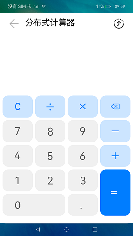

# 分布式计算器

### 简介

本示例使用分布式能力实现了一个简单的计算器应用，可以进行简单的数值计算，支持远程拉起另一个设备的计算器应用，两个计算器应用进行协同计算。

远程拉起：通过StartAbility实现远端应用的拉起。

协同计算：通过DistributedDataKit分布式数据框架实现异端应用的数据同步。实现效果如下：



### 相关概念

数据管理实例： 用于获取KVStore的相关信息。

单版本分布式数据库：继承自KVStore，不对数据所属设备进行区分，提供查询数据和同步数据的方法。

### 相关权限

允许不同设备间的数据交换：ohos.permission.DISTRIBUTED_DATASYNC

允许系统应用获取分布式设备的认证组网能力：[ohos.permission.ACCESS_SERVICE_DM](https://gitee.com/openharmony/docs/blob/master/zh-cn/application-dev/security/permission-list.md#ohospermissionaccess_service_dm)

### 使用说明

1.点击桌面应用图标，启动应用。

2.点击应用右上角按钮，或者在界面任意位置滑动（上下左右滑动皆可）即可弹出设备选择框。

3.在设备选择框中点击对端设备名称，拉起对端应用。

4.对端应用启动后，可在任意一端中操作应用，两端应用可实现数据实时同步。

5.在设备选择框中选中本机即可关闭对端应用。

### 约束与限制

1.本示例只实现简单的加减乘除功能，后续开发者可基于当前框架考虑在calc页面中实现更多的功能，如开方、立方、三角函数等科学计算功能。

2.分布式计算功能使用的前提是分布式组网。

3.本示例已适配API version 9版本SDK，版本号：3.2.11.9，本示例需要使用DevEco Studio 3.1 Beta2 (Build Version: 3.1.0.400)及以上版本进行编译。

4.本示例需要使用@ohos.distributedHardware.deviceManager系统权限的系统接口。使用Full SDK时需要手动从镜像站点获取，并在DevEco Studio中替换，具体操作可参考[替换指南](https://docs.openharmony.cn/pages/v3.2/zh-cn/application-dev/quick-start/full-sdk-switch-guide.md/)。

### 下载

如需单独下载本工程，执行如下命令：
```
git init
git config core.sparsecheckout true
echo code/SuperFeature/DistributedAppDev/ArkTSDistributedCalc/ > .git/info/sparse-checkout
git remote add origin https://gitee.com/openharmony/applications_app_samples.git
git pull origin master
```