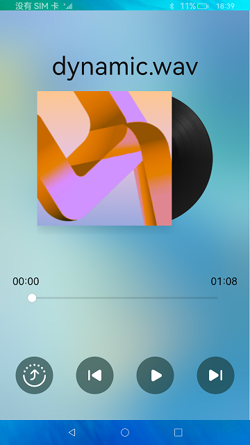

# 分布式音乐播放

### 介绍

本示例使用fileIo获取指定音频文件，并通过AudioPlayer完成了音乐的播放完成了基本的音乐播放、暂停、上一曲、下一曲功能；并使用DeviceManager完成了分布式设备列表的显示和分布式能力完成了音乐播放状态的跨设备分享。  

本示例用到了与用户进行交互的Ability的能力接口[@ohos.ability.featureAbility](https://gitee.com/openharmony/docs/blob/master/zh-cn/application-dev/reference/apis-ability-kit/js-apis-ability-featureAbility.md)

文件存储管理能力接口[@ohos.fileio](https://gitee.com/openharmony/docs/blob/master/zh-cn/application-dev/reference/apis-core-file-kit/js-apis-fileio.md)

屏幕属性接口[@ohos.display](https://gitee.com/openharmony/docs/blob/master/zh-cn/application-dev/reference/apis-arkui/js-apis-display.md)

媒体查询接口[@ohos.mediaquery](https://gitee.com/openharmony/docs/blob/master/zh-cn/application-dev/reference/apis-arkui/js-apis-mediaquery.md)。

分布式数据管理接口[@ohos.data.distributedData](https://gitee.com/openharmony/docs/blob/master/zh-cn/application-dev/reference/apis-arkdata/js-apis-distributed-data.md)

音视频相关媒体业务能力接口[@ohos.multimedia.media](https://gitee.com/openharmony/docs/blob/master/zh-cn/application-dev/reference/apis-media-kit/js-apis-media.md)

分布式设备管理能力接口(设备管理)，实现设备之间的kvStore对象的数据传输交互[@ohos.distributedDeviceManager](https://gitee.com/openharmony/docs/blob/master/zh-cn/application-dev/reference/apis-distributedservice-kit/js-apis-distributedDeviceManager.md)

### 效果预览
| 首页                              |
|--------------------------------------|
||

使用说明

1.**音乐播放**，点击**播放**、**暂停**、上**一曲**、下**一曲**按钮可以对音乐进行操作。

2.**跨设备分享**，组网并且双端均已授权条件下，点击**分享**按钮，选择设备，拉起对端设备上的音乐，并将本端的播放状态同步到对端上。

3.**跨设备停止分享**，分享成功前提条件下，点击**停止分享**按钮，将对端设备拉起的音乐应用停止退出。

#### 相关概念

音频播放：媒体子系统包含了音视频相关媒体业务，通过AudioPlayer实现音频播放的能力。

数据分享：分布式数据管理为应用程序提供不同设备间数据库的分布式协同能力。通过调用分布式数据各个接口，应用程序可将数据保存到分布式数据库中，并可对分布式数据库中的数据进行增/删/改/查等各项操作。

### 工程目录
```
entry/src/main/ets/
|---pages
|   |---index.ets                           // 首页
|---model                                  
|   |---PlayerModel.ts                      // 播放器模块
|   |---KvStoreModel.ts                     // kvstore对象操作类
|   |---RemoteDeviceModel.ts                // 远程设备操作类
|---common                                    
|   |---MusicSharedDefinition.ts            // 定义音乐播放器状态
|   |---DeviceDialog.ets                    // 分布式设备列表弹窗
                                                      
```

### 具体实现
在分布式音乐播放器中，分布式设备管理包含了分布式设备搜索、分布式设备列表弹窗、远端设备拉起三部分。  
首先在分布式组网内搜索设备，然后把设备展示到分布式设备列表弹窗中，最后根据用户的选择拉起远端设备。
#### 分布式设备搜索
通过SUBSCRIBE_ID搜索分布式组网内的远端设备，详见registerDeviceListCallback(callback) {}模块[源码参考](entry/src/main/ets/model/RemoteDeviceModel.ts )。
#### 分布式设备列表弹窗
使用@CustomDialog弹出分布式设备列表弹窗，参考首页。[源码参考](entry/src/main/ets/common/DeviceDialog.ets )。
#### 远端设备拉起
通过startAbility(deviceId)方法拉起远端设备的包，[源码参考](entry/src/main/ets/pages/Index.ets )。
#### 分布式数据管理
(1) 管理分布式数据库  
创建一个KVManager对象实例，用于管理分布式数据库对象。通过distributedData.createKVManager(config)，并通过指定Options和storeId，创建并获取KVStore数据库，并通过Promise方式返回，此方法为异步方法，例如this.kvManager.getKVStore(STORE_ID, options).then((store) => {})  
(2) 订阅分布式数据变化  
通过订阅分布式数据库所有（本地及远端）数据变化实现数据协同[源码参考](entry/src/main/ets/pages/Index.ets )。

#### 跨设备播放操作
(1)分布式设备管理器绑定应用包
deviceManager.createDeviceManager('ohos.samples.distributedmusicplayer') [源码参考](entry/src/main/ets/model/RemoteDeviceModel.ts )。  
(2) 初始化播放器
构造函数中通过'@ohos.multimedia.media'组件对播放器进行实例化，并调用播放器初始化函数，通过播放器的on函数，监听error、finish、timeUpdate  
(3) 同步当前播放数据
播放器通过调用selectedIndexChange(),将当前播放的资源、时间、以及播放状态同步给选中的设备。  
(4) 接收当前播放数据
播放器通过在aboutToAppear()时调用this.restoreFromWant(), KvStoreModel组件获取播放列表，playerModel组件重新加载播放器状态和资源。


### 相关权限

允许不同设备间的数据交换：[ohos.permission.DISTRIBUTED_DATASYNC](https://gitee.com/openharmony/docs/blob/master/zh-cn/application-dev/security/AccessToken/permissions-for-all.md#ohospermissiondistributed_datasync)

允许音乐服务后台拉起音乐页面：[ohos.permission.START_ABILITIES_FROM_BACKGROUND](https://gitee.com/openharmony/docs/blob/master/zh-cn/application-dev/security/AccessToken/permissions-for-system-apps.md#ohospermissionstart_abilities_from_background)

允许应用进行调用,无论Ability是否可见: [ohos.permission.START_INVISIBLE_ABILITY](https://gitee.com/openharmony/docs/blob/master/zh-cn/application-dev/security/AccessToken/permissions-for-system-apps.md#ohospermissionstart_invisible_ability)

### 依赖

不涉及

### 约束与限制

1.本示例仅支持标准系统上运行。

2.本示例完整功能必须双端授予允许使用分布式协同能力，否则在只有发起端授权条件下，发起端会弹框提示错误。

3.本示例为stage模型，已适配API version 10版本SDK，SDK版本号(API Version 10 Release),镜像版本号(4.0Release)。

4.本示例需要使用DevEco Studio 版本号(4.0Release)才可编译运行。

5.本示例需要使用@ohos.distributedDeviceManager系统权限的系统接口。使用Full SDK时需要手动从镜像站点获取，并在DevEco Studio中替换，具体操作可参考[替换指南](https://gitee.com/openharmony/docs/blob/master/zh-cn/application-dev/faqs/full-sdk-switch-guide.md)。

6.本示例中使用到特殊安装，需要将本示例加入到白名单中再进行安装。详细内容如下
{
    "bundleName": "ohos.samples.distributedmusicplayer",
    "app_signature" : [],
    "allowAppUsePrivilegeExtension": true
}

### 下载

如需单独下载本工程，执行如下命令：
```
git init
git config core.sparsecheckout true
echo code/SuperFeature/DistributedAppDev/ArkTSDistributedMusicPlayer/ > .git/info/sparse-checkout
git remote add origin https://gitee.com/openharmony/applications_app_samples.git
git pull origin master
```