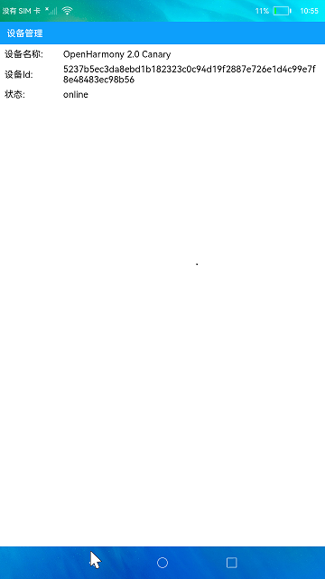

# 设备管理

### 介绍

本示例展示了在eTS中DeviceManager接口的使用，包括获取授信设备列表，设备扫描，设备认证，设备状态订阅。实现操作如下：

1.进入应用会自动获取授信设备列表显示在设备列表中，状态显示为"online"，并开始设备扫描发现设备，发现设备后会显示在设备列表中，状态显示为"discover"。

2.点击状态为"discover"的设备，会触发认证，认证完成会刷新界面。

3.设备状态订阅监听组网状态变化从而刷新界面。

### 效果预览

### 相关权限

不涉及。

### 依赖

不涉及。

### 约束与限制

1.本示例需要组网测试。

2.本示例仅支持标准系统上运行。

3.本示例已适配API10版本FUll SDK，版本号：4.0.5.1。

4.本示例需要使用DevEco Studio 3.1 Canary1 (Build Version: 3.1.0.100)及以上版本才可编译运行。

5.本示例需要使用@ohos.distributedHardware.deviceManager系统权限的系统接口。使用Full SDK时需要手动从镜像站点获取，并在DevEco Studio中替换，具体操作可参考[替换指南](https://gitee.com/openharmony/docs/blob/master/zh-cn/application-dev/quick-start/full-sdk-switch-guide.md)。