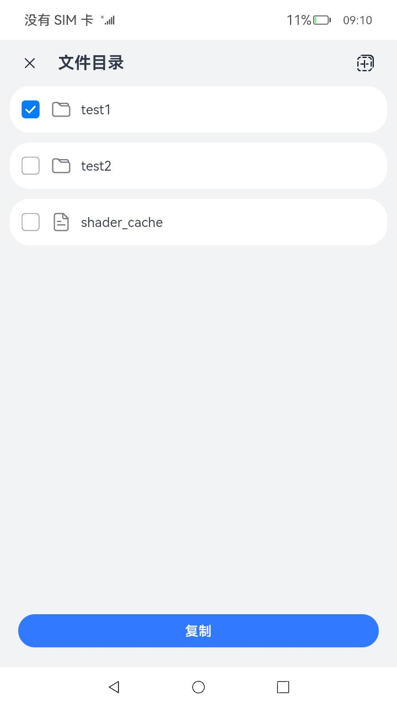

# 分布式文件管理

### 介绍

本示例使用分布式能力实现了一个分布式的文件管理，可以进行文件的跨设备拷贝。

本示例用到了文件管理接口[@ohos.file.fs](https://gitee.com/openharmony/docs/blob/master/zh-cn/application-dev/reference/apis/js-apis-file-fs.md )。

分布式数据对象接口[@ohos.data.distributedDataObject](https://gitee.com/openharmony/docs/blob/master/zh-cn/application-dev/reference/apis/js-apis-data-distributedobject.md )。

### 效果预览
|                                     |
|-------------------------------------|
|  |

使用说明

1.两台设备A、B组网成功。

2.A设备上长按列表出现复选框，选择文件(夹)后点击下方的“复制”按钮。

3.B设备上进入要复制的文件夹目录，点击右上角的“粘贴”图标。

4.A设备上的文件成功拷贝至B设备。

### 工程目录
```
entry/src/main/ets/
|---pages
|   |---index.ets                           // 页面逻辑
|---model                                    
|   |---DataObject.ets                      // 分布式数据对象
|   |---FsManager.ets                       // 文件拷贝操作                                                     
```


### 相关权限

允许系统应用获取分布式设备的认证组网能力：[ohos.permission.ACCESS_SERVICE_DM](https://gitee.com/openharmony/docs/blob/master/zh-cn/application-dev/security/permission-list.md#ohospermissionaccess_service_dm)

### 依赖

不涉及

### 约束与限制

无

### 下载

如需单独下载本工程，执行如下命令：
```
git init
git config core.sparsecheckout true
echo code/SuperFeature/DistributedAppDev/DistributedCalc/ > .git/info/sparse-checkout
git remote add origin https://gitee.com/openharmony/applications_app_samples.git
git pull origin master
```