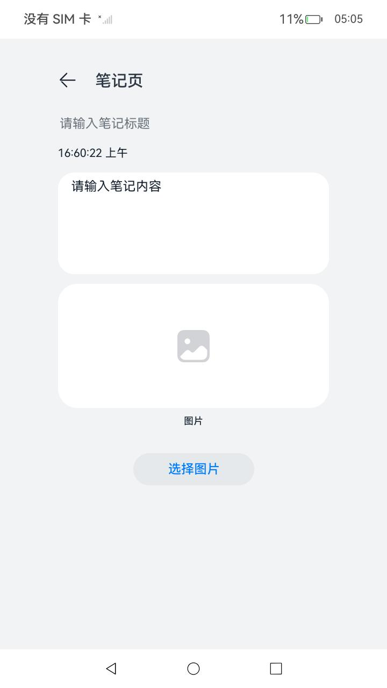

# 跨端迁移随手记

### 介绍

本示例主要展示了应用数据跨端迁移的能力，通过跨端迁移的能力实现了一个简单的随手记应用，可以响应系统迁移事件，控制应用的迁移能力、是否迁移页面栈以及迁移后是否退出源端等。同时实现了数据迁移以及ArkUI控件的迁移。本示例仅适配设备类型为phone。

本示例使用了权限管理接口[@ohos.abilityAccessCtrl](https://gitee.com/openharmony/docs/blob/master/zh-cn/application-dev/reference/apis/js-apis-abilityAccessCtrl.md)、分布式数据对象接口[@ohos.data.distributedDataObject](https://gitee.com/openharmony/docs/blob/master/zh-cn/application-dev/reference/apis/js-apis-data-distributedobject.md)、基础文件操作接口[@ohos.file.fs](https://gitee.com/openharmony/docs/blob/master/zh-cn/application-dev/reference/apis/js-apis-file-fs.md) 、相册管理模块接口[@ohos.file.photoAccessHelper](https://gitee.com/eileen-dxy/docs/blob/master/zh-cn/application-dev/reference/apis/js-apis-file-fs.md)、图片处理接口[@ohos.multimedia.image](https://gitee.com/openharmony/docs/blob/master/zh-cn/application-dev/reference/apis/js-apis-image.md)等接口，通过分布式数据对象以及分布式文件两种方式实现了图片数据的流转迁移。

### 效果预览

|主页|迁移设置页|笔记页|图片墙页|
|--------------------------------|--------------------------------|--------------------------------|--------------------------------|
|||||

使用说明

1. 启动应用，进入欢迎页，点击允许授权；
2. 进入主页，点击右上角设置图标进入迁移设置页面，可以设置当前应用是否具备迁移能力、是否迁移页面栈以及迁移后是否退出源端；
3. 进入主页，可以点击笔记页、待办事项、图片墙等按钮进入对应页面；
4. 在笔记页，可以编辑笔记标题、笔记内容、选择图片，在打开迁移能力和迁移页面栈的情况下，所编辑的内容和选择的图片可以同步迁移到对端设备；
5. 在待办事项页，勾选多选框，在打开迁移能力和迁移页面栈的情况下，可以迁移当前的勾选状态；
6. 在图片墙页，滑动页面到某个位置，在打开迁移能力和迁移页面栈的情况下，可以迁移当前的瀑布流控件索引位置。
7. 点击“迁移时使用异步接口保存数据”，进入页面输入文本，可以迁移文本数据（RK3568设备不支持）。

### 工程目录

```
entry/src/main/ets/
|---common
|   |---bean
|   |   |---WaterFlowDataSource.ets       //瀑布流组件加载数据对象
|   |---constants
|   |   |---CommonConstants.ets           // 常量
|   |---img
|---entryability
|   |---EntryAbility.ets
|---pages
|   |---Home.ets                          // 主页
|   |---ImgWall.ets                       // 图片墙页
|   |---Index.ets                         // 欢迎页
|   |---Notes.ets                         // 笔记页
|   |---Settings.ets                      // 迁移设置页
|   |---Todolist.ets                      // 待办事项页
|---utils                                 
|   |---Logger.ts                         // 日志工具
|---viewmodel                                 
|   |---MainViewModel.ets                 // 获取轮播图数据
```

### 具体实现

- 在端端迁移随手记应用里，迁移设置的功能在Setting.ets和entryability中的onContinue()实现，通过[UIAbilityContext](https://docs.openharmony.cn/pages/v4.0/zh-cn/application-dev/reference/apis/js-apis-inner-application-uiAbilityContext.md/)的[setMissionContinueState](https://docs.openharmony.cn/pages/v4.0/zh-cn/application-dev/reference/apis/js-apis-inner-application-uiAbilityContext.md/#uiabilitycontextsetmissioncontinuestate10)可以设置当前应用任务流转的状态，控制当前应用是否具有迁移能力。通过设置wantConstant.Params.SUPPORT_CONTINUE_PAGE_STACK_KEY和wantConstant.Params.SUPPORT_CONTINUE_SOURCE_EXIT_KEY的值可以控制当前应用是否迁移页面栈以及迁移后源端是否退出。

- 笔记页通过分布式数据对象和分布式文件在Notes.ets中实现大文件（100KB以上）数据的迁移。通过分布式文件的[跨设备文件访问](https://gitee.com/openharmony/docs/blob/master/zh-cn/application-dev/file-management/file-access-across-devices.md)实现了图片的迁移。源码参考：[Notes.ets](code/SuperFeature/DistributedAppDev/JotNote/entry/src/main/ets/pages/Notes.ets)
  * 获取分布式目录的文件路径filePath：context.distributedFilesDir+‘picture.jpg’，迁移图片文件使用.jpg来命名;
  * 从图库中选择图片，使用选择器接口[@ohos.file.picker](https://gitee.com/openharmony/docs/blob/master/zh-cn/application-dev/reference/apis/js-apis-file-picker.md)的PhotoViewPicker图库选择器对象选择一张图片并通过writeSrcToDistributedFile(this.uris)将选择的图片的uri写入分布式文件路径filePath，接口参考：[@ohos.file.fs](https://gitee.com/openharmony/docs/blob/master/zh-cn/application-dev/reference/apis/js-apis-file-fs.md) 
  * 使用getImage()方法获取从图库中选择的图片资源PixelMap类型，首先使用photoAccessHelper.getPhotoAccessHelper(context)获取相册管理模块的实例，使用phAccessHelper.getAssets()获取图片资源,使用photoAsset.getThumbnail()获取所选的图片的PixelMap类型数据，接口参考：[ohos.file.photoAccessHelper](https://gitee.com/openharmony/docs/blob/master/zh-cn/application-dev/reference/apis/js-apis-photoAccessHelper.md) 。
  * 在对端设备上迁移显示笔记页内容时，在aboutToAppear()钩子中调用readFromDistributedFile()读取分布式路径里存储的图片文件，首先以同步方法fs.accessSync(filePath)检查分布式路径下文件是否存在，通过image.createImageSource(filePath)传入的uri创建图片源实例imageSourceApi,通过imageSourceApi.createPixelMap()来创建PixelMap 并负责流转后展示，接口参考：[@ohos.multimedia.image](https://gitee.com/openharmony/docs/blob/master/zh-cn/application-dev/reference/apis/js-apis-image.md) 。
- 通过restoreId()实现ArkUI控件保存对应信息的迁移，源码参考：[ImgWall.ets](code/SuperFeature/DistributedAppDev/JotNote/entry/src/main/ets/pages/ImgWall.ets)

### 相关权限

允许不同设备间的数据交换：[ohos.permission.DISTRIBUTED_DATASYNC](https://gitee.com/openharmony/docs/blob/master/zh-cn/application-dev/security/permission-list.md#ohospermissiondistributed_datasync)

允许读取用户公共目录的图片或视频文件：[ ohos.permission.READ_IMAGEVIDEO](https://gitee.com/openharmony/docs/blob/master/zh-cn/application-dev/security/permission-list.md#ohospermissionread_imagevideo)

### 依赖

不涉及

### 约束与限制

1. 本示例仅支持标准系统上运行，支持设备：RK3568;
2. 本示例完整功能必须双端授予允许使用分布式协同能力,迁移等功能暂不支持RK3568。
3. 本示例为stage模型，已适配API version 12版本SDK，SDK版本号(API Version 12 Release),镜像版本号(5.0.0.16)。
4. 本示例需要使用DevEco Studio 版本号(4.0Release)才可编译运行。
5. 本示例需要使用 ohos.permission.READ_IMAGEVIDEO权限级别为system_basic的系统接口。
6. 本示例涉及系统接口，需要配置系统应用签名，可以参考[特殊权限配置方法](https://gitee.com/link?target=https%3A%2F%2Fdocs.openharmony.cn%2Fpages%2Fv3.2%2Fzh-cn%2Fapplication-dev%2Fsecurity%2Fhapsigntool-overview.md%2F) ，把配置文件中的“app-feature”字段信息改为“hos_system_app”。

### 下载

如需单独下载本工程，执行如下命令：

```
git init
echo code/SuperFeature/DistributedAppDev/DistributedJotNote/ > .git/info/sparse-checkout
git remote add origin https://gitee.com/openharmony/applications_app_samples.git
git pull origin master
```