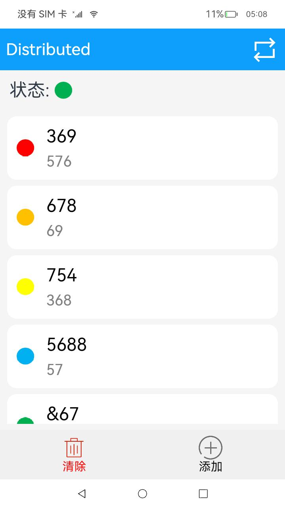

# 分布式备忘录

### 介绍

本示例展示了在eTS中如何使用分布式数据对象实现一个简单的分布式备忘录。  

本示例用到了分布式设备管理能力接口(设备管理)，实现设备之间的distributedDataObject对象的数据传输交互[@ohos.distributedHardware.deviceManager](https://gitee.com/openharmony/docs/blob/master/zh-cn/application-dev/reference/apis/js-apis-device-manager.md )。  

分布式数据管理接口[@ohos.data.distributedData](https://gitee.com/openharmony/docs/blob/master/zh-cn/application-dev/reference/apis/js-apis-distributed-data.md )。  

用到了权限管理能力[@ohos.abilityAccessCtrl](https://gitee.com/openharmony/docs/blob/master/zh-cn/application-dev/reference/apis/js-apis-abilityAccessCtrl.md )。  

分布式数据对象接口[@ohos.data.distributedDataObject](https://gitee.com/openharmony/docs/blob/master/zh-cn/application-dev/reference/apis/js-apis-data-distributedobject.md )。  


### 效果预览
| 首页                                    | 
|---------------------------------------|
|  |


使用说明

1.启动应用,点击右上角按钮可以连接组网设备，选择设备后进行连接，连接成功后两个设备上首页状态均显示绿色，每次连接其他设备，界面会清空备忘录内容。

2.点击**添加**按钮进入添加界面，可以编辑标题、内容、标记颜色，点击**提交**按钮添加备忘录。

3.点击**清除**按钮清除所有备忘录内容。

4.点击已经添加的备忘录可以进入编辑界面更新备忘录内容，编辑完成后点击**提交**按钮更新备忘录。

5.两台设备连接成功后步骤2、3、4的操作会同步到另一台设备上。

#### 相关概念

分布式数据对象：组网内的设备，通过创建相同sessionId的分布式数据对象，修改分布式对象时，对端设备可以监听到数据变化并获取到新的数据，从而实现不同设备间的数据交换。

### 工程目录
```
entry/src/main/ets/
|---pages
|   |---index.ets                           // 首页
|   |---Edit.ets                            // 编写笔记页面
|---MainAbility                                    
|   |---MainAbility.ts                      // 请求用户授权
|---model                                  
|   |---Const.ts                            // 静态资源模块（笔记标记颜色的图片资源）
|   |---DistributedObjectModel.ts           // 分布式数据对象类
|   |---Note.ts                             // Note对象操作类
|   |---RemoteDeviceModel.ts                // 远程设备操作类
|---common                                    
|   |---BasicDataSource.ets                 // 初始化数据模块
|   |---NoteItem.ets                        // 笔记列表模块
|   |---DeviceDialog.ets                    // 分布式设备列表弹窗
|   |---TitleBar.ets                        // 菜单栏模块                                                          
```

### 具体实现
在分布式笔记应用中，分布式设备管理包含了分布式设备搜索、分布式设备列表弹窗、远端设备拉起三部分。  
首先在分布式组网内搜索设备，然后把设备展示到分布式设备列表弹窗中，最后根据用户的选择拉起远端设备。
#### 分布式设备搜索
通过SUBSCRIBE_ID搜索分布式组网内的设备，详见startDeviceDiscovery(){}模块[源码参考](https://gitee.com/openharmony/applications_app_samples/blob/117e134dd0d4393f5d1d089a50e4ebbb552d596a/code/SuperFeature/DistributedAppDev/DistributedNote/entry/src/main/ets/model/RemoteDeviceModel.ts )。
#### 分布式设备列表弹窗
使用@CustomDialog装饰器来装饰分布式设备列表弹窗，[源码参考](https://gitee.com/openharmony/applications_app_samples/blob/117e134dd0d4393f5d1d089a50e4ebbb552d596a/code/SuperFeature/DistributedAppDev/DistributedNote/entry/src/main/ets/common/DeviceDialog.ets )。
#### 远端设备拉起
通过startAbility(deviceId)方法拉起远端设备的包，[源码参考](https://gitee.com/openharmony/applications_app_samples/blob/117e134dd0d4393f5d1d089a50e4ebbb552d596a/code/SuperFeature/DistributedAppDev/DistributedNote/entry/src/main/ets/pages/Index.ets )。  
#### 分布式数据管理
(1) 管理分布式数据库  
创建一个distributedObject分布式数据对象实例，用于管理分布式数据对象。详见distributedObject.createDistributedObject()，[源码参考](https://gitee.com/openharmony/applications_app_samples/blob/117e134dd0d4393f5d1d089a50e4ebbb552d596a/code/SuperFeature/DistributedAppDev/DistributedNote/entry/src/main/ets/model/DistributedObjectModel.ts )。  
(2) 订阅分布式数据变化  
通过this.distributedObject.on('status', this.statusCallback)监听分布式数据对象的变更。
#### 笔记
(1)UIAbility拉起弹框请求用户授权:在onCreate()时通过abilityAccessCtrl.createAtManager.requestPermissionsFromUser(this.context, ['ohos.permission.DISTRIBUTED_DATASYNC']).then((data)=> {})获取不同设备间的数据交换权限，[源码参考](https://gitee.com/openharmony/applications_app_samples/blob/117e134dd0d4393f5d1d089a50e4ebbb552d596a/code/SuperFeature/DistributedAppDev/DistributedNote/entry/src/main/ets/MainAbility/MainAbility.ts )。  
(2)将sessionID存在应用全局的UI状态存储AppStorage内：在onCreate(want, launchParam) {}时拿到sessionId并存储在AppStorage内，并把同时把sessionId绑定到@StorageLink上实现双向数据绑定。
(3)对笔记内容进行存储在dataArray:note[]中：通过this.noteDataSource['dataArray'] = this.globalObject.distributedObject.documents。
(4)笔记内容更新：通过绑定Button的onClick事件指定this.globalObject.update(index, this.note.title, this.note.content, this.note.mark)进行笔记内容和状态更新，[源码参考](https://gitee.com/openharmony/applications_app_samples/blob/117e134dd0d4393f5d1d089a50e4ebbb552d596a/code/SuperFeature/DistributedAppDev/DistributedNote/entry/src/main/ets/pages/Edit.ets )。  
(5)实现分布式数据自动同步：通过this.globalObject.distributedObject.setSessionId(this.sessionId)，从而实现当可信组网中有多个设备时，多个设备间的对象如果设置为同一个sessionId的笔记数据自动同步，并将其封装在share()函数内，[源码参考](https://gitee.com/openharmony/applications_app_samples/blob/117e134dd0d4393f5d1d089a50e4ebbb552d596a/code/SuperFeature/DistributedAppDev/DistributedNote/entry/src/main/ets/pages/Index.ets )。  
(6)在首页的onPageShow()钩子中，调用share()实现首页在分布式设备上同步渲染组件。
### 相关权限

允许不同设备间的数据交换：[ohos.permission.DISTRIBUTED_DATASYNC](https://gitee.com/openharmony/docs/blob/master/zh-cn/application-dev/security/permission-list.md#ohospermissiondistributed_datasync)

允许系统应用获取分布式设备的认证组网能力：[ohos.permission.ACCESS_SERVICE_DM](https://gitee.com/openharmony/docs/blob/master/zh-cn/application-dev/security/permission-list.md#ohospermissionaccess_service_dm)

### 依赖

不涉及

### 约束与限制

1.本示例仅支持标准系统上运行。

2.本示例为Stage模型，已适配API version 9版本SDK，版本号：3.2.11.9；

3.本示例需要使用DevEco Studio 3.1 Beta2 (Build Version: 3.1.0.400, built on April 7, 2023)及以上版本才可编译运行；

4.本示例需要使用@ohos.distributedHardware.deviceManager系统权限的系统接口。使用Full SDK时需要手动从镜像站点获取，并在DevEco Studio中替换，具体操作可参考[替换指南](https://docs.openharmony.cn/pages/v3.2/zh-cn/application-dev/quick-start/full-sdk-switch-guide.md/)。

### 下载

如需单独下载本工程，执行如下命令：
```
git init
git config core.sparsecheckout true
echo code/SuperFeature/DistributedAppDev/DistributedNote/ > .git/info/sparse-checkout
git remote add origin https://gitee.com/openharmony/applications_app_samples.git
git pull origin master
```