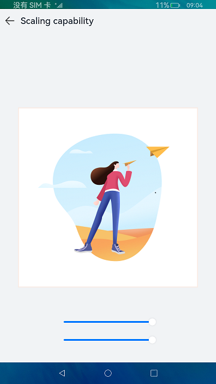
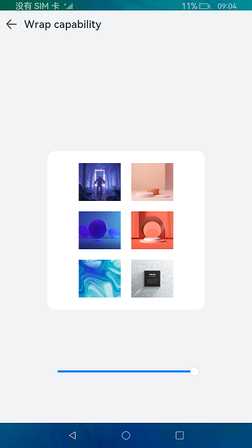

# Multi-device Adaptation

### Introduction

This sample shows multi-device adaptation capabilities in JS, including resource qualifiers, atomic layouts, and responsive layouts. The display effect is as follows.

  

### Concepts

Resource qualifier: The name of a resource qualifier consists of one or more qualifiers that represent the application scenarios or device characteristics, such as screen density. The qualifiers are separated using hyphens (-). The **qualifiers** file is available in the **resources** directory.
Atomic layout: It implements adaptive layout for screens of different sizes and types.
Responsive layout: It enables apps to be well displayed on devices of various resolutions, including mobile phones, tablets, and smart TVs.

### Required Permissions

N/A

### Usage

1. This sample provides resource qualifiers and the responsive layout for common device types. You can enable **Multi-profile preview** in the previewer for multi-device preview.

2. This sample provides a slider in the atomic layout. You can drag the slider to change the size of the parent container. For better highlighting and easier understanding, the code in this part is simplified. You can use the MatePadPro previewer preset in DevEco Studio to view the effect of the atomic layout.

3. Start the sample app. The **Resource qualifiers**, **Atomic layout**, and **Responsive layout** buttons are displayed on the home page.

4. Touch **Resource qualifiers**. A page is displayed, showing the usage of strings and images.

5. Touch **Atomic layout**. A page is displayed, showing the stretching, scaling, hiding, wrapping, equalization, proportion, and extension capabilities of the atomic layout.

6. Touch **Responsive layout**. A page is displayed, showing the media query, grid layout, and typical scenario capabilities of the responsive layout.

### Constraints

1. This sample can only be run on standard-system devices.

2. This sample demonstrates the FA model, which supports only API version 9.

3. DevEco Studio 3.0 Beta3 (Build version: 3.0.0.901, built on May 30, 2022) must be used.

4. This sample does not introduce the breakpoint capability. To learn this capability, use the MatePadPro previewer provided by DevEco Studio.
